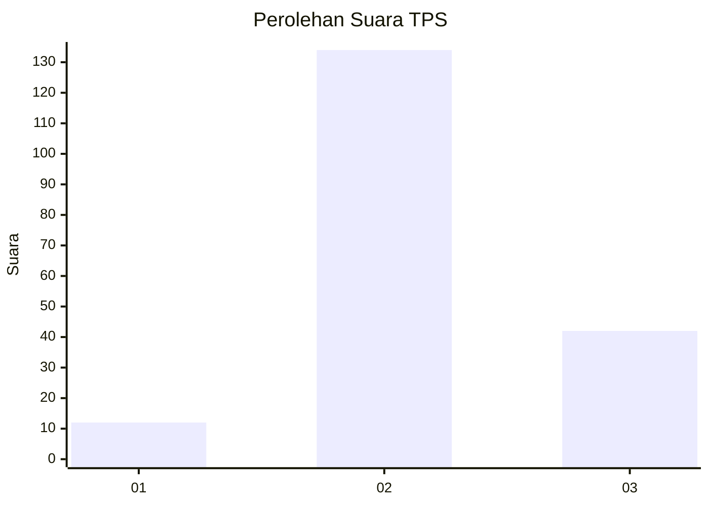
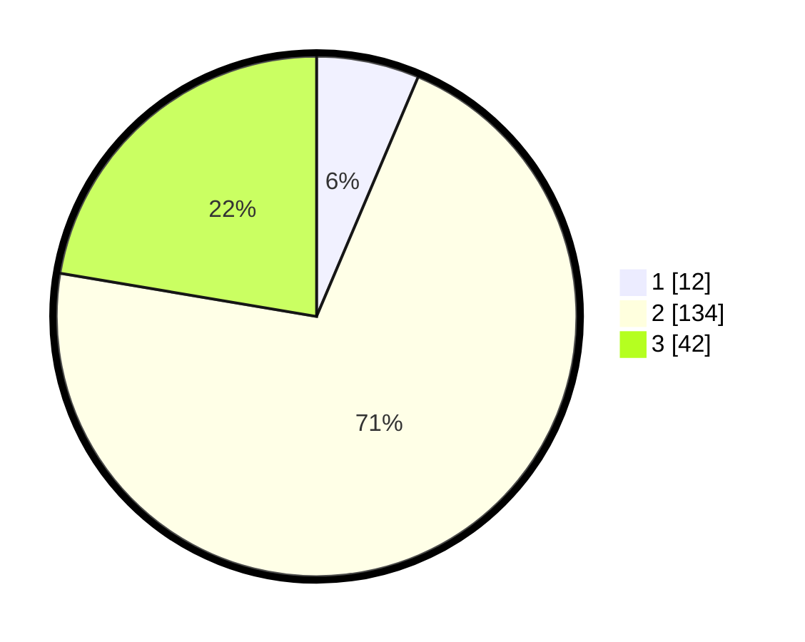

# Hasil

## Grafik

## Tabel

| No. | Nama Paslon    | Suara | Suara (raw) | Persentase |
|:--- |:-------------- | -----:| -----------:| ----------:|
| 1   | ANIES MUHAIMIN | 12    | [12][p-1]   | 6,38       |
| 2   | PRABOWO GIBRAN | 134   | [134][p-2]  | 71,28      |
| 3   | GANJAR MAHFUD  | 42    | [42][p-3]   | 22,34      |

[p-1]: https://github.com/gigit-pemilu/pemilu-2024/blob/main/pilpres/hitung-suara/sub/12-sumatera-utara/sub/06-karo/sub/08-tigabinanga/sub/1019-tiga-binanga/sub/006-tps/sub/paslon-1.txt
[p-2]: https://github.com/gigit-pemilu/pemilu-2024/blob/main/pilpres/hitung-suara/sub/12-sumatera-utara/sub/06-karo/sub/08-tigabinanga/sub/1019-tiga-binanga/sub/006-tps/sub/paslon-2.txt
[p-3]: https://github.com/gigit-pemilu/pemilu-2024/blob/main/pilpres/hitung-suara/sub/12-sumatera-utara/sub/06-karo/sub/08-tigabinanga/sub/1019-tiga-binanga/sub/006-tps/sub/paslon-3.txt

## Foto C Plano

https://sirekap-obj-formc.kpu.go.id/7d4b/pemilu/ppwp/12/06/08/10/19/1206081019006-20240215-023054--81020833-66e0-4a55-8270-7190fd379a6d.jpg

https://sirekap-obj-formc.kpu.go.id/7d4b/pemilu/ppwp/12/06/08/10/19/1206081019006-20240215-023154--8b426391-0d17-4c83-973b-7574e0f25135.jpg

https://sirekap-obj-formc.kpu.go.id/7d4b/pemilu/ppwp/12/06/08/10/19/1206081019006-20240215-023249--430e6c62-47dd-441e-a923-e36014325ddb.jpg

## Metadata

| Key        | Value               |
| ---------- | ------------------- |
| Time Stamp | 2024-02-26 12:00:00 |

