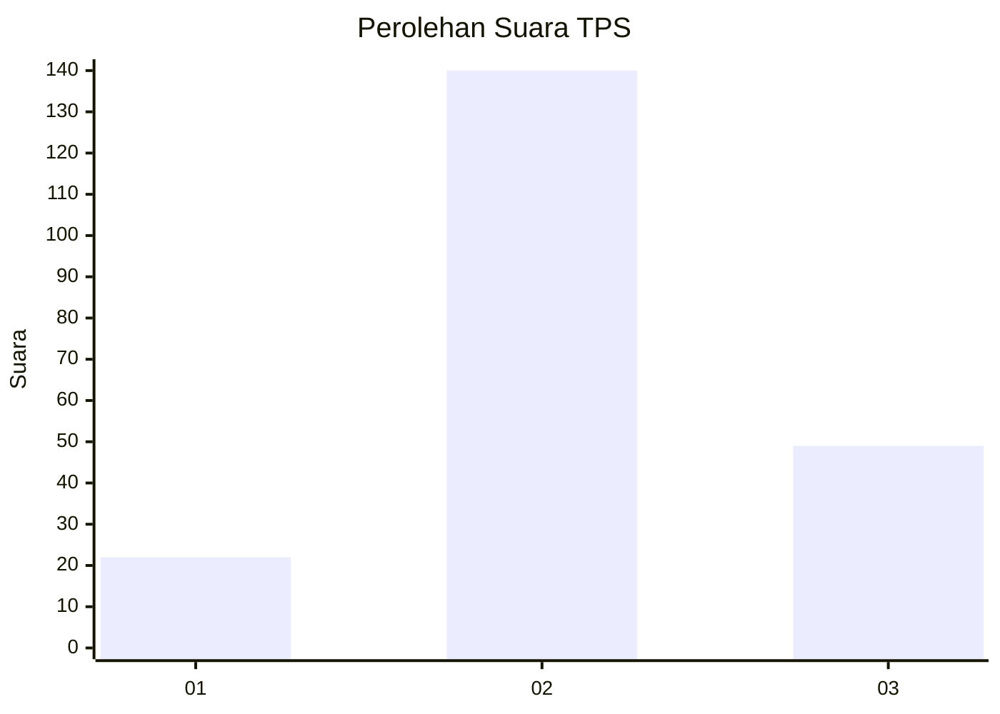
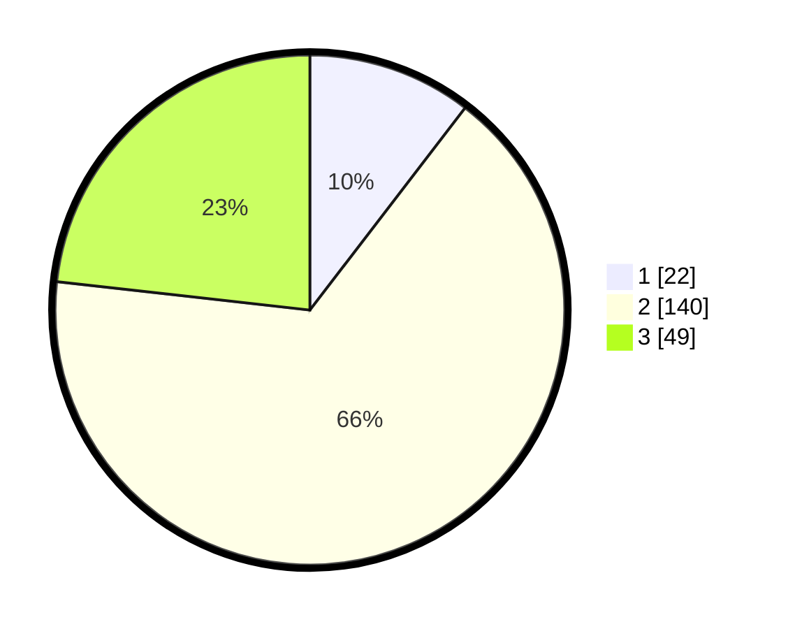

# Hasil

## Grafik

## Tabel

| No. | Nama Paslon    | Suara | Suara (raw) | Persentase |
|:--- |:-------------- | -----:| -----------:| ----------:|
| 1   | ANIES MUHAIMIN | 22    | [22][p-1]   | 10,43      |
| 2   | PRABOWO GIBRAN | 140   | [140][p-2]  | 66,35      |
| 3   | GANJAR MAHFUD  | 49    | [49][p-3]   | 23,22      |

[p-1]: https://github.com/gigit-pemilu/pemilu-2024-12-sumatera-utara/blob/main/pilpres/hitung-suara/sub/12-sumatera-utara/sub/06-karo/sub/08-tigabinanga/sub/1019-tiga-binanga/sub/007-tps/sub/paslon-1.txt
[p-2]: https://github.com/gigit-pemilu/pemilu-2024-12-sumatera-utara/blob/main/pilpres/hitung-suara/sub/12-sumatera-utara/sub/06-karo/sub/08-tigabinanga/sub/1019-tiga-binanga/sub/007-tps/sub/paslon-2.txt
[p-3]: https://github.com/gigit-pemilu/pemilu-2024-12-sumatera-utara/blob/main/pilpres/hitung-suara/sub/12-sumatera-utara/sub/06-karo/sub/08-tigabinanga/sub/1019-tiga-binanga/sub/007-tps/sub/paslon-3.txt

## Foto C Plano

https://sirekap-obj-formc.kpu.go.id/4f61/pemilu/ppwp/12/06/08/10/19/1206081019007-20240215-004329--10fe14e5-52e4-4e23-8693-d6e6ef9fbb19.jpg

https://sirekap-obj-formc.kpu.go.id/4f61/pemilu/ppwp/12/06/08/10/19/1206081019007-20240214-210943--eb7005a5-42d3-4e4d-9886-dfb5b61320a3.jpg

https://sirekap-obj-formc.kpu.go.id/4f61/pemilu/ppwp/12/06/08/10/19/1206081019007-20240215-004510--f474592e-5fd4-43fb-a683-844f34a59ee7.jpg

## Metadata

| Key        | Value               |
| ---------- | ------------------- |
| Time Stamp | 2024-02-15 01:47:43 |

