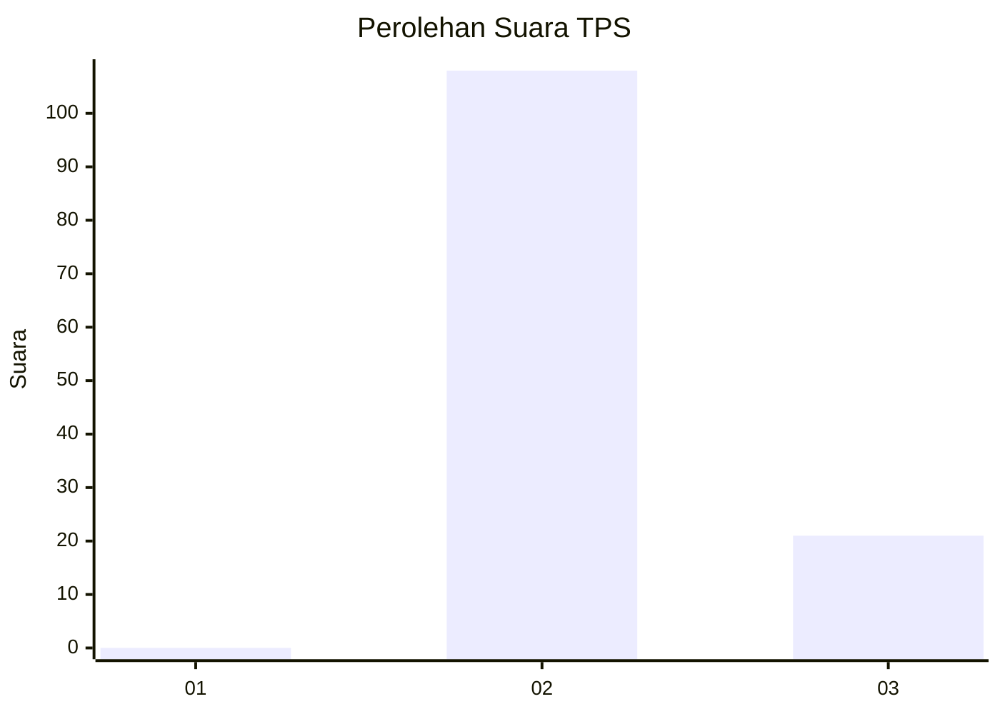
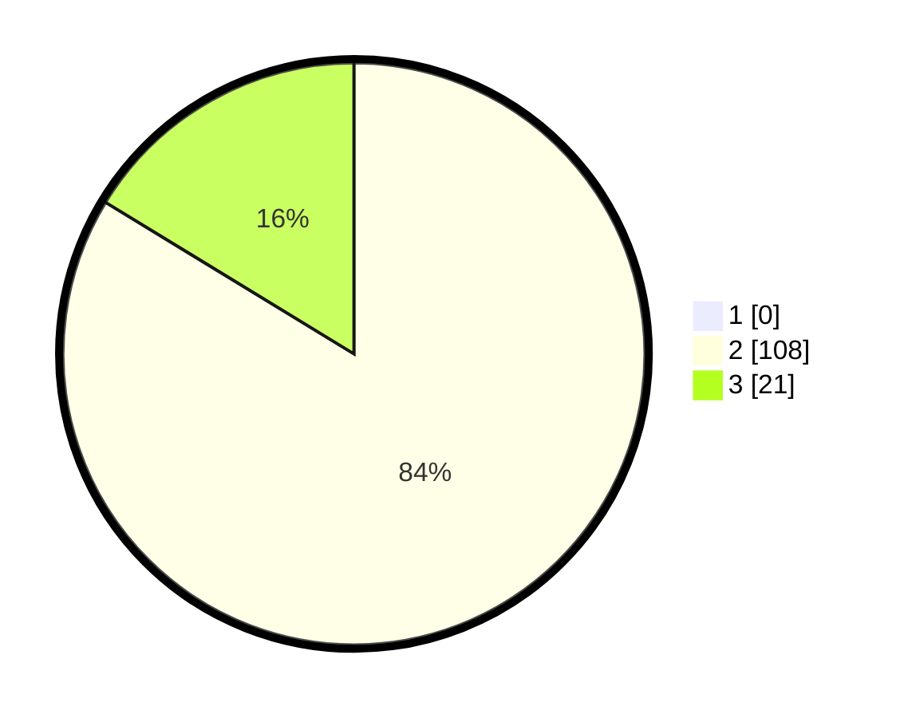

# Hasil

## Grafik

## Tabel

| No. | Nama Paslon    | Suara | Suara (raw) | Persentase |
|:--- |:-------------- | -----:| -----------:| ----------:|
| 1   | ANIES MUHAIMIN | 0     | [0][p-1]    | 0,00       |
| 2   | PRABOWO GIBRAN | 108   | [108][p-2]  | 83,72      |
| 3   | GANJAR MAHFUD  | 21    | [21][p-3]   | 16,28      |

[p-1]: https://github.com/gigit-pemilu/pemilu-2024-12-sumatera-utara/blob/main/pilpres/hitung-suara/sub/12-sumatera-utara/sub/06-karo/sub/08-tigabinanga/sub/2020-batumamak/sub/001-tps/sub/paslon-1.txt
[p-2]: https://github.com/gigit-pemilu/pemilu-2024-12-sumatera-utara/blob/main/pilpres/hitung-suara/sub/12-sumatera-utara/sub/06-karo/sub/08-tigabinanga/sub/2020-batumamak/sub/001-tps/sub/paslon-2.txt
[p-3]: https://github.com/gigit-pemilu/pemilu-2024-12-sumatera-utara/blob/main/pilpres/hitung-suara/sub/12-sumatera-utara/sub/06-karo/sub/08-tigabinanga/sub/2020-batumamak/sub/001-tps/sub/paslon-3.txt

## Foto C Plano

https://sirekap-obj-formc.kpu.go.id/6bc1/pemilu/ppwp/12/06/08/20/20/1206082020001-20240220-202703--d1e7b224-9479-4218-9e00-e0b6a1e36058.jpg

https://sirekap-obj-formc.kpu.go.id/6bc1/pemilu/ppwp/12/06/08/20/20/1206082020001-20240220-233641--95e7aaf3-2bc2-42fd-bed5-65cc0fbcf69a.jpg

https://sirekap-obj-formc.kpu.go.id/6bc1/pemilu/ppwp/12/06/08/20/20/1206082020001-20240220-233830--e0e57fc2-22f4-4a8e-8932-daad2c3818f8.jpg

## Metadata

| Key        | Value               |
| ---------- | ------------------- |
| Time Stamp | 2024-02-25 13:00:00 |

