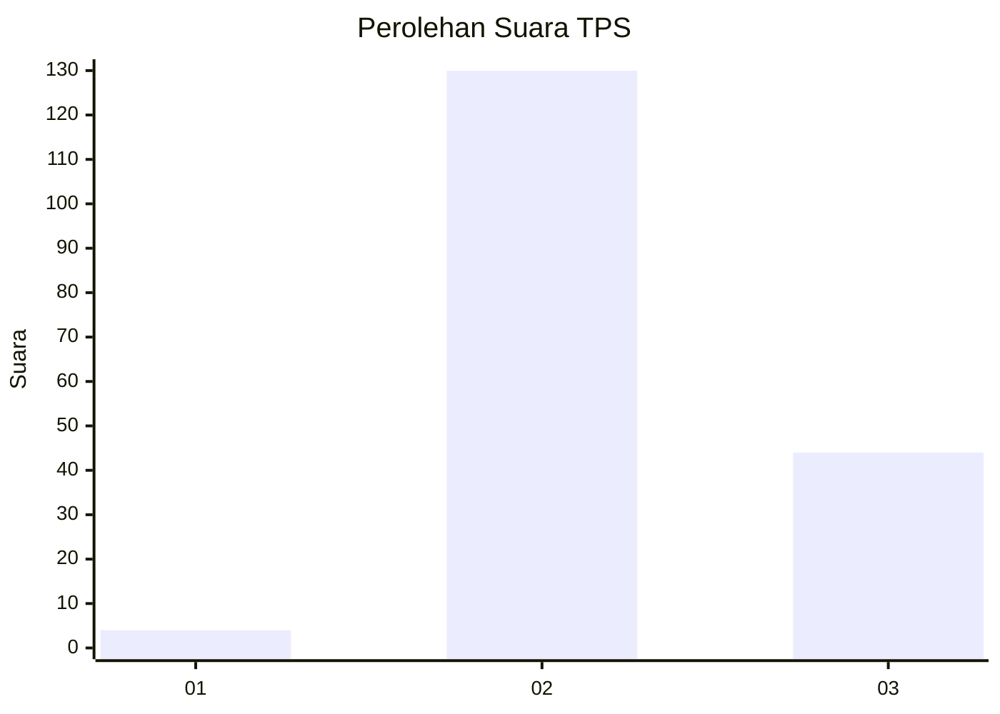
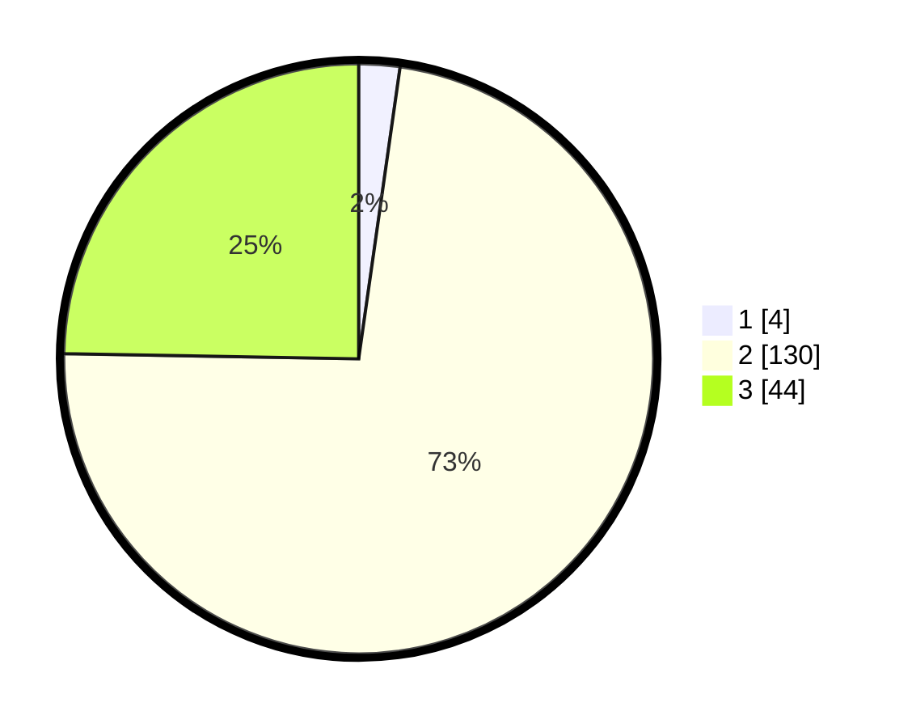

# Hasil

## Grafik

## Tabel

| No. | Nama Paslon    | Suara | Suara (raw) | Persentase |
|:--- |:-------------- | -----:| -----------:| ----------:|
| 1   | ANIES MUHAIMIN | 4     | [4][p-1]    | 2,25       |
| 2   | PRABOWO GIBRAN | 130   | [130][p-2]  | 73,03      |
| 3   | GANJAR MAHFUD  | 44    | [44][p-3]   | 24,72      |

[p-1]: https://github.com/gigit-pemilu/pemilu-2024/blob/main/pilpres/hitung-suara/sub/12-sumatera-utara/sub/06-karo/sub/10-mardingding/sub/2001-lau-pengulu/sub/001-tps/sub/paslon-1.txt
[p-2]: https://github.com/gigit-pemilu/pemilu-2024/blob/main/pilpres/hitung-suara/sub/12-sumatera-utara/sub/06-karo/sub/10-mardingding/sub/2001-lau-pengulu/sub/001-tps/sub/paslon-2.txt
[p-3]: https://github.com/gigit-pemilu/pemilu-2024/blob/main/pilpres/hitung-suara/sub/12-sumatera-utara/sub/06-karo/sub/10-mardingding/sub/2001-lau-pengulu/sub/001-tps/sub/paslon-3.txt

## Foto C Plano

https://sirekap-obj-formc.kpu.go.id/8aa9/pemilu/ppwp/12/06/10/20/01/1206102001001-20240216-134621--f70a2cb5-d6af-4611-bcf3-7f4094b136de.jpg

https://sirekap-obj-formc.kpu.go.id/8aa9/pemilu/ppwp/12/06/10/20/01/1206102001001-20240216-141345--706b3f9c-a226-494e-a7ad-28f6e39449a2.jpg

https://sirekap-obj-formc.kpu.go.id/8aa9/pemilu/ppwp/12/06/10/20/01/1206102001001-20240216-141634--5fea1dd6-71c8-4a52-ae1a-f20965973753.jpg

## Metadata

| Key        | Value               |
| ---------- | ------------------- |
| Time Stamp | 2024-02-19 15:00:00 |

## DATA PEMILIH TETAP

Jumlah pemilih dalam DPT: **239**.
 * L: **877**.
 * P: **655**.

## DATA PENGGUNA HAK PILIH

Jumlah pengguna hak pilih dalam DPT: **880**.
 * L: **89**.
 * P: **92**.

Jumlah pengguna hak pilih dalam DPTb: **0**.
 * L: **0**.
 * P: **0**.

Jumlah pengguna hak pilih dalam DPK: **83**.
 * L: **0**.
 * P: **7**.

Jumlah pengguna hak pilih: **183**.
 * L: **889**.
 * P: **892**.

## JUMLAH SUARA SAH DAN TIDAK SAH

JUMLAH SELURUH SUARA SAH: **178**.

JUMLAH SUARA TIDAK SAH: **3**.

JUMLAH SELURUH SUARA SAH DAN SUARA TIDAK SAH: **181**.

