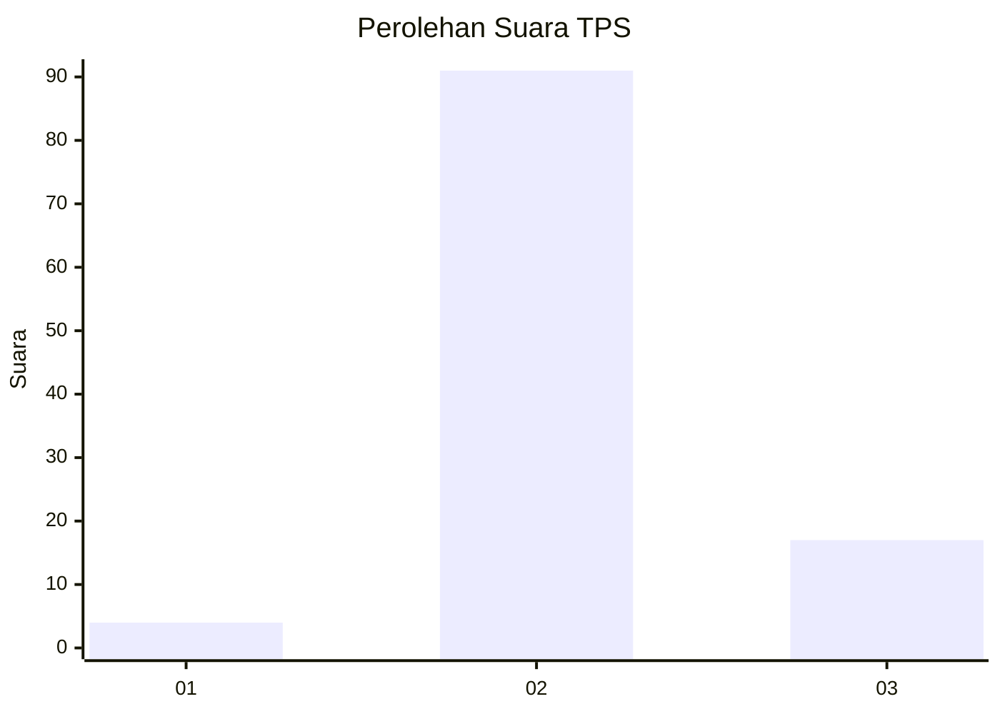
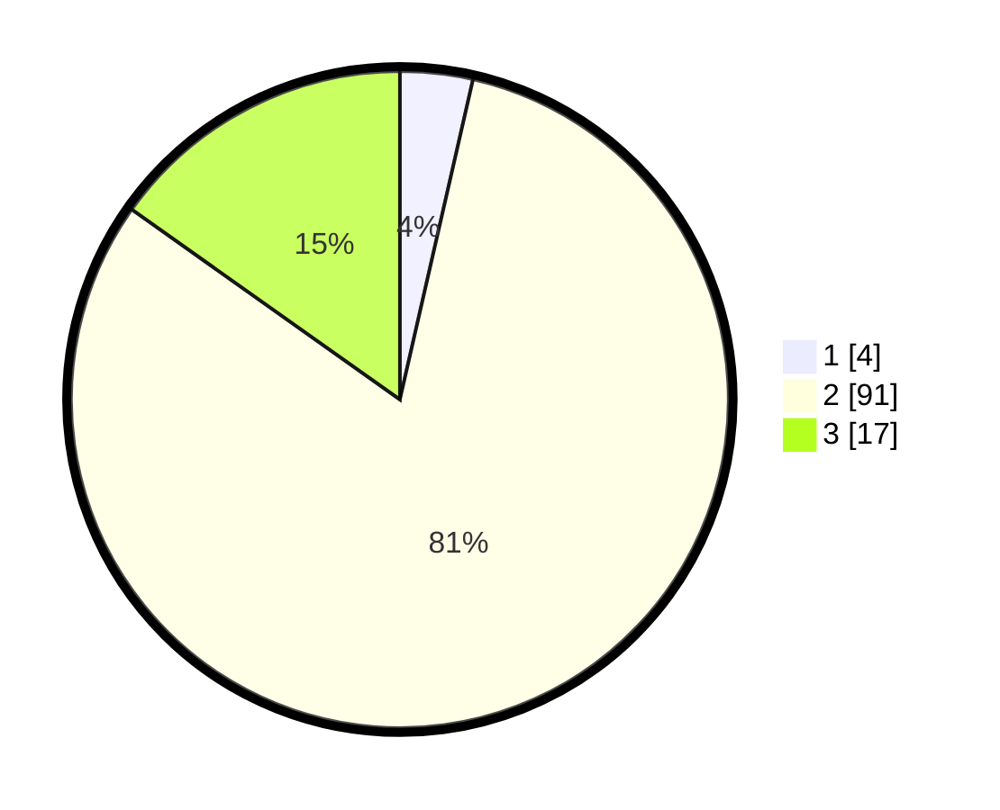

# Hasil

## Grafik

## Tabel

| No. | Nama Paslon    | Suara | Suara (raw) | Persentase |
|:--- |:-------------- | -----:| -----------:| ----------:|
| 1   | ANIES MUHAIMIN | 4     | [4][p-1]    | 3,57       |
| 2   | PRABOWO GIBRAN | 91    | [91][p-2]   | 81,25      |
| 3   | GANJAR MAHFUD  | 17    | [17][p-3]   | 15,18      |

[p-1]: https://github.com/gigit-pemilu/pemilu-2024/blob/main/pilpres/hitung-suara/sub/12-sumatera-utara/sub/06-karo/sub/10-mardingding/sub/2007-bandar-purba/sub/004-tps/sub/paslon-1.txt
[p-2]: https://github.com/gigit-pemilu/pemilu-2024/blob/main/pilpres/hitung-suara/sub/12-sumatera-utara/sub/06-karo/sub/10-mardingding/sub/2007-bandar-purba/sub/004-tps/sub/paslon-2.txt
[p-3]: https://github.com/gigit-pemilu/pemilu-2024/blob/main/pilpres/hitung-suara/sub/12-sumatera-utara/sub/06-karo/sub/10-mardingding/sub/2007-bandar-purba/sub/004-tps/sub/paslon-3.txt

## Foto C Plano

https://sirekap-obj-formc.kpu.go.id/9600/pemilu/ppwp/12/06/10/20/07/1206102007004-20240214-201543--192b7509-6c4d-400e-941b-585e87a1e05b.jpg

https://sirekap-obj-formc.kpu.go.id/9600/pemilu/ppwp/12/06/10/20/07/1206102007004-20240214-202050--a3ea6a42-baa6-4b42-a052-c017c5e53488.jpg

https://sirekap-obj-formc.kpu.go.id/9600/pemilu/ppwp/12/06/10/20/07/1206102007004-20240214-202256--e15dfc23-8c66-42ca-901d-f6ea5d5c5080.jpg

## Metadata

| Key        | Value               |
| ---------- | ------------------- |
| Time Stamp | 2024-02-24 22:31:28 |

