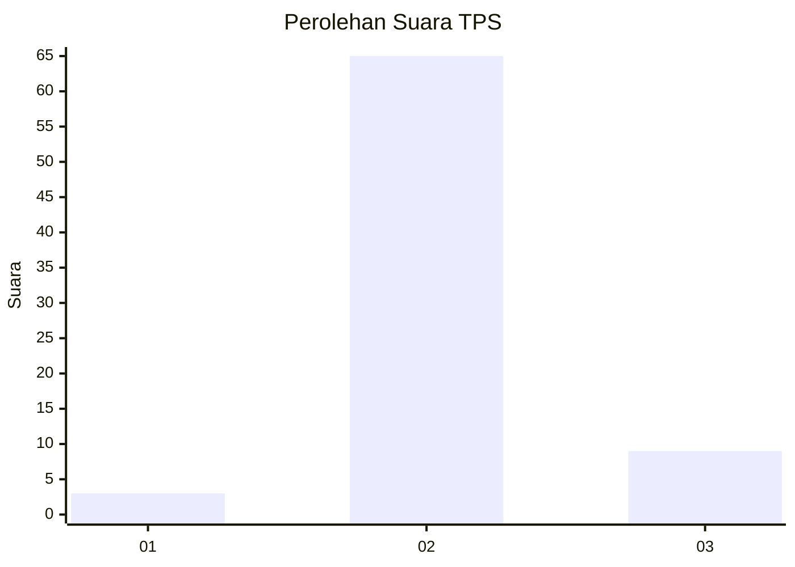
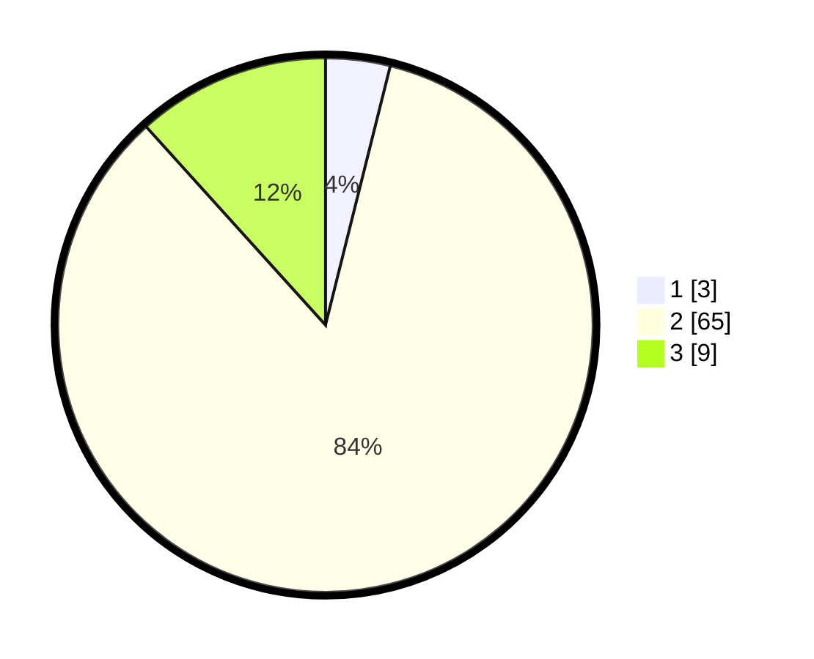

# Hasil

## Grafik

## Tabel

| No. | Nama Paslon    | Suara | Suara (raw) | Persentase |
|:--- |:-------------- | -----:| -----------:| ----------:|
| 1   | ANIES MUHAIMIN | 3     | [3][p-1]    | 3,90       |
| 2   | PRABOWO GIBRAN | 65    | [65][p-2]   | 84,42      |
| 3   | GANJAR MAHFUD  | 9     | [9][p-3]    | 11,69      |

[p-1]: https://github.com/gigit-pemilu/pemilu-2024/blob/main/pilpres/hitung-suara/sub/12-sumatera-utara/sub/06-karo/sub/10-mardingding/sub/2009-lau-pakam/sub/011-tps/sub/paslon-1.txt
[p-2]: https://github.com/gigit-pemilu/pemilu-2024/blob/main/pilpres/hitung-suara/sub/12-sumatera-utara/sub/06-karo/sub/10-mardingding/sub/2009-lau-pakam/sub/011-tps/sub/paslon-2.txt
[p-3]: https://github.com/gigit-pemilu/pemilu-2024/blob/main/pilpres/hitung-suara/sub/12-sumatera-utara/sub/06-karo/sub/10-mardingding/sub/2009-lau-pakam/sub/011-tps/sub/paslon-3.txt

## Foto C Plano

https://sirekap-obj-formc.kpu.go.id/6986/pemilu/ppwp/12/06/10/20/09/1206102009011-20240218-092558--07c8a5db-45f5-4a9a-abe3-06579aded0d7.jpg

https://sirekap-obj-formc.kpu.go.id/6986/pemilu/ppwp/12/06/10/20/09/1206102009011-20240218-092926--85951d2d-e551-4afc-bcb9-8dd98a56bff3.jpg

https://sirekap-obj-formc.kpu.go.id/6986/pemilu/ppwp/12/06/10/20/09/1206102009011-20240218-082525--67073305-7de2-4a44-ae8e-8e663bb69f96.jpg

## Metadata

| Key        | Value               |
| ---------- | ------------------- |
| Time Stamp | 2024-02-25 00:00:00 |

