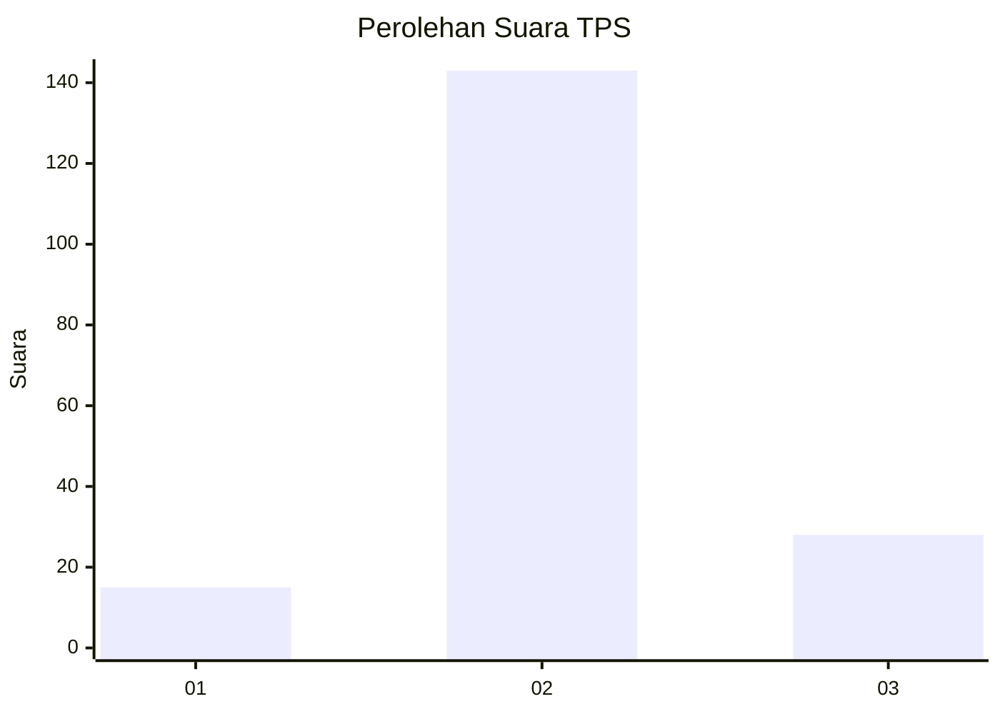

# Hasil

## Grafik

## Tabel

| No. | Nama Paslon    | Suara | Suara (raw) | Persentase |
|:--- |:-------------- | -----:| -----------:| ----------:|
| 1   | ANIES MUHAIMIN | 15    | [15][p-1]   | 8,06       |
| 2   | PRABOWO GIBRAN | 143   | [143][p-2]  | 76,88      |
| 3   | GANJAR MAHFUD  | 28    | [28][p-3]   | 15,05      |

[p-1]: https://github.com/gigit-pemilu/pemilu-2024-12-sumatera-utara/blob/main/pilpres/hitung-suara/sub/12-sumatera-utara/sub/06-karo/sub/10-mardingding/sub/2010-lau-solu/sub/005-tps/sub/paslon-1.txt
[p-2]: https://github.com/gigit-pemilu/pemilu-2024-12-sumatera-utara/blob/main/pilpres/hitung-suara/sub/12-sumatera-utara/sub/06-karo/sub/10-mardingding/sub/2010-lau-solu/sub/005-tps/sub/paslon-2.txt
[p-3]: https://github.com/gigit-pemilu/pemilu-2024-12-sumatera-utara/blob/main/pilpres/hitung-suara/sub/12-sumatera-utara/sub/06-karo/sub/10-mardingding/sub/2010-lau-solu/sub/005-tps/sub/paslon-3.txt

## Foto C Plano

https://sirekap-obj-formc.kpu.go.id/c2ea/pemilu/ppwp/12/06/10/20/10/1206102010005-20240217-124834--b025a7a9-3fe6-4e3c-a7d2-60cf899acff4.jpg

https://sirekap-obj-formc.kpu.go.id/c2ea/pemilu/ppwp/12/06/10/20/10/1206102010005-20240216-210604--5ed72b3e-d636-4fc5-8389-c35e2fd68078.jpg

https://sirekap-obj-formc.kpu.go.id/c2ea/pemilu/ppwp/12/06/10/20/10/1206102010005-20240217-125040--e368f629-33d4-4479-a471-e0d791f72c4e.jpg

## Metadata

| Key        | Value               |
| ---------- | ------------------- |
| Time Stamp | 2024-02-24 22:31:28 |

## DATA PEMILIH TETAP

Jumlah pemilih dalam DPT: **223**.
 * L: **30**.
 * P: **3**.

## DATA PENGGUNA HAK PILIH

Jumlah pengguna hak pilih dalam DPT: **486**.
 * L: **804**.
 * P: **885**.

Jumlah pengguna hak pilih dalam DPTb: **43**.
 * L: **884**.
 * P: **82**.

Jumlah pengguna hak pilih dalam DPK: **800**.
 * L: **880**.
 * P: **802**.

Jumlah pengguna hak pilih: **490**.
 * L: **2**.
 * P: **888**.

## JUMLAH SUARA SAH DAN TIDAK SAH

JUMLAH SELURUH SUARA SAH: **186**.

JUMLAH SUARA TIDAK SAH: **4**.

JUMLAH SELURUH SUARA SAH DAN SUARA TIDAK SAH: **190**.

