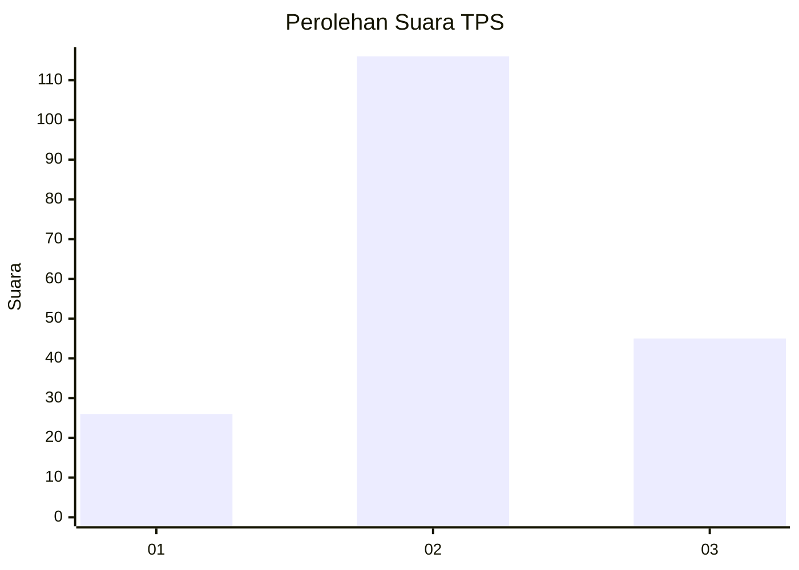
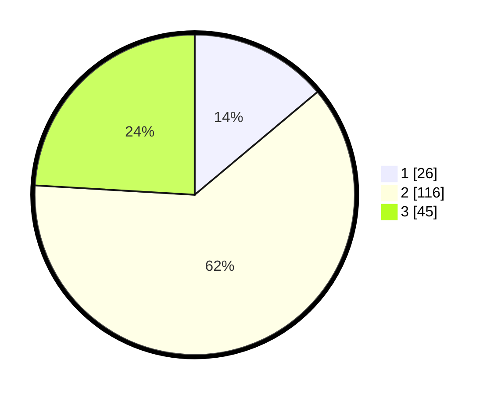

# Hasil

## Grafik

## Tabel

| No. | Nama Paslon    | Suara | Suara (raw) | Persentase |
|:--- |:-------------- | -----:| -----------:| ----------:|
| 1   | ANIES MUHAIMIN | 26    | [26][p-1]   | 13,90      |
| 2   | PRABOWO GIBRAN | 116   | [116][p-2]  | 62,03      |
| 3   | GANJAR MAHFUD  | 45    | [45][p-3]   | 24,06      |

[p-1]: https://github.com/gigit-pemilu/pemilu-2024-12-sumatera-utara/blob/main/pilpres/hitung-suara/sub/12-sumatera-utara/sub/06-karo/sub/12-simpang-empat/sub/2005-kutatengah/sub/001-tps/sub/paslon-1.txt
[p-2]: https://github.com/gigit-pemilu/pemilu-2024-12-sumatera-utara/blob/main/pilpres/hitung-suara/sub/12-sumatera-utara/sub/06-karo/sub/12-simpang-empat/sub/2005-kutatengah/sub/001-tps/sub/paslon-2.txt
[p-3]: https://github.com/gigit-pemilu/pemilu-2024-12-sumatera-utara/blob/main/pilpres/hitung-suara/sub/12-sumatera-utara/sub/06-karo/sub/12-simpang-empat/sub/2005-kutatengah/sub/001-tps/sub/paslon-3.txt

## Foto C Plano

https://sirekap-obj-formc.kpu.go.id/fc80/pemilu/ppwp/12/06/12/20/05/1206122005001-20240214-194922--c8c0006e-839b-4ed1-af2e-6bb0e88402e7.jpg

https://sirekap-obj-formc.kpu.go.id/fc80/pemilu/ppwp/12/06/12/20/05/1206122005001-20240214-155234--d2613fba-bb33-4d85-a5ba-a2c0ac6f59de.jpg

https://sirekap-obj-formc.kpu.go.id/fc80/pemilu/ppwp/12/06/12/20/05/1206122005001-20240214-195051--7b49db7f-5dfb-4db2-9b22-d15699355648.jpg

## Metadata

| Key        | Value               |
| ---------- | ------------------- |
| Time Stamp | 2024-02-15 22:40:13 |

