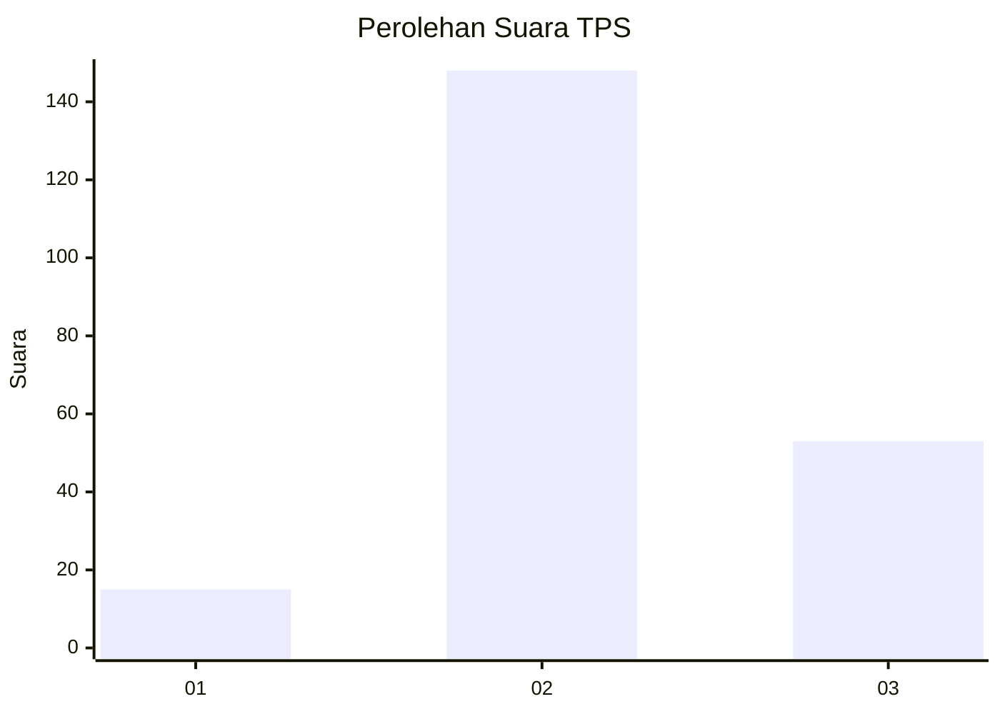
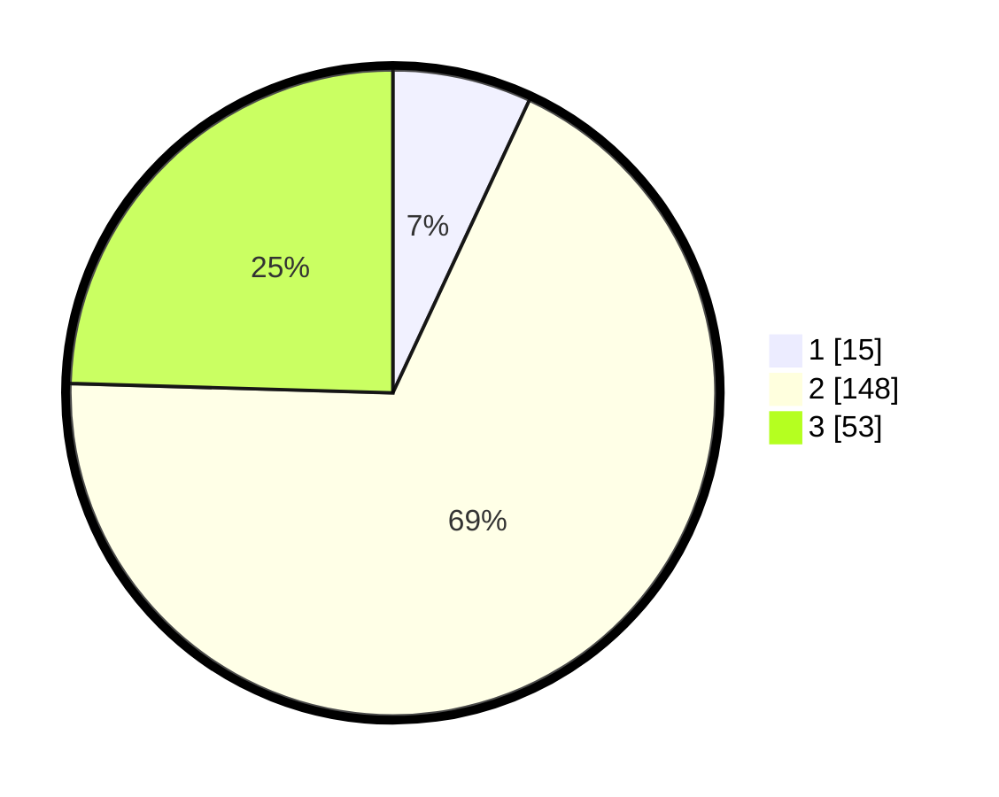

# Hasil

## Grafik

## Tabel

| No. | Nama Paslon    | Suara | Suara (raw) | Persentase |
|:--- |:-------------- | -----:| -----------:| ----------:|
| 1   | ANIES MUHAIMIN | 15    | [15][p-1]   | 6,94       |
| 2   | PRABOWO GIBRAN | 148   | [148][p-2]  | 68,52      |
| 3   | GANJAR MAHFUD  | 53    | [53][p-3]   | 24,54      |

[p-1]: https://github.com/gigit-pemilu/pemilu-2024-12-sumatera-utara/blob/main/pilpres/hitung-suara/sub/12-sumatera-utara/sub/06-karo/sub/12-simpang-empat/sub/2006-tigapancur/sub/002-tps/sub/paslon-1.txt
[p-2]: https://github.com/gigit-pemilu/pemilu-2024-12-sumatera-utara/blob/main/pilpres/hitung-suara/sub/12-sumatera-utara/sub/06-karo/sub/12-simpang-empat/sub/2006-tigapancur/sub/002-tps/sub/paslon-2.txt
[p-3]: https://github.com/gigit-pemilu/pemilu-2024-12-sumatera-utara/blob/main/pilpres/hitung-suara/sub/12-sumatera-utara/sub/06-karo/sub/12-simpang-empat/sub/2006-tigapancur/sub/002-tps/sub/paslon-3.txt

## Foto C Plano

https://sirekap-obj-formc.kpu.go.id/9bd1/pemilu/ppwp/12/06/12/20/06/1206122006002-20240214-224333--dd6b144b-fde1-4a22-b360-d6e0a93b10c3.jpg

https://sirekap-obj-formc.kpu.go.id/9bd1/pemilu/ppwp/12/06/12/20/06/1206122006002-20240214-193954--00e75473-20ef-4462-971c-6346bb0a2a2b.jpg

https://sirekap-obj-formc.kpu.go.id/9bd1/pemilu/ppwp/12/06/12/20/06/1206122006002-20240214-194012--42ff2139-a183-463e-9e9b-e37700636bef.jpg

## Metadata

| Key        | Value               |
| ---------- | ------------------- |
| Time Stamp | 2024-02-15 12:00:28 |

