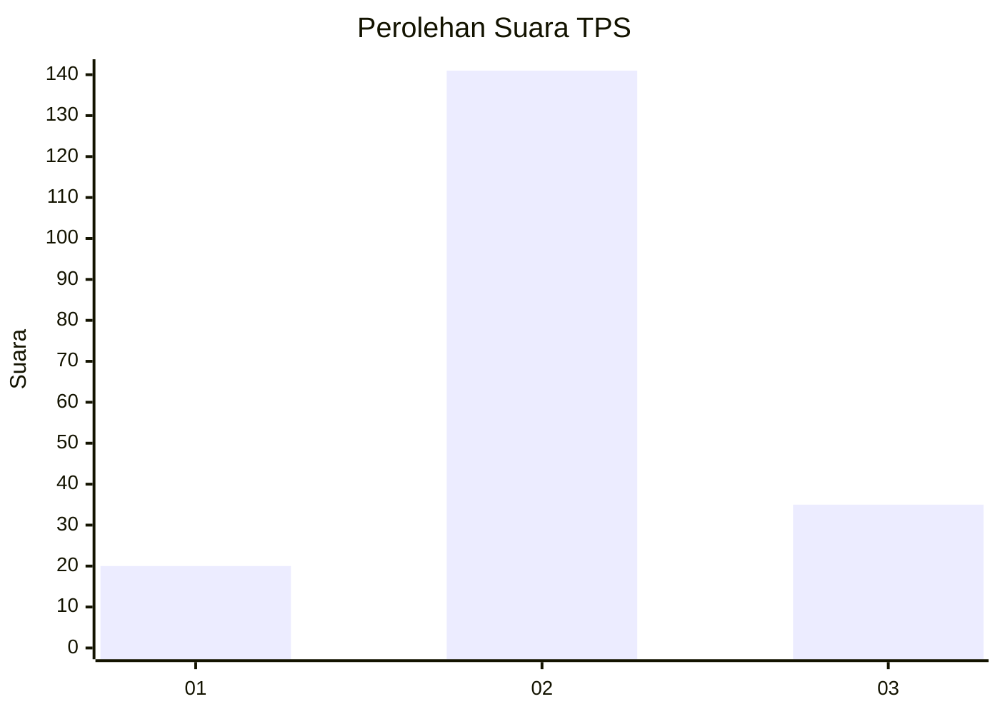
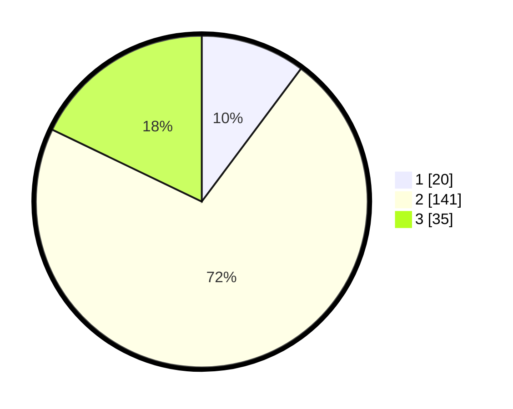

# Hasil

## Grafik

## Tabel

| No. | Nama Paslon    | Suara | Suara (raw) | Persentase |
|:--- |:-------------- | -----:| -----------:| ----------:|
| 1   | ANIES MUHAIMIN | 20    | [20][p-1]   | 10,20      |
| 2   | PRABOWO GIBRAN | 141   | [141][p-2]  | 71,94      |
| 3   | GANJAR MAHFUD  | 35    | [35][p-3]   | 17,86      |

[p-1]: https://github.com/gigit-pemilu/pemilu-2024/blob/main/pilpres/hitung-suara/sub/12-sumatera-utara/sub/06-karo/sub/12-simpang-empat/sub/2014-ndokumsiroga/sub/001-tps/sub/paslon-1.txt
[p-2]: https://github.com/gigit-pemilu/pemilu-2024/blob/main/pilpres/hitung-suara/sub/12-sumatera-utara/sub/06-karo/sub/12-simpang-empat/sub/2014-ndokumsiroga/sub/001-tps/sub/paslon-2.txt
[p-3]: https://github.com/gigit-pemilu/pemilu-2024/blob/main/pilpres/hitung-suara/sub/12-sumatera-utara/sub/06-karo/sub/12-simpang-empat/sub/2014-ndokumsiroga/sub/001-tps/sub/paslon-3.txt

## Foto C Plano

https://sirekap-obj-formc.kpu.go.id/cfa4/pemilu/ppwp/12/06/12/20/14/1206122014001-20240214-160106--97d71818-fc2d-4a32-bd34-8fa50c030c81.jpg

https://sirekap-obj-formc.kpu.go.id/cfa4/pemilu/ppwp/12/06/12/20/14/1206122014001-20240214-160102--59838f88-c2fb-4461-985a-86db4c463395.jpg

https://sirekap-obj-formc.kpu.go.id/cfa4/pemilu/ppwp/12/06/12/20/14/1206122014001-20240214-160055--8c163af8-0a8c-4488-b504-5737aa84cc56.jpg

## Metadata

| Key        | Value               |
| ---------- | ------------------- |
| Time Stamp | 2024-02-15 23:29:50 |

