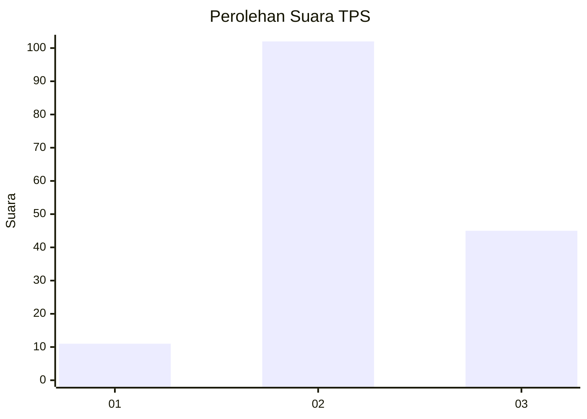
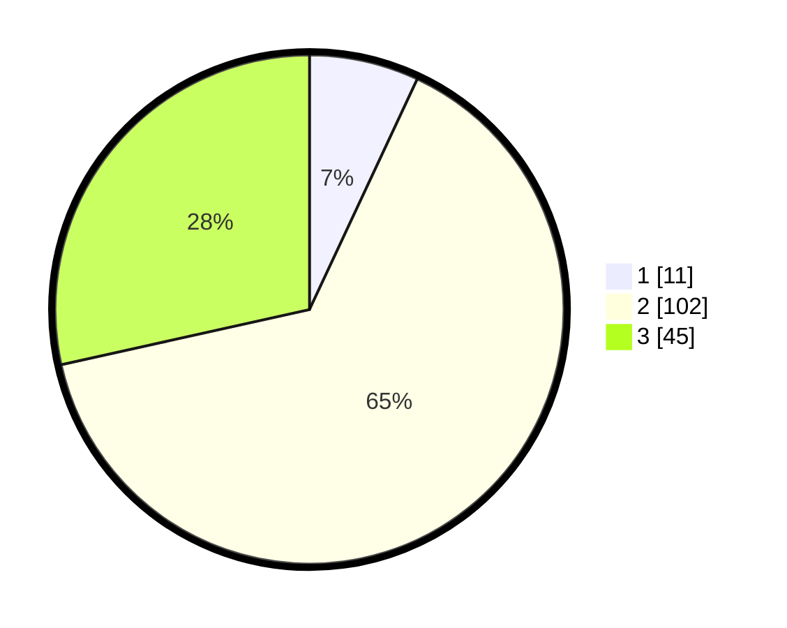

# Hasil

## Grafik

## Tabel

| No. | Nama Paslon    | Suara | Suara (raw) | Persentase |
|:--- |:-------------- | -----:| -----------:| ----------:|
| 1   | ANIES MUHAIMIN | 11    | [11][p-1]   | 6,96       |
| 2   | PRABOWO GIBRAN | 102   | [102][p-2]  | 64,56      |
| 3   | GANJAR MAHFUD  | 45    | [45][p-3]   | 28,48      |

[p-1]: https://github.com/gigit-pemilu/pemilu-2024/blob/main/pilpres/hitung-suara/sub/12-sumatera-utara/sub/06-karo/sub/13-kutabuluh/sub/2002-kutabuluh-gugung/sub/002-tps/sub/paslon-1.txt
[p-2]: https://github.com/gigit-pemilu/pemilu-2024/blob/main/pilpres/hitung-suara/sub/12-sumatera-utara/sub/06-karo/sub/13-kutabuluh/sub/2002-kutabuluh-gugung/sub/002-tps/sub/paslon-2.txt
[p-3]: https://github.com/gigit-pemilu/pemilu-2024/blob/main/pilpres/hitung-suara/sub/12-sumatera-utara/sub/06-karo/sub/13-kutabuluh/sub/2002-kutabuluh-gugung/sub/002-tps/sub/paslon-3.txt

## Foto C Plano

https://sirekap-obj-formc.kpu.go.id/b674/pemilu/ppwp/12/06/13/20/02/1206132002002-20240217-125556--cc7b72ae-1e99-4f83-86df-81181019881b.jpg

https://sirekap-obj-formc.kpu.go.id/b674/pemilu/ppwp/12/06/13/20/02/1206132002002-20240217-125625--8c8564e7-8fa1-49a6-ad14-9fe1d6fb80df.jpg

https://sirekap-obj-formc.kpu.go.id/b674/pemilu/ppwp/12/06/13/20/02/1206132002002-20240217-125644--bef4bfc4-b19d-4d1f-9f87-cd15e14addf4.jpg

## Metadata

| Key        | Value               |
| ---------- | ------------------- |
| Time Stamp | 2024-02-25 21:00:00 |

