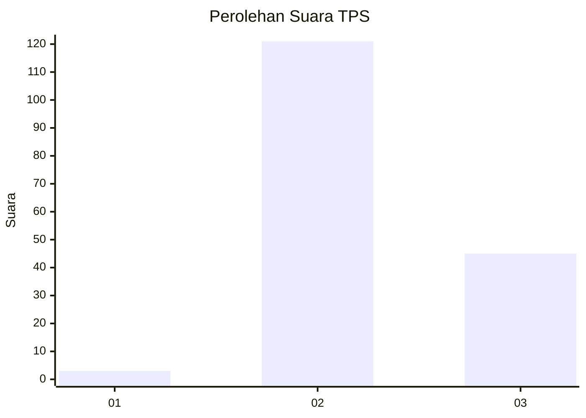
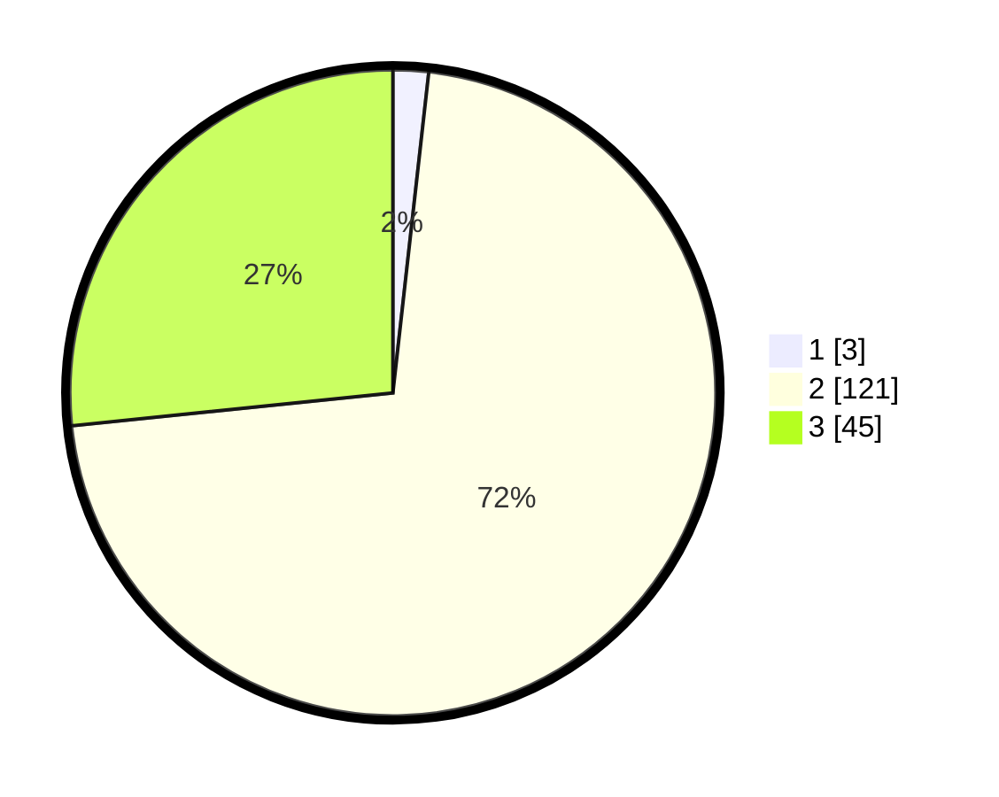

# Hasil

## Grafik

## Tabel

| No. | Nama Paslon    | Suara | Suara (raw) | Persentase |
|:--- |:-------------- | -----:| -----------:| ----------:|
| 1   | ANIES MUHAIMIN | 3     | [3][p-1]    | 1,78       |
| 2   | PRABOWO GIBRAN | 121   | [121][p-2]  | 71,60      |
| 3   | GANJAR MAHFUD  | 45    | [45][p-3]   | 26,63      |

[p-1]: https://github.com/gigit-pemilu/pemilu-2024-12-sumatera-utara/blob/main/pilpres/hitung-suara/sub/12-sumatera-utara/sub/06-karo/sub/14-dolat-rayat/sub/2002-ujung-sampun/sub/001-tps/sub/paslon-1.txt
[p-2]: https://github.com/gigit-pemilu/pemilu-2024-12-sumatera-utara/blob/main/pilpres/hitung-suara/sub/12-sumatera-utara/sub/06-karo/sub/14-dolat-rayat/sub/2002-ujung-sampun/sub/001-tps/sub/paslon-2.txt
[p-3]: https://github.com/gigit-pemilu/pemilu-2024-12-sumatera-utara/blob/main/pilpres/hitung-suara/sub/12-sumatera-utara/sub/06-karo/sub/14-dolat-rayat/sub/2002-ujung-sampun/sub/001-tps/sub/paslon-3.txt

## Foto C Plano

https://sirekap-obj-formc.kpu.go.id/6510/pemilu/ppwp/12/06/14/20/02/1206142002001-20240214-202721--b1621884-8d3f-4f29-8a77-0c1f67e4f76d.jpg

https://sirekap-obj-formc.kpu.go.id/6510/pemilu/ppwp/12/06/14/20/02/1206142002001-20240214-211357--ebacdcc8-de5b-4f51-a621-f2a2881e065e.jpg

https://sirekap-obj-formc.kpu.go.id/6510/pemilu/ppwp/12/06/14/20/02/1206142002001-20240214-202701--d7d1cc67-0f2a-416b-8df0-d8710c7da75e.jpg

## Metadata

| Key        | Value               |
| ---------- | ------------------- |
| Time Stamp | 2024-02-25 16:00:00 |

