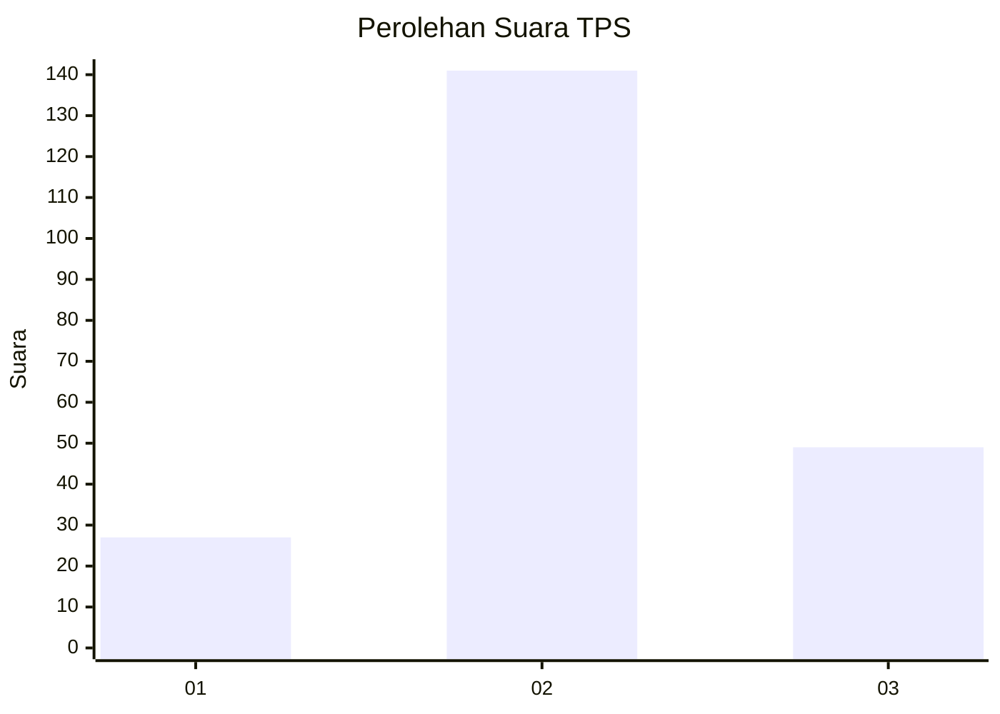
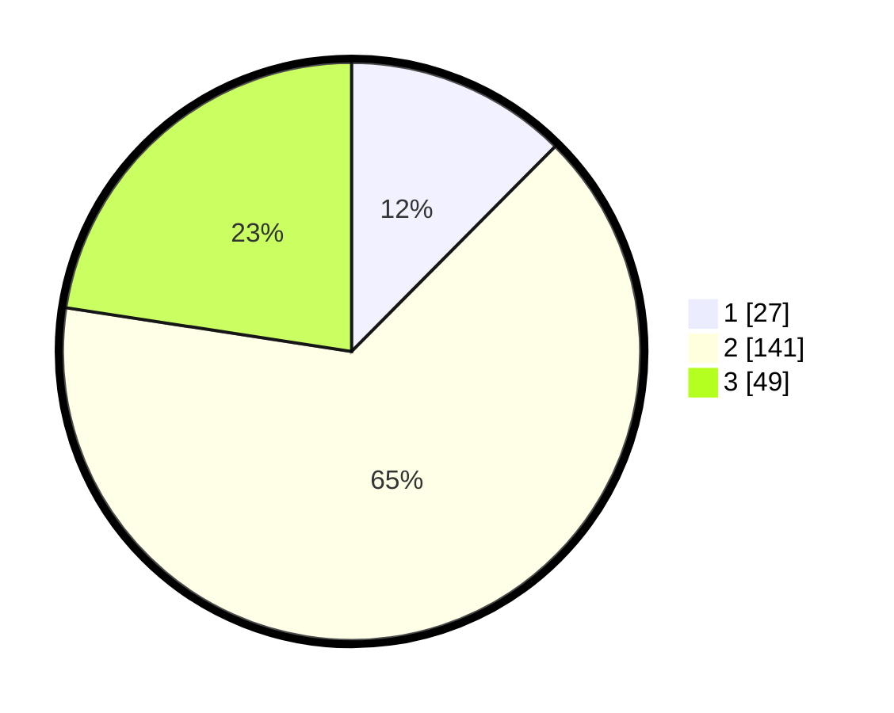

# Hasil

## Grafik

## Tabel

| No. | Nama Paslon    | Suara | Suara (raw) | Persentase |
|:--- |:-------------- | -----:| -----------:| ----------:|
| 1   | ANIES MUHAIMIN | 27    | [27][p-1]   | 12,44      |
| 2   | PRABOWO GIBRAN | 141   | [141][p-2]  | 64,98      |
| 3   | GANJAR MAHFUD  | 49    | [49][p-3]   | 22,58      |

[p-1]: https://github.com/gigit-pemilu/pemilu-2024-12-sumatera-utara/blob/main/pilpres/hitung-suara/sub/12-sumatera-utara/sub/06-karo/sub/15-merdeka/sub/2001-cinta-rakyat/sub/008-tps/sub/paslon-1.txt
[p-2]: https://github.com/gigit-pemilu/pemilu-2024-12-sumatera-utara/blob/main/pilpres/hitung-suara/sub/12-sumatera-utara/sub/06-karo/sub/15-merdeka/sub/2001-cinta-rakyat/sub/008-tps/sub/paslon-2.txt
[p-3]: https://github.com/gigit-pemilu/pemilu-2024-12-sumatera-utara/blob/main/pilpres/hitung-suara/sub/12-sumatera-utara/sub/06-karo/sub/15-merdeka/sub/2001-cinta-rakyat/sub/008-tps/sub/paslon-3.txt

## Foto C Plano

https://sirekap-obj-formc.kpu.go.id/c261/pemilu/ppwp/12/06/15/20/01/1206152001008-20240214-155721--02806283-8477-4de4-9b79-139e872e176b.jpg

https://sirekap-obj-formc.kpu.go.id/c261/pemilu/ppwp/12/06/15/20/01/1206152001008-20240214-155559--7a181478-f147-494e-81ab-e92514354e3d.jpg

https://sirekap-obj-formc.kpu.go.id/c261/pemilu/ppwp/12/06/15/20/01/1206152001008-20240214-155749--917d2f00-c4ae-40d3-8840-7d12bd4e11bf.jpg

## Metadata

| Key        | Value               |
| ---------- | ------------------- |
| Time Stamp | 2024-02-16 01:00:27 |

