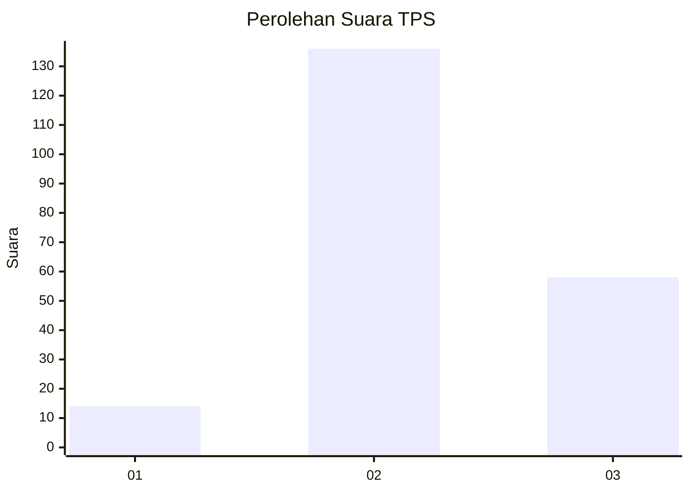

# Hasil

## Grafik

## Tabel

| No. | Nama Paslon    | Suara | Suara (raw) | Persentase |
|:--- |:-------------- | -----:| -----------:| ----------:|
| 1   | ANIES MUHAIMIN | 14    | [14][p-1]   | 6,73       |
| 2   | PRABOWO GIBRAN | 136   | [136][p-2]  | 65,38      |
| 3   | GANJAR MAHFUD  | 58    | [58][p-3]   | 27,88      |

[p-1]: https://github.com/gigit-pemilu/pemilu-2024-12-sumatera-utara/blob/main/pilpres/hitung-suara/sub/12-sumatera-utara/sub/06-karo/sub/16-naman-teran/sub/2002-kutagugung/sub/003-tps/sub/paslon-1.txt
[p-2]: https://github.com/gigit-pemilu/pemilu-2024-12-sumatera-utara/blob/main/pilpres/hitung-suara/sub/12-sumatera-utara/sub/06-karo/sub/16-naman-teran/sub/2002-kutagugung/sub/003-tps/sub/paslon-2.txt
[p-3]: https://github.com/gigit-pemilu/pemilu-2024-12-sumatera-utara/blob/main/pilpres/hitung-suara/sub/12-sumatera-utara/sub/06-karo/sub/16-naman-teran/sub/2002-kutagugung/sub/003-tps/sub/paslon-3.txt

## Foto C Plano

https://sirekap-obj-formc.kpu.go.id/8641/pemilu/ppwp/12/06/16/20/02/1206162002003-20240215-015614--6aca8a65-6291-40eb-9644-c8f96bfb3dd6.jpg

https://sirekap-obj-formc.kpu.go.id/8641/pemilu/ppwp/12/06/16/20/02/1206162002003-20240215-015834--47f35a6c-6d78-48e6-bd38-30f0b771b75c.jpg

https://sirekap-obj-formc.kpu.go.id/8641/pemilu/ppwp/12/06/16/20/02/1206162002003-20240215-020021--f34a679b-3ab0-45a9-a428-75dfd9649f57.jpg

## Metadata

| Key        | Value               |
| ---------- | ------------------- |
| Time Stamp | 2024-02-25 18:00:00 |

