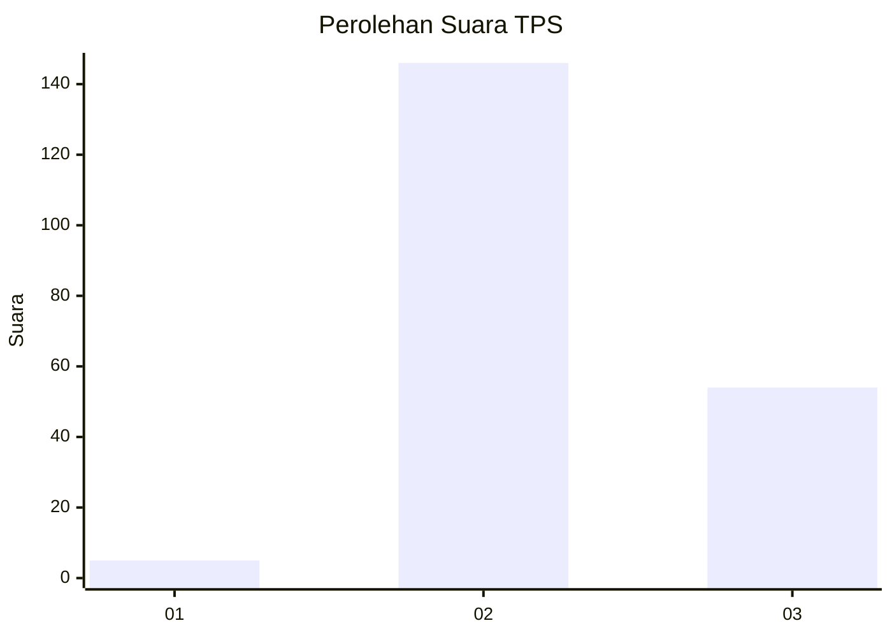
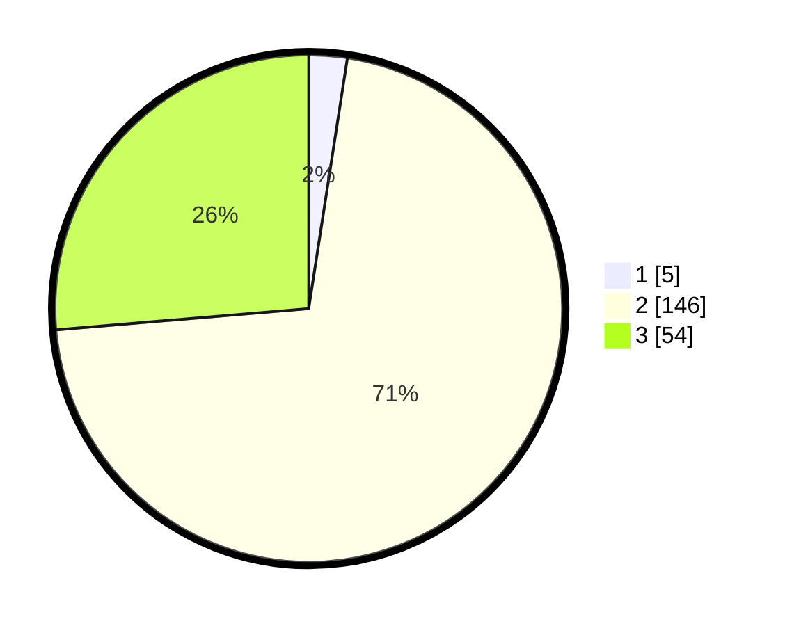

# Hasil

## Grafik

## Tabel

| No. | Nama Paslon    | Suara | Suara (raw) | Persentase |
|:--- |:-------------- | -----:| -----------:| ----------:|
| 1   | ANIES MUHAIMIN | 5     | [5][p-1]    | 2,44       |
| 2   | PRABOWO GIBRAN | 146   | [146][p-2]  | 71,22      |
| 3   | GANJAR MAHFUD  | 54    | [54][p-3]   | 26,34      |

[p-1]: https://github.com/gigit-pemilu/pemilu-2024/blob/main/pilpres/hitung-suara/sub/12-sumatera-utara/sub/06-karo/sub/17-tiganderket/sub/2002-mardingding/sub/001-tps/sub/paslon-1.txt
[p-2]: https://github.com/gigit-pemilu/pemilu-2024/blob/main/pilpres/hitung-suara/sub/12-sumatera-utara/sub/06-karo/sub/17-tiganderket/sub/2002-mardingding/sub/001-tps/sub/paslon-2.txt
[p-3]: https://github.com/gigit-pemilu/pemilu-2024/blob/main/pilpres/hitung-suara/sub/12-sumatera-utara/sub/06-karo/sub/17-tiganderket/sub/2002-mardingding/sub/001-tps/sub/paslon-3.txt

## Foto C Plano

https://sirekap-obj-formc.kpu.go.id/70eb/pemilu/ppwp/12/06/17/20/02/1206172002001-20240215-010916--f570ac6e-b48d-42dc-afe5-922664e693de.jpg

https://sirekap-obj-formc.kpu.go.id/70eb/pemilu/ppwp/12/06/17/20/02/1206172002001-20240215-011016--f2e22793-1c3f-43e5-ac30-42bd818d15f0.jpg

https://sirekap-obj-formc.kpu.go.id/70eb/pemilu/ppwp/12/06/17/20/02/1206172002001-20240215-011134--308f0a37-61e6-4118-8a84-ee261fc2d457.jpg

## Metadata

| Key        | Value               |
| ---------- | ------------------- |
| Time Stamp | 2024-02-15 15:00:29 |

