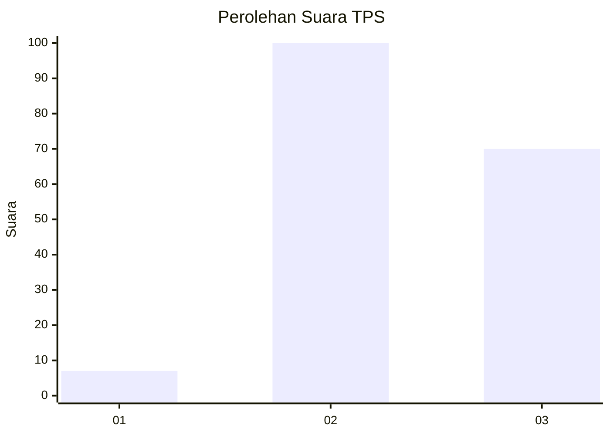
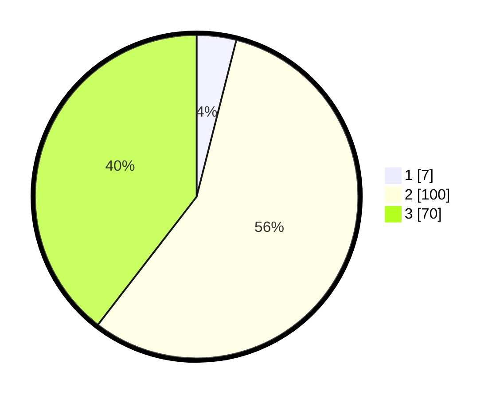

# Hasil

## Grafik

## Tabel

| No. | Nama Paslon    | Suara | Suara (raw) | Persentase |
|:--- |:-------------- | -----:| -----------:| ----------:|
| 1   | ANIES MUHAIMIN | 7     | [7][p-1]    | 3,95       |
| 2   | PRABOWO GIBRAN | 100   | [100][p-2]  | 56,50      |
| 3   | GANJAR MAHFUD  | 70    | [70][p-3]   | 39,55      |

[p-1]: https://github.com/gigit-pemilu/pemilu-2024-12-sumatera-utara/blob/main/pilpres/hitung-suara/sub/12-sumatera-utara/sub/06-karo/sub/17-tiganderket/sub/2003-kutagaluh/sub/001-tps/sub/paslon-1.txt
[p-2]: https://github.com/gigit-pemilu/pemilu-2024-12-sumatera-utara/blob/main/pilpres/hitung-suara/sub/12-sumatera-utara/sub/06-karo/sub/17-tiganderket/sub/2003-kutagaluh/sub/001-tps/sub/paslon-2.txt
[p-3]: https://github.com/gigit-pemilu/pemilu-2024-12-sumatera-utara/blob/main/pilpres/hitung-suara/sub/12-sumatera-utara/sub/06-karo/sub/17-tiganderket/sub/2003-kutagaluh/sub/001-tps/sub/paslon-3.txt

## Foto C Plano

https://sirekap-obj-formc.kpu.go.id/7eda/pemilu/ppwp/12/06/17/20/03/1206172003001-20240215-032541--6552aff1-50ac-452f-ab70-0f2c4e9bacd5.jpg

https://sirekap-obj-formc.kpu.go.id/7eda/pemilu/ppwp/12/06/17/20/03/1206172003001-20240215-032753--81df30d1-2e93-4475-8997-57d46af2ac9e.jpg

https://sirekap-obj-formc.kpu.go.id/7eda/pemilu/ppwp/12/06/17/20/03/1206172003001-20240215-032925--00ed58f9-3536-4f80-af15-beb61202af86.jpg

## Metadata

| Key        | Value               |
| ---------- | ------------------- |
| Time Stamp | 2024-02-16 04:30:27 |

