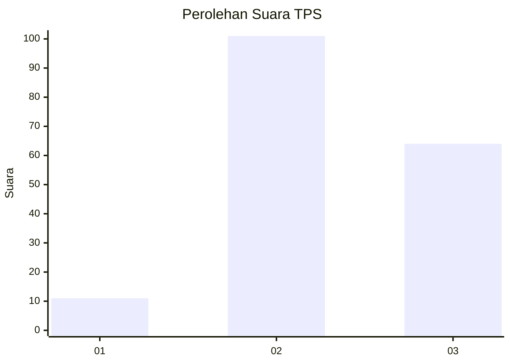
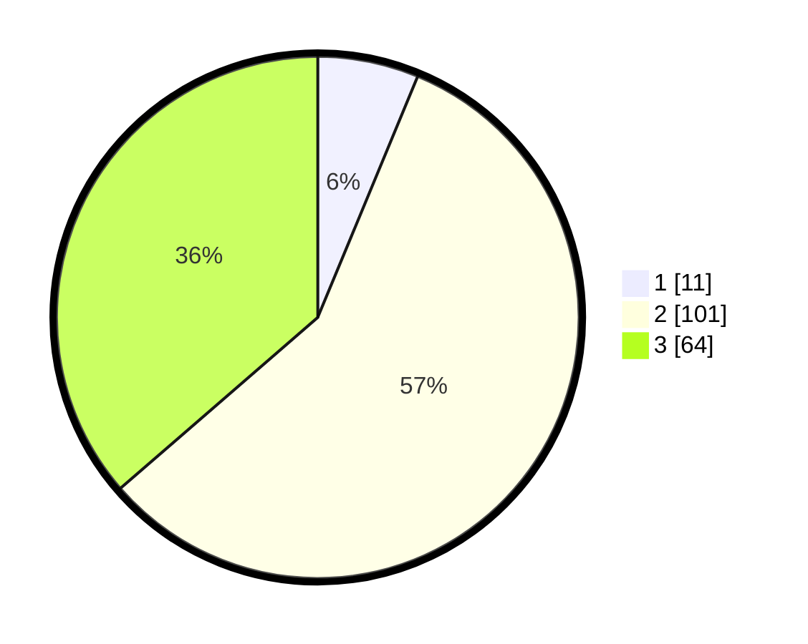

# Hasil

## Grafik

## Tabel

| No. | Nama Paslon    | Suara | Suara (raw) | Persentase |
|:--- |:-------------- | -----:| -----------:| ----------:|
| 1   | ANIES MUHAIMIN | 11    | [11][p-1]   | 6,25       |
| 2   | PRABOWO GIBRAN | 101   | [101][p-2]  | 57,39      |
| 3   | GANJAR MAHFUD  | 64    | [64][p-3]   | 36,36      |

[p-1]: https://github.com/gigit-pemilu/pemilu-2024-12-sumatera-utara/blob/main/pilpres/hitung-suara/sub/12-sumatera-utara/sub/06-karo/sub/17-tiganderket/sub/2003-kutagaluh/sub/002-tps/sub/paslon-1.txt
[p-2]: https://github.com/gigit-pemilu/pemilu-2024-12-sumatera-utara/blob/main/pilpres/hitung-suara/sub/12-sumatera-utara/sub/06-karo/sub/17-tiganderket/sub/2003-kutagaluh/sub/002-tps/sub/paslon-2.txt
[p-3]: https://github.com/gigit-pemilu/pemilu-2024-12-sumatera-utara/blob/main/pilpres/hitung-suara/sub/12-sumatera-utara/sub/06-karo/sub/17-tiganderket/sub/2003-kutagaluh/sub/002-tps/sub/paslon-3.txt

## Foto C Plano

https://sirekap-obj-formc.kpu.go.id/4311/pemilu/ppwp/12/06/17/20/03/1206172003002-20240215-033607--fcb960ea-4c58-4f61-a237-4206b54d1d78.jpg

https://sirekap-obj-formc.kpu.go.id/4311/pemilu/ppwp/12/06/17/20/03/1206172003002-20240215-034044--24bc684c-f88b-409c-8142-63230c4fb5db.jpg

https://sirekap-obj-formc.kpu.go.id/4311/pemilu/ppwp/12/06/17/20/03/1206172003002-20240215-035001--c2b798b2-b499-4406-8a7d-c5862de051c9.jpg

## Metadata

| Key        | Value               |
| ---------- | ------------------- |
| Time Stamp | 2024-02-25 15:00:00 |

