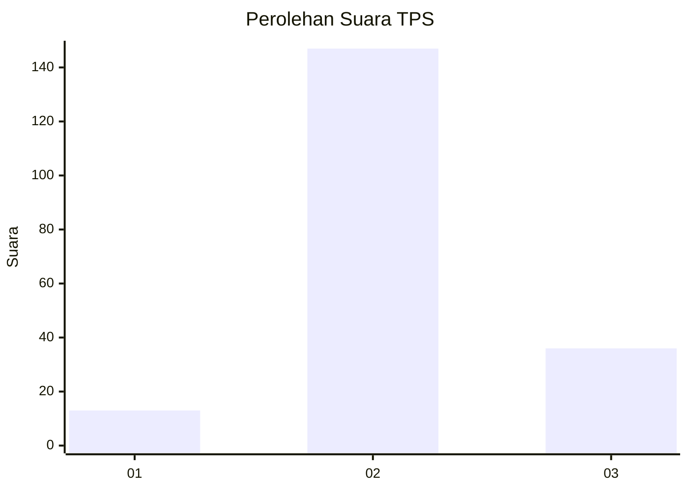
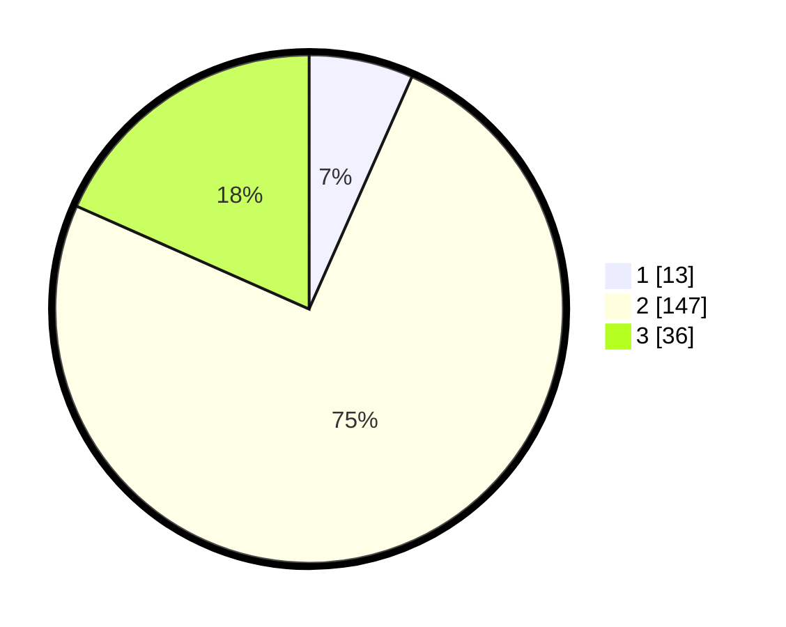

# Hasil

## Grafik

## Tabel

| No. | Nama Paslon    | Suara | Suara (raw) | Persentase |
|:--- |:-------------- | -----:| -----------:| ----------:|
| 1   | ANIES MUHAIMIN | 13    | [13][p-1]   | 6,63       |
| 2   | PRABOWO GIBRAN | 147   | [147][p-2]  | 75,00      |
| 3   | GANJAR MAHFUD  | 36    | [36][p-3]   | 18,37      |

[p-1]: https://github.com/gigit-pemilu/pemilu-2024/blob/main/pilpres/hitung-suara/sub/12-sumatera-utara/sub/06-karo/sub/17-tiganderket/sub/2003-kutagaluh/sub/003-tps/sub/paslon-1.txt
[p-2]: https://github.com/gigit-pemilu/pemilu-2024/blob/main/pilpres/hitung-suara/sub/12-sumatera-utara/sub/06-karo/sub/17-tiganderket/sub/2003-kutagaluh/sub/003-tps/sub/paslon-2.txt
[p-3]: https://github.com/gigit-pemilu/pemilu-2024/blob/main/pilpres/hitung-suara/sub/12-sumatera-utara/sub/06-karo/sub/17-tiganderket/sub/2003-kutagaluh/sub/003-tps/sub/paslon-3.txt

## Foto C Plano

https://sirekap-obj-formc.kpu.go.id/f45a/pemilu/ppwp/12/06/17/20/03/1206172003003-20240215-035046--b10b8666-26f5-4d69-b70c-402f0d28a2a2.jpg

https://sirekap-obj-formc.kpu.go.id/f45a/pemilu/ppwp/12/06/17/20/03/1206172003003-20240215-035525--2aab823a-a8cc-4162-a8e8-cb3b7ae184b2.jpg

https://sirekap-obj-formc.kpu.go.id/f45a/pemilu/ppwp/12/06/17/20/03/1206172003003-20240215-043323--64b191e3-0c06-44f2-a987-9e1312a03893.jpg

## Metadata

| Key        | Value               |
| ---------- | ------------------- |
| Time Stamp | 2024-02-24 22:31:28 |

