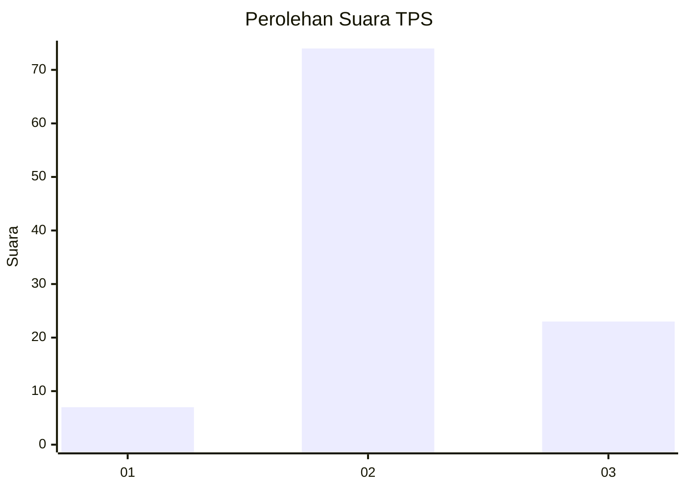
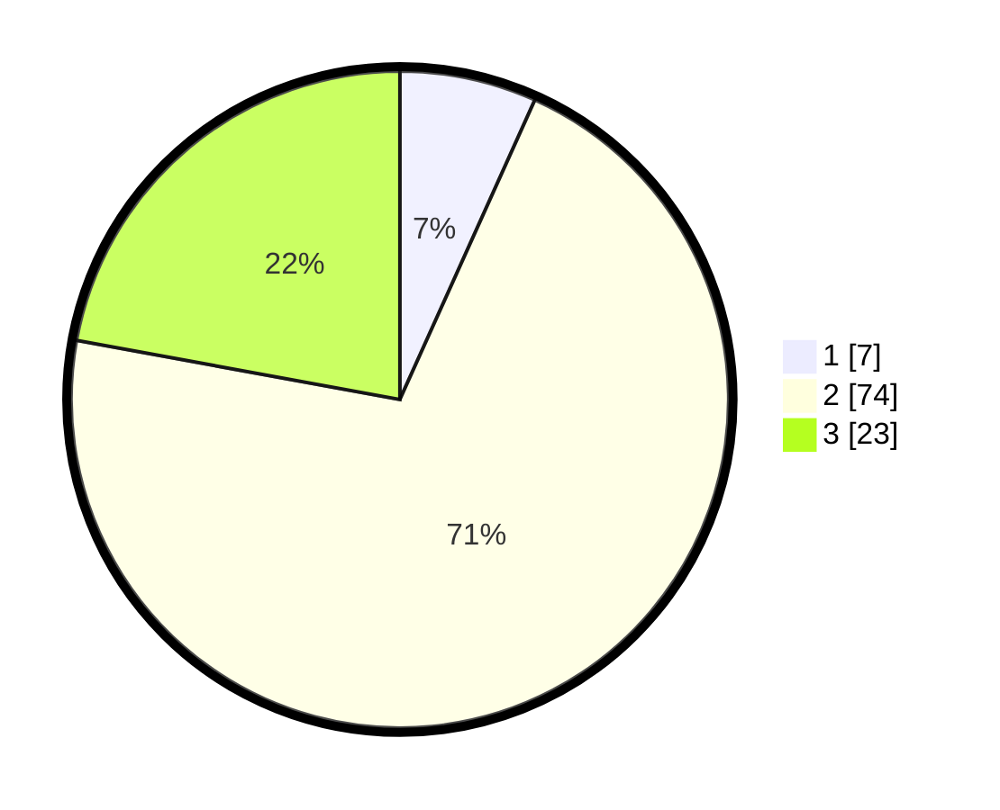

# Hasil

## Grafik

## Tabel

| No. | Nama Paslon    | Suara | Suara (raw) | Persentase |
|:--- |:-------------- | -----:| -----------:| ----------:|
| 1   | ANIES MUHAIMIN | 7     | [7][p-1]    | 6,73       |
| 2   | PRABOWO GIBRAN | 74    | [74][p-2]   | 71,15      |
| 3   | GANJAR MAHFUD  | 23    | [23][p-3]   | 22,12      |

[p-1]: https://github.com/gigit-pemilu/pemilu-2024/blob/main/pilpres/hitung-suara/sub/12-sumatera-utara/sub/07-deli-serdang/sub/01-gunung-meriah/sub/2006-bintang-meriah/sub/001-tps/sub/paslon-1.txt
[p-2]: https://github.com/gigit-pemilu/pemilu-2024/blob/main/pilpres/hitung-suara/sub/12-sumatera-utara/sub/07-deli-serdang/sub/01-gunung-meriah/sub/2006-bintang-meriah/sub/001-tps/sub/paslon-2.txt
[p-3]: https://github.com/gigit-pemilu/pemilu-2024/blob/main/pilpres/hitung-suara/sub/12-sumatera-utara/sub/07-deli-serdang/sub/01-gunung-meriah/sub/2006-bintang-meriah/sub/001-tps/sub/paslon-3.txt

## Foto C Plano

https://sirekap-obj-formc.kpu.go.id/cdbc/pemilu/ppwp/12/07/01/20/06/1207012006001-20240219-155946--cd6ef3fb-d070-42de-912a-6267e1340abc.jpg

https://sirekap-obj-formc.kpu.go.id/cdbc/pemilu/ppwp/12/07/01/20/06/1207012006001-20240214-213333--1d0c44fe-e1aa-4a88-b10c-56ad674fa54d.jpg

https://sirekap-obj-formc.kpu.go.id/cdbc/pemilu/ppwp/12/07/01/20/06/1207012006001-20240214-214348--012f689f-5052-48f8-be1f-47d63e38bd16.jpg

## Metadata

| Key        | Value               |
| ---------- | ------------------- |
| Time Stamp | 2024-02-19 16:00:00 |

