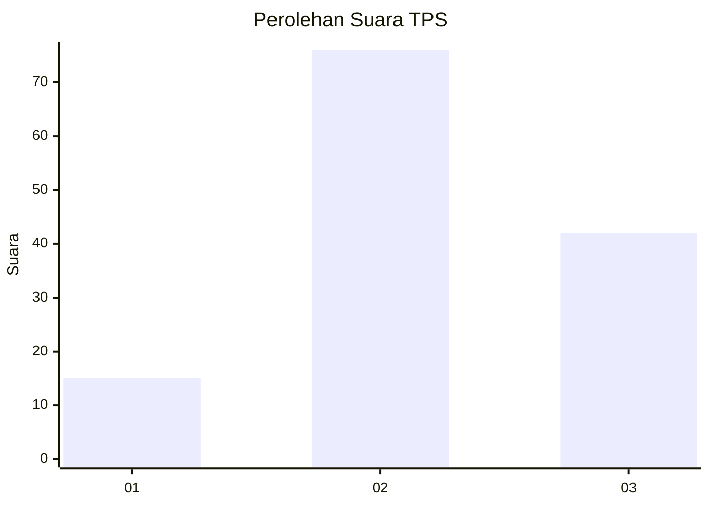
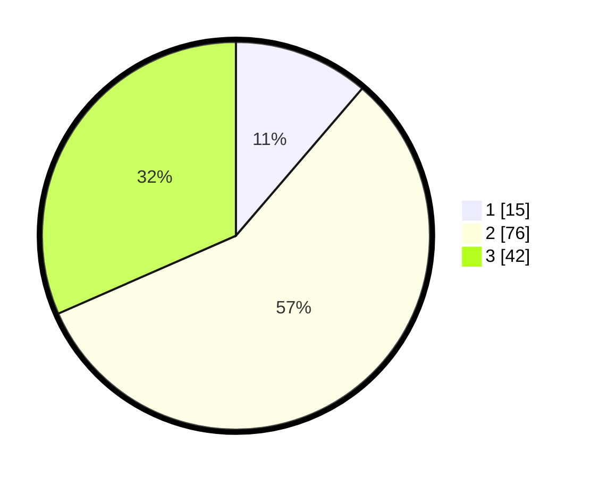

# Hasil

## Grafik

## Tabel

| No. | Nama Paslon    | Suara | Suara (raw) | Persentase |
|:--- |:-------------- | -----:| -----------:| ----------:|
| 1   | ANIES MUHAIMIN | 15    | [15][p-1]   | 11,28      |
| 2   | PRABOWO GIBRAN | 76    | [76][p-2]   | 57,14      |
| 3   | GANJAR MAHFUD  | 42    | [42][p-3]   | 31,58      |

[p-1]: https://github.com/gigit-pemilu/pemilu-2024/blob/main/pilpres/hitung-suara/sub/12-sumatera-utara/sub/07-deli-serdang/sub/02-tanjung-morawa/sub/1026-pekan-tanjung-morawa/sub/001-tps/sub/paslon-1.txt
[p-2]: https://github.com/gigit-pemilu/pemilu-2024/blob/main/pilpres/hitung-suara/sub/12-sumatera-utara/sub/07-deli-serdang/sub/02-tanjung-morawa/sub/1026-pekan-tanjung-morawa/sub/001-tps/sub/paslon-2.txt
[p-3]: https://github.com/gigit-pemilu/pemilu-2024/blob/main/pilpres/hitung-suara/sub/12-sumatera-utara/sub/07-deli-serdang/sub/02-tanjung-morawa/sub/1026-pekan-tanjung-morawa/sub/001-tps/sub/paslon-3.txt

## Foto C Plano

https://sirekap-obj-formc.kpu.go.id/7939/pemilu/ppwp/12/07/02/10/26/1207021026001-20240214-231332--3b3ce4fb-1079-4050-aa7a-5c284c3dae3d.jpg

https://sirekap-obj-formc.kpu.go.id/7939/pemilu/ppwp/12/07/02/10/26/1207021026001-20240214-231528--1a5fc78f-4c87-4780-9493-a508d29d8e3e.jpg

https://sirekap-obj-formc.kpu.go.id/7939/pemilu/ppwp/12/07/02/10/26/1207021026001-20240214-231726--700acacd-753e-46c4-8ca7-d3ce3c47ac3f.jpg

## Metadata

| Key        | Value               |
| ---------- | ------------------- |
| Time Stamp | 2024-02-15 22:00:27 |

