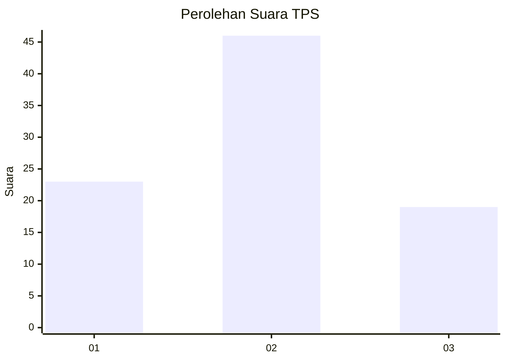
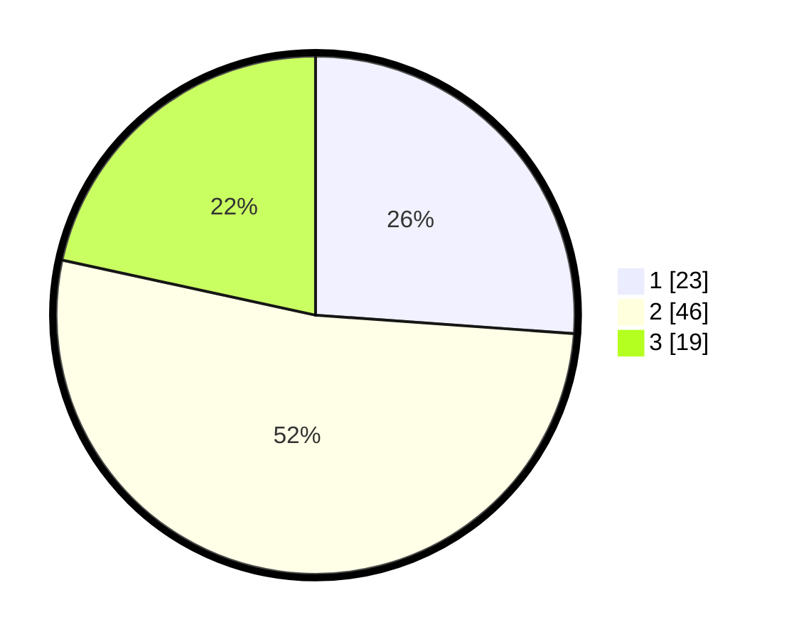

# Hasil

## Grafik

## Tabel

| No. | Nama Paslon    | Suara | Suara (raw) | Persentase |
|:--- |:-------------- | -----:| -----------:| ----------:|
| 1   | ANIES MUHAIMIN | 23    | [23][p-1]   | 26,14      |
| 2   | PRABOWO GIBRAN | 46    | [46][p-2]   | 52,27      |
| 3   | GANJAR MAHFUD  | 19    | [19][p-3]   | 21,59      |

[p-1]: https://github.com/gigit-pemilu/pemilu-2024-12-sumatera-utara/blob/main/pilpres/hitung-suara/sub/12-sumatera-utara/sub/07-deli-serdang/sub/02-tanjung-morawa/sub/1026-pekan-tanjung-morawa/sub/023-tps/sub/paslon-1.txt
[p-2]: https://github.com/gigit-pemilu/pemilu-2024-12-sumatera-utara/blob/main/pilpres/hitung-suara/sub/12-sumatera-utara/sub/07-deli-serdang/sub/02-tanjung-morawa/sub/1026-pekan-tanjung-morawa/sub/023-tps/sub/paslon-2.txt
[p-3]: https://github.com/gigit-pemilu/pemilu-2024-12-sumatera-utara/blob/main/pilpres/hitung-suara/sub/12-sumatera-utara/sub/07-deli-serdang/sub/02-tanjung-morawa/sub/1026-pekan-tanjung-morawa/sub/023-tps/sub/paslon-3.txt

## Foto C Plano

https://sirekap-obj-formc.kpu.go.id/a739/pemilu/ppwp/12/07/02/10/26/1207021026023-20240215-023108--1335f951-5dac-48a0-9dd1-6fe30ad06c9d.jpg

https://sirekap-obj-formc.kpu.go.id/a739/pemilu/ppwp/12/07/02/10/26/1207021026023-20240215-023217--6c744c21-b2a1-4dea-98a4-ea8021fc836b.jpg

https://sirekap-obj-formc.kpu.go.id/a739/pemilu/ppwp/12/07/02/10/26/1207021026023-20240215-023415--93720599-dbfc-4ce5-8278-1817e9c89e29.jpg

## Metadata

| Key        | Value               |
| ---------- | ------------------- |
| Time Stamp | 2024-02-15 21:01:18 |

