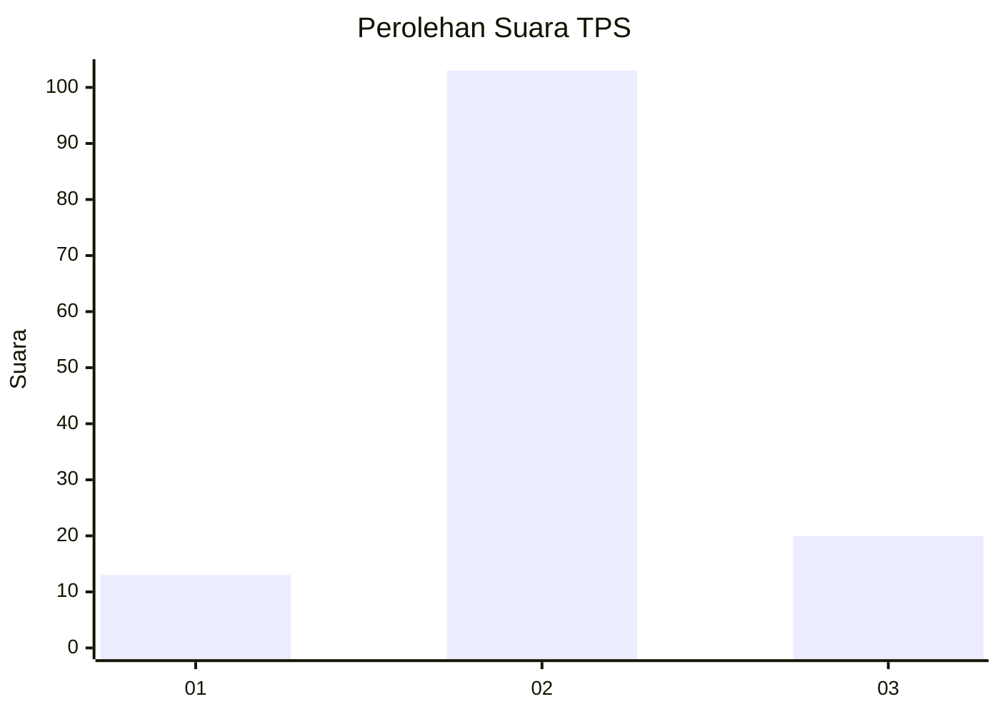

# Hasil

## Grafik

## Tabel

| No. | Nama Paslon    | Suara | Suara (raw) | Persentase |
|:--- |:-------------- | -----:| -----------:| ----------:|
| 1   | ANIES MUHAIMIN | 13    | [13][p-1]   | 9,56       |
| 2   | PRABOWO GIBRAN | 103   | [103][p-2]  | 75,74      |
| 3   | GANJAR MAHFUD  | 20    | [20][p-3]   | 14,71      |

[p-1]: https://github.com/gigit-pemilu/pemilu-2024/blob/main/pilpres/hitung-suara/sub/12-sumatera-utara/sub/07-deli-serdang/sub/02-tanjung-morawa/sub/2001-medan-senembah/sub/001-tps/sub/paslon-1.txt
[p-2]: https://github.com/gigit-pemilu/pemilu-2024/blob/main/pilpres/hitung-suara/sub/12-sumatera-utara/sub/07-deli-serdang/sub/02-tanjung-morawa/sub/2001-medan-senembah/sub/001-tps/sub/paslon-2.txt
[p-3]: https://github.com/gigit-pemilu/pemilu-2024/blob/main/pilpres/hitung-suara/sub/12-sumatera-utara/sub/07-deli-serdang/sub/02-tanjung-morawa/sub/2001-medan-senembah/sub/001-tps/sub/paslon-3.txt

## Foto C Plano

https://sirekap-obj-formc.kpu.go.id/120e/pemilu/ppwp/12/07/02/20/01/1207022001001-20240214-232002--83f016ac-bad1-458f-9a1e-f07342fe2c07.jpg

https://sirekap-obj-formc.kpu.go.id/120e/pemilu/ppwp/12/07/02/20/01/1207022001001-20240214-232343--8332dc9b-ec7e-478c-954a-8de8fd4b193f.jpg

https://sirekap-obj-formc.kpu.go.id/120e/pemilu/ppwp/12/07/02/20/01/1207022001001-20240214-232623--d1d7c3f1-16d3-46c0-9ae8-2b4680cbc5b3.jpg

## Metadata

| Key        | Value               |
| ---------- | ------------------- |
| Time Stamp | 2024-02-16 03:00:26 |

