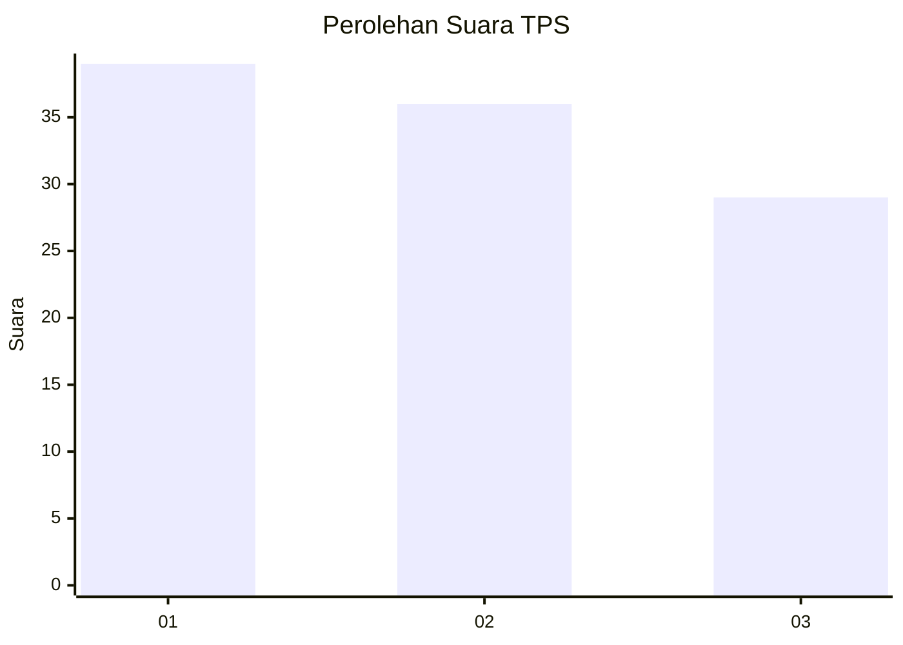
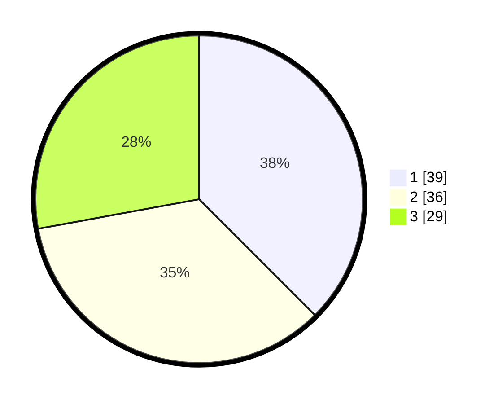

# Hasil

## Grafik

## Tabel

| No. | Nama Paslon    | Suara | Suara (raw) | Persentase |
|:--- |:-------------- | -----:| -----------:| ----------:|
| 1   | ANIES MUHAIMIN | 39    | [39][p-1]   | 37,50      |
| 2   | PRABOWO GIBRAN | 36    | [36][p-2]   | 34,62      |
| 3   | GANJAR MAHFUD  | 29    | [29][p-3]   | 27,88      |

[p-1]: https://github.com/gigit-pemilu/pemilu-2024-12-sumatera-utara/blob/main/pilpres/hitung-suara/sub/12-sumatera-utara/sub/07-deli-serdang/sub/02-tanjung-morawa/sub/2003-limau-manis/sub/062-tps/sub/paslon-1.txt
[p-2]: https://github.com/gigit-pemilu/pemilu-2024-12-sumatera-utara/blob/main/pilpres/hitung-suara/sub/12-sumatera-utara/sub/07-deli-serdang/sub/02-tanjung-morawa/sub/2003-limau-manis/sub/062-tps/sub/paslon-2.txt
[p-3]: https://github.com/gigit-pemilu/pemilu-2024-12-sumatera-utara/blob/main/pilpres/hitung-suara/sub/12-sumatera-utara/sub/07-deli-serdang/sub/02-tanjung-morawa/sub/2003-limau-manis/sub/062-tps/sub/paslon-3.txt

## Foto C Plano

https://sirekap-obj-formc.kpu.go.id/b111/pemilu/ppwp/12/07/02/20/03/1207022003062-20240214-220701--d87ddd38-ad31-4481-ad67-9b1407e790cf.jpg

https://sirekap-obj-formc.kpu.go.id/b111/pemilu/ppwp/12/07/02/20/03/1207022003062-20240214-220704--d482bc7f-ff65-4185-8732-0053299819c2.jpg

https://sirekap-obj-formc.kpu.go.id/b111/pemilu/ppwp/12/07/02/20/03/1207022003062-20240214-220710--042637cd-c7be-4cf1-8b5d-21156df6424a.jpg

## Metadata

| Key        | Value               |
| ---------- | ------------------- |
| Time Stamp | 2024-02-15 21:01:18 |

