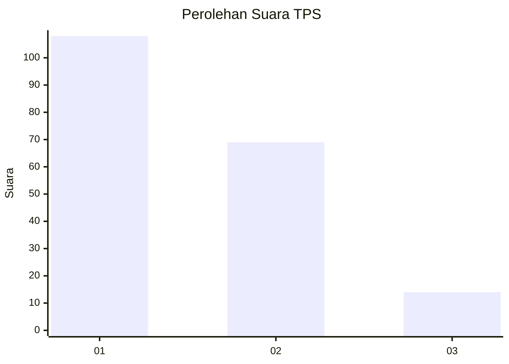
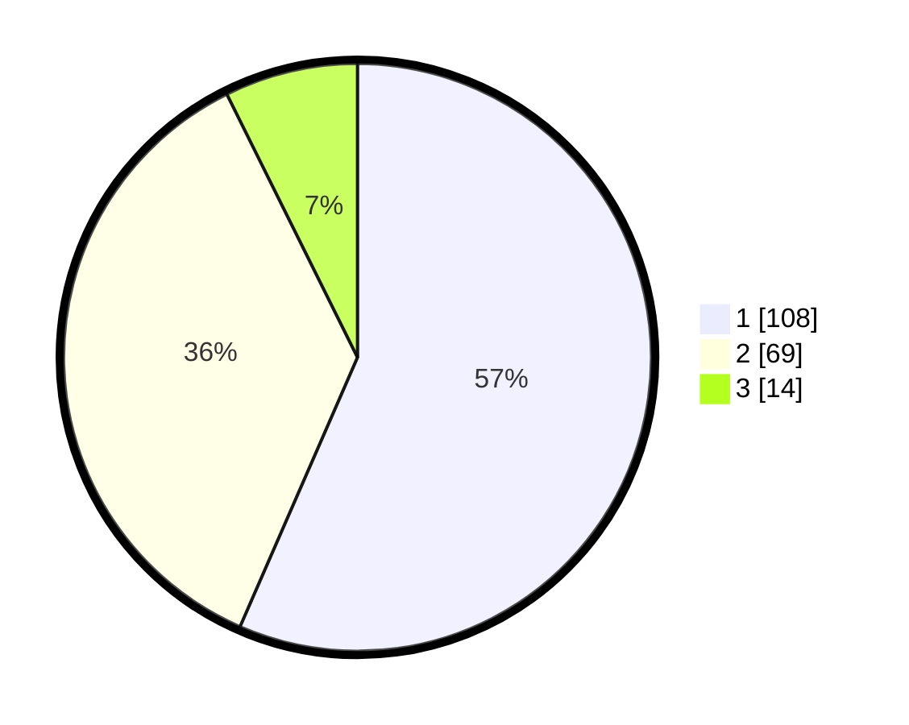

# Hasil

## Grafik

## Tabel

| No. | Nama Paslon    | Suara | Suara (raw) | Persentase |
|:--- |:-------------- | -----:| -----------:| ----------:|
| 1   | ANIES MUHAIMIN | 108   | [108][p-1]  | 56,54      |
| 2   | PRABOWO GIBRAN | 69    | [69][p-2]   | 36,13      |
| 3   | GANJAR MAHFUD  | 14    | [14][p-3]   | 7,33       |

[p-1]: https://github.com/gigit-pemilu/pemilu-2024-12-sumatera-utara/blob/main/pilpres/hitung-suara/sub/12-sumatera-utara/sub/07-deli-serdang/sub/02-tanjung-morawa/sub/2003-limau-manis/sub/064-tps/sub/paslon-1.txt
[p-2]: https://github.com/gigit-pemilu/pemilu-2024-12-sumatera-utara/blob/main/pilpres/hitung-suara/sub/12-sumatera-utara/sub/07-deli-serdang/sub/02-tanjung-morawa/sub/2003-limau-manis/sub/064-tps/sub/paslon-2.txt
[p-3]: https://github.com/gigit-pemilu/pemilu-2024-12-sumatera-utara/blob/main/pilpres/hitung-suara/sub/12-sumatera-utara/sub/07-deli-serdang/sub/02-tanjung-morawa/sub/2003-limau-manis/sub/064-tps/sub/paslon-3.txt

## Foto C Plano

https://sirekap-obj-formc.kpu.go.id/2d82/pemilu/ppwp/12/07/02/20/03/1207022003064-20240214-235921--adb60a88-e0ac-45a9-8548-6936d513ee46.jpg

https://sirekap-obj-formc.kpu.go.id/2d82/pemilu/ppwp/12/07/02/20/03/1207022003064-20240215-001022--b55d6179-4f5d-41a9-878b-518248178835.jpg

https://sirekap-obj-formc.kpu.go.id/2d82/pemilu/ppwp/12/07/02/20/03/1207022003064-20240215-001123--df40084a-30e3-4fb0-b726-e63fc6e3f205.jpg

## Metadata

| Key        | Value               |
| ---------- | ------------------- |
| Time Stamp | 2024-02-24 22:31:28 |

