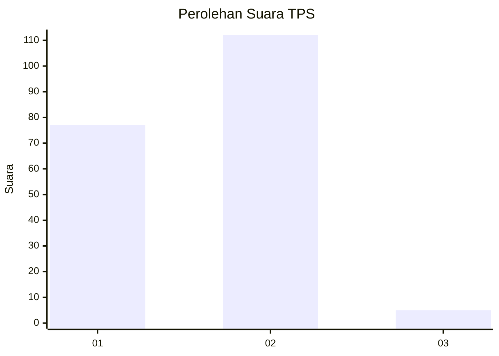
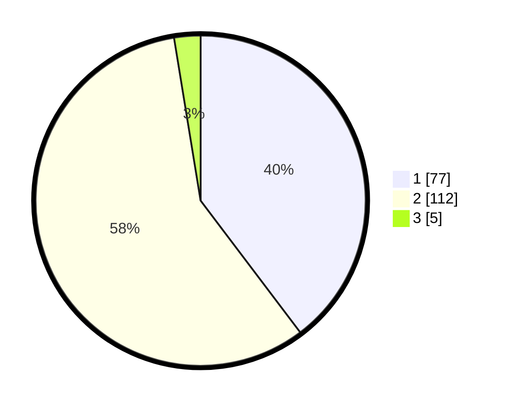

# Hasil

## Grafik

## Tabel

| No. | Nama Paslon    | Suara | Suara (raw) | Persentase |
|:--- |:-------------- | -----:| -----------:| ----------:|
| 1   | ANIES MUHAIMIN | 77    | [77][p-1]   | 39,69      |
| 2   | PRABOWO GIBRAN | 112   | [112][p-2]  | 57,73      |
| 3   | GANJAR MAHFUD  | 5     | [5][p-3]    | 2,58       |

[p-1]: https://github.com/gigit-pemilu/pemilu-2024/blob/main/pilpres/hitung-suara/sub/12-sumatera-utara/sub/07-deli-serdang/sub/02-tanjung-morawa/sub/2012-tanjung-morawa-b/sub/010-tps/sub/paslon-1.txt
[p-2]: https://github.com/gigit-pemilu/pemilu-2024/blob/main/pilpres/hitung-suara/sub/12-sumatera-utara/sub/07-deli-serdang/sub/02-tanjung-morawa/sub/2012-tanjung-morawa-b/sub/010-tps/sub/paslon-2.txt
[p-3]: https://github.com/gigit-pemilu/pemilu-2024/blob/main/pilpres/hitung-suara/sub/12-sumatera-utara/sub/07-deli-serdang/sub/02-tanjung-morawa/sub/2012-tanjung-morawa-b/sub/010-tps/sub/paslon-3.txt

## Foto C Plano

https://sirekap-obj-formc.kpu.go.id/f366/pemilu/ppwp/12/07/02/20/12/1207022012010-20240214-233122--dd44c5d7-c861-4b97-98f1-10e234865440.jpg

https://sirekap-obj-formc.kpu.go.id/f366/pemilu/ppwp/12/07/02/20/12/1207022012010-20240215-025835--0155e8b6-eab1-4bc2-9bdd-e65d665b5b65.jpg

https://sirekap-obj-formc.kpu.go.id/f366/pemilu/ppwp/12/07/02/20/12/1207022012010-20240214-233459--ad7902e1-3a20-4dc4-895b-f7f66cf7b7eb.jpg

## Metadata

| Key        | Value               |
| ---------- | ------------------- |
| Time Stamp | 2024-02-15 22:30:27 |

