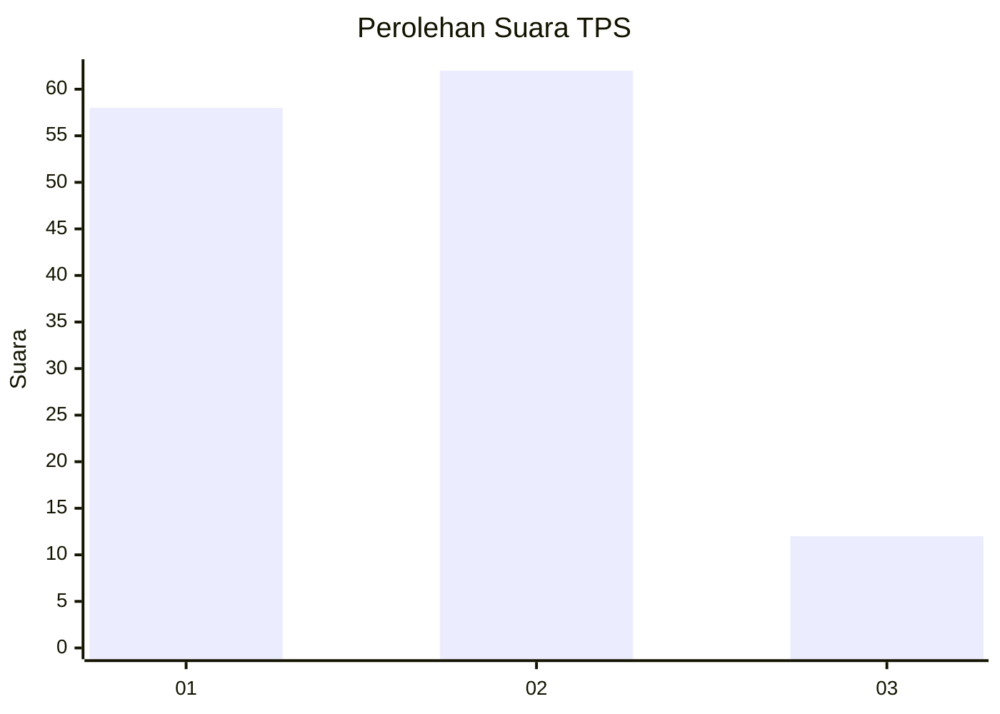
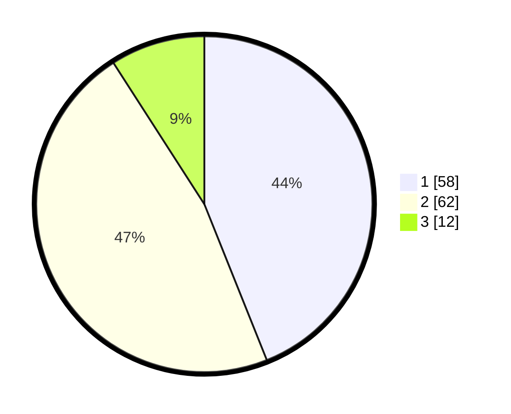

# Hasil

## Grafik

## Tabel

| No. | Nama Paslon    | Suara | Suara (raw) | Persentase |
|:--- |:-------------- | -----:| -----------:| ----------:|
| 1   | ANIES MUHAIMIN | 58    | [58][p-1]   | 43,94      |
| 2   | PRABOWO GIBRAN | 62    | [62][p-2]   | 46,97      |
| 3   | GANJAR MAHFUD  | 12    | [12][p-3]   | 9,09       |

[p-1]: https://github.com/gigit-pemilu/pemilu-2024-12-sumatera-utara/blob/main/pilpres/hitung-suara/sub/12-sumatera-utara/sub/07-deli-serdang/sub/02-tanjung-morawa/sub/2012-tanjung-morawa-b/sub/029-tps/sub/paslon-1.txt
[p-2]: https://github.com/gigit-pemilu/pemilu-2024-12-sumatera-utara/blob/main/pilpres/hitung-suara/sub/12-sumatera-utara/sub/07-deli-serdang/sub/02-tanjung-morawa/sub/2012-tanjung-morawa-b/sub/029-tps/sub/paslon-2.txt
[p-3]: https://github.com/gigit-pemilu/pemilu-2024-12-sumatera-utara/blob/main/pilpres/hitung-suara/sub/12-sumatera-utara/sub/07-deli-serdang/sub/02-tanjung-morawa/sub/2012-tanjung-morawa-b/sub/029-tps/sub/paslon-3.txt

## Foto C Plano

https://sirekap-obj-formc.kpu.go.id/c9ee/pemilu/ppwp/12/07/02/20/12/1207022012029-20240215-143414--1df4a746-5192-4f24-9803-5b83d93c4195.jpg

https://sirekap-obj-formc.kpu.go.id/c9ee/pemilu/ppwp/12/07/02/20/12/1207022012029-20240215-143502--27d7774b-22c9-4e12-af61-7dc3ed03bc72.jpg

https://sirekap-obj-formc.kpu.go.id/c9ee/pemilu/ppwp/12/07/02/20/12/1207022012029-20240215-143541--cb46e0be-489a-4baa-a5ae-ad5915c0adb0.jpg

## Metadata

| Key        | Value               |
| ---------- | ------------------- |
| Time Stamp | 2024-02-25 20:00:00 |

