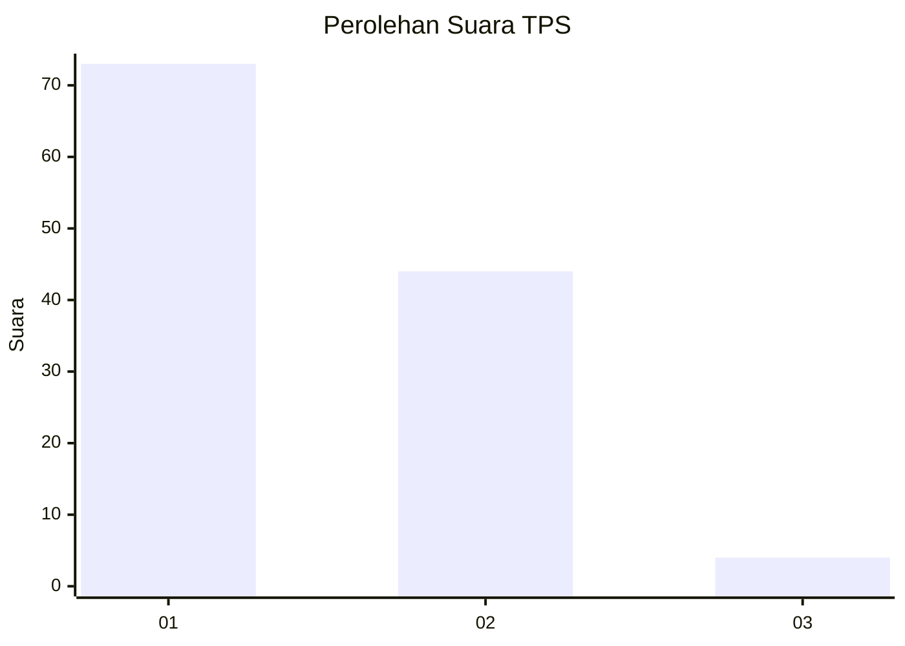
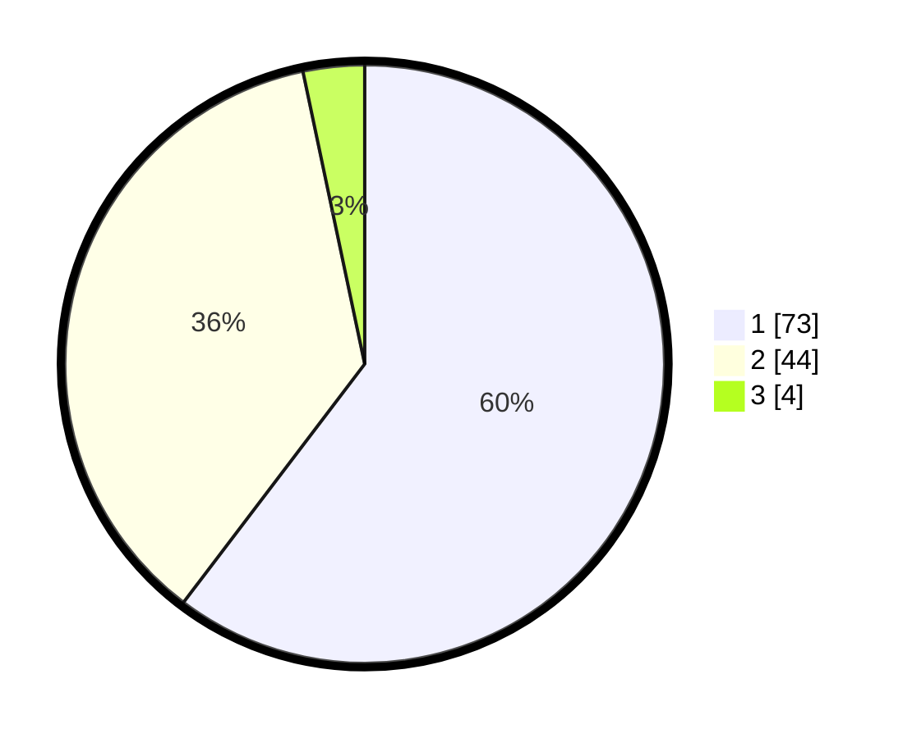

# Hasil

## Grafik

## Tabel

| No. | Nama Paslon    | Suara | Suara (raw) | Persentase |
|:--- |:-------------- | -----:| -----------:| ----------:|
| 1   | ANIES MUHAIMIN | 73    | [73][p-1]   | 60,33      |
| 2   | PRABOWO GIBRAN | 44    | [44][p-2]   | 36,36      |
| 3   | GANJAR MAHFUD  | 4     | [4][p-3]    | 3,31       |

[p-1]: https://github.com/gigit-pemilu/pemilu-2024/blob/main/pilpres/hitung-suara/sub/12-sumatera-utara/sub/07-deli-serdang/sub/02-tanjung-morawa/sub/2014-tanjung-morawa-a/sub/005-tps/sub/paslon-1.txt
[p-2]: https://github.com/gigit-pemilu/pemilu-2024/blob/main/pilpres/hitung-suara/sub/12-sumatera-utara/sub/07-deli-serdang/sub/02-tanjung-morawa/sub/2014-tanjung-morawa-a/sub/005-tps/sub/paslon-2.txt
[p-3]: https://github.com/gigit-pemilu/pemilu-2024/blob/main/pilpres/hitung-suara/sub/12-sumatera-utara/sub/07-deli-serdang/sub/02-tanjung-morawa/sub/2014-tanjung-morawa-a/sub/005-tps/sub/paslon-3.txt

## Foto C Plano

https://sirekap-obj-formc.kpu.go.id/02ba/pemilu/ppwp/12/07/02/20/14/1207022014005-20240214-195028--30ad62db-861a-4c9c-993a-f9bf670c982b.jpg

https://sirekap-obj-formc.kpu.go.id/02ba/pemilu/ppwp/12/07/02/20/14/1207022014005-20240214-201335--cb62b1e8-030f-42b0-a42c-55a94c61dc4b.jpg

https://sirekap-obj-formc.kpu.go.id/02ba/pemilu/ppwp/12/07/02/20/14/1207022014005-20240214-201434--3b06a5ab-3c7e-42bb-ba5b-86d98bea0d45.jpg

## Metadata

| Key        | Value               |
| ---------- | ------------------- |
| Time Stamp | 2024-02-25 22:00:00 |

