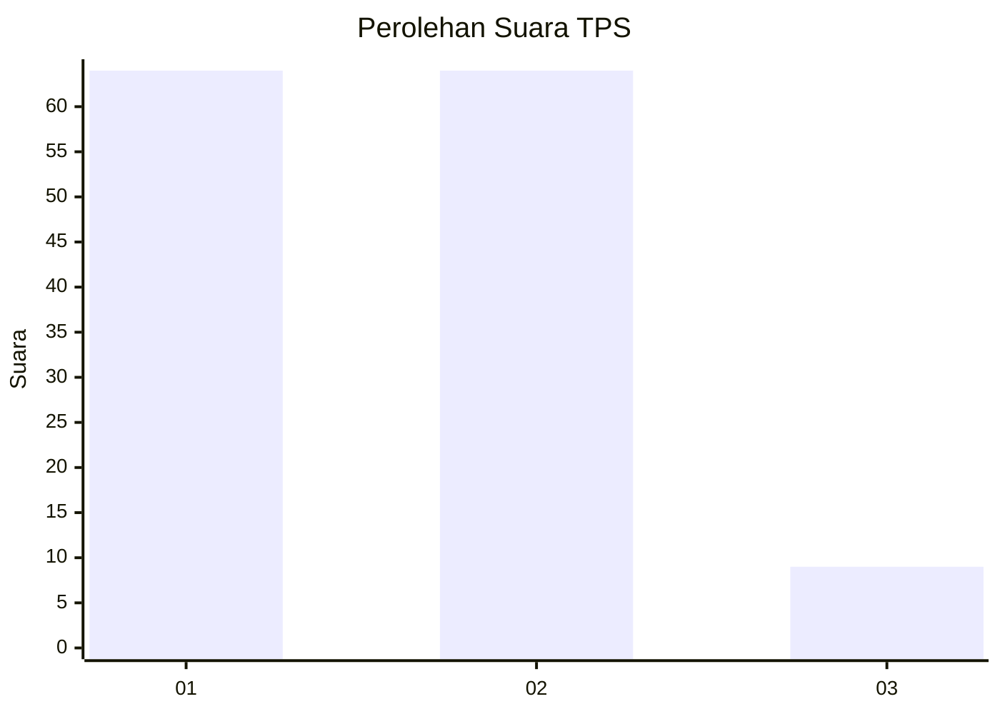
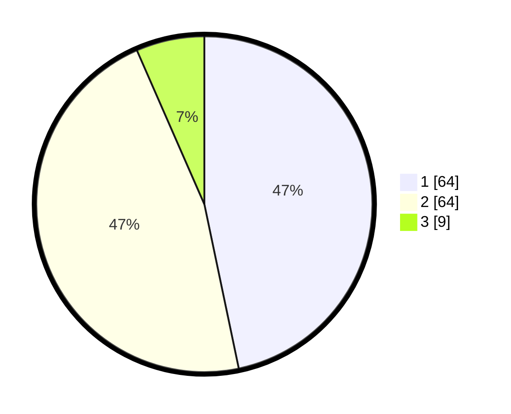

# Hasil

## Grafik

## Tabel

| No. | Nama Paslon    | Suara | Suara (raw) | Persentase |
|:--- |:-------------- | -----:| -----------:| ----------:|
| 1   | ANIES MUHAIMIN | 64    | [64][p-1]   | 46,72      |
| 2   | PRABOWO GIBRAN | 64    | [64][p-2]   | 46,72      |
| 3   | GANJAR MAHFUD  | 9     | [9][p-3]    | 6,57       |

[p-1]: https://github.com/gigit-pemilu/pemilu-2024-12-sumatera-utara/blob/main/pilpres/hitung-suara/sub/12-sumatera-utara/sub/07-deli-serdang/sub/02-tanjung-morawa/sub/2014-tanjung-morawa-a/sub/009-tps/sub/paslon-1.txt
[p-2]: https://github.com/gigit-pemilu/pemilu-2024-12-sumatera-utara/blob/main/pilpres/hitung-suara/sub/12-sumatera-utara/sub/07-deli-serdang/sub/02-tanjung-morawa/sub/2014-tanjung-morawa-a/sub/009-tps/sub/paslon-2.txt
[p-3]: https://github.com/gigit-pemilu/pemilu-2024-12-sumatera-utara/blob/main/pilpres/hitung-suara/sub/12-sumatera-utara/sub/07-deli-serdang/sub/02-tanjung-morawa/sub/2014-tanjung-morawa-a/sub/009-tps/sub/paslon-3.txt

## Foto C Plano

https://sirekap-obj-formc.kpu.go.id/332e/pemilu/ppwp/12/07/02/20/14/1207022014009-20240214-222421--91d69567-b9cd-4429-83dd-2a8164d4a04f.jpg

https://sirekap-obj-formc.kpu.go.id/332e/pemilu/ppwp/12/07/02/20/14/1207022014009-20240214-231958--f19f814c-24ca-4a30-80e5-d6e198ce049f.jpg

https://sirekap-obj-formc.kpu.go.id/332e/pemilu/ppwp/12/07/02/20/14/1207022014009-20240214-232114--9f9c5ea6-02d7-466b-a907-3e01403a2090.jpg

## Metadata

| Key        | Value               |
| ---------- | ------------------- |
| Time Stamp | 2024-02-15 22:30:27 |

