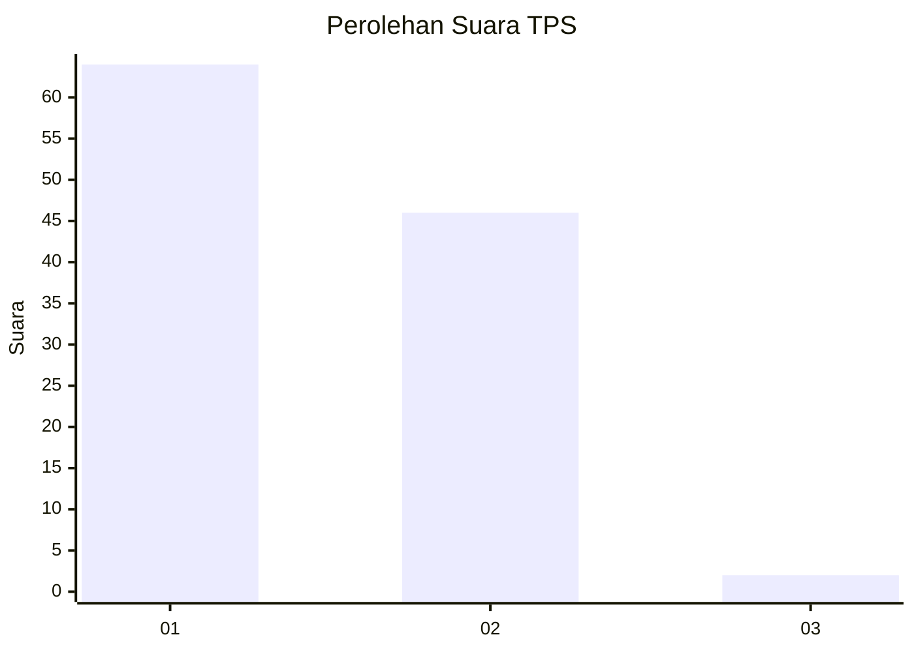
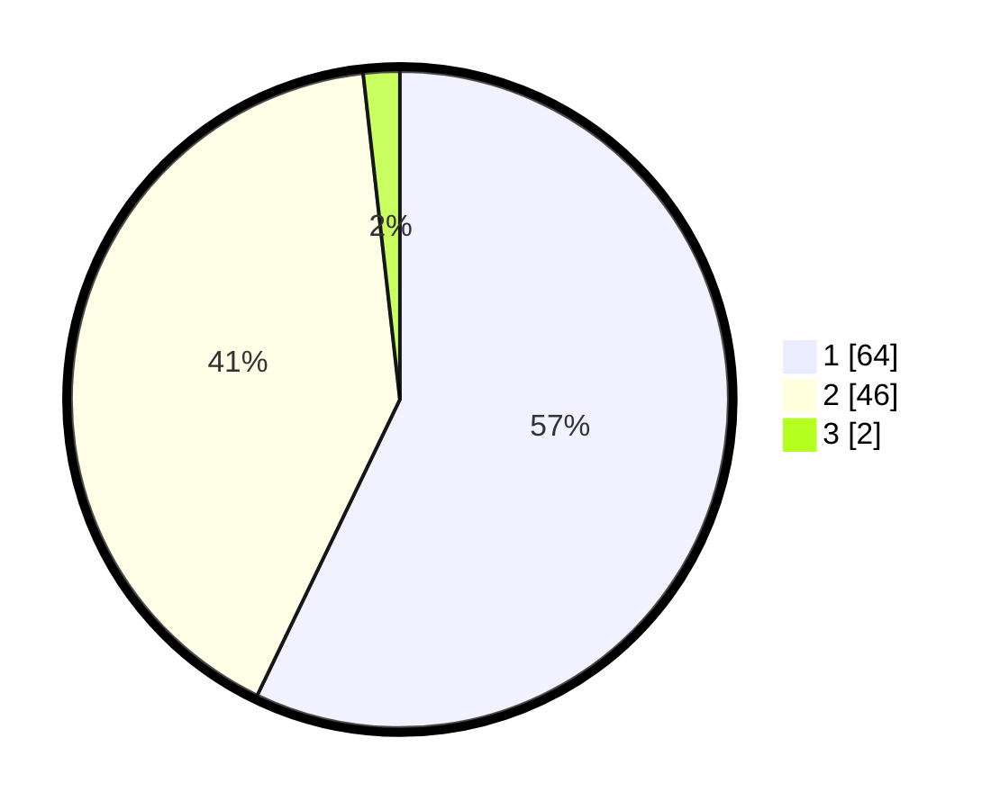

# Hasil

## Grafik

## Tabel

| No. | Nama Paslon    | Suara | Suara (raw) | Persentase |
|:--- |:-------------- | -----:| -----------:| ----------:|
| 1   | ANIES MUHAIMIN | 64    | [64][p-1]   | 57,14      |
| 2   | PRABOWO GIBRAN | 46    | [46][p-2]   | 41,07      |
| 3   | GANJAR MAHFUD  | 2     | [2][p-3]    | 1,79       |

[p-1]: https://github.com/gigit-pemilu/pemilu-2024-12-sumatera-utara/blob/main/pilpres/hitung-suara/sub/12-sumatera-utara/sub/07-deli-serdang/sub/02-tanjung-morawa/sub/2014-tanjung-morawa-a/sub/019-tps/sub/paslon-1.txt
[p-2]: https://github.com/gigit-pemilu/pemilu-2024-12-sumatera-utara/blob/main/pilpres/hitung-suara/sub/12-sumatera-utara/sub/07-deli-serdang/sub/02-tanjung-morawa/sub/2014-tanjung-morawa-a/sub/019-tps/sub/paslon-2.txt
[p-3]: https://github.com/gigit-pemilu/pemilu-2024-12-sumatera-utara/blob/main/pilpres/hitung-suara/sub/12-sumatera-utara/sub/07-deli-serdang/sub/02-tanjung-morawa/sub/2014-tanjung-morawa-a/sub/019-tps/sub/paslon-3.txt

## Foto C Plano

https://sirekap-obj-formc.kpu.go.id/31bb/pemilu/ppwp/12/07/02/20/14/1207022014019-20240215-052606--b6cd19ad-ee9d-4e40-95d8-cac5bf6bc977.jpg

https://sirekap-obj-formc.kpu.go.id/31bb/pemilu/ppwp/12/07/02/20/14/1207022014019-20240215-052610--155c7088-1547-4d16-86ae-18eeed55a641.jpg

https://sirekap-obj-formc.kpu.go.id/31bb/pemilu/ppwp/12/07/02/20/14/1207022014019-20240215-052613--440e2d1b-7a96-4e89-b869-2effb57ea751.jpg

## Metadata

| Key        | Value               |
| ---------- | ------------------- |
| Time Stamp | 2024-02-24 22:31:28 |

