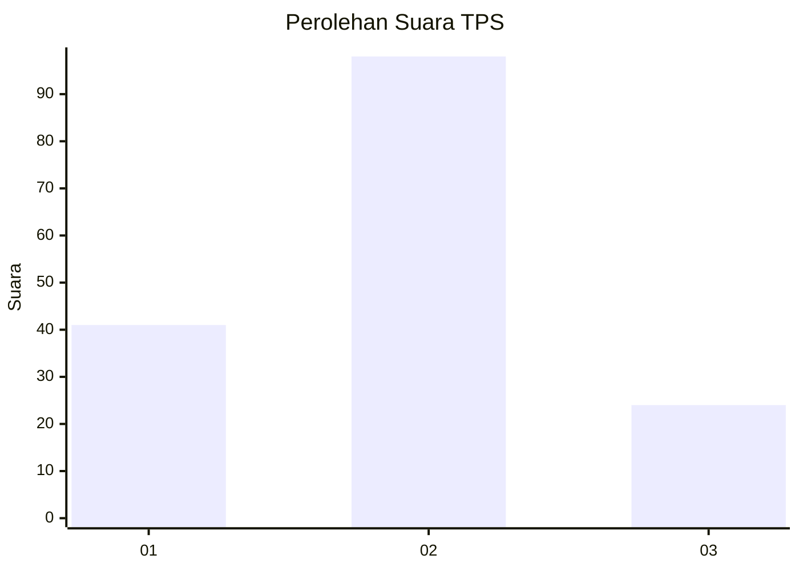
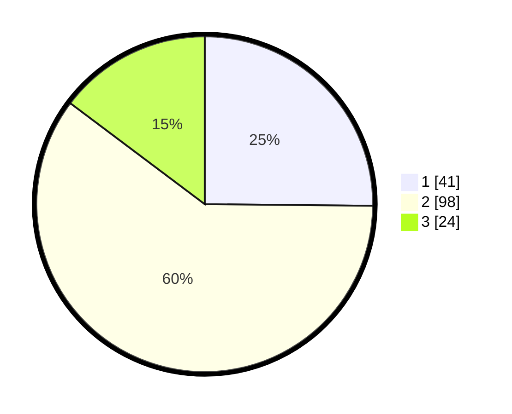

# Hasil

## Grafik

## Tabel

| No. | Nama Paslon    | Suara | Suara (raw) | Persentase |
|:--- |:-------------- | -----:| -----------:| ----------:|
| 1   | ANIES MUHAIMIN | 41    | [41][p-1]   | 25,15      |
| 2   | PRABOWO GIBRAN | 98    | [98][p-2]   | 60,12      |
| 3   | GANJAR MAHFUD  | 24    | [24][p-3]   | 14,72      |

[p-1]: https://github.com/gigit-pemilu/pemilu-2024/blob/main/pilpres/hitung-suara/sub/12-sumatera-utara/sub/07-deli-serdang/sub/02-tanjung-morawa/sub/2015-buntu-bedimbar/sub/018-tps/sub/paslon-1.txt
[p-2]: https://github.com/gigit-pemilu/pemilu-2024/blob/main/pilpres/hitung-suara/sub/12-sumatera-utara/sub/07-deli-serdang/sub/02-tanjung-morawa/sub/2015-buntu-bedimbar/sub/018-tps/sub/paslon-2.txt
[p-3]: https://github.com/gigit-pemilu/pemilu-2024/blob/main/pilpres/hitung-suara/sub/12-sumatera-utara/sub/07-deli-serdang/sub/02-tanjung-morawa/sub/2015-buntu-bedimbar/sub/018-tps/sub/paslon-3.txt

## Foto C Plano

https://sirekap-obj-formc.kpu.go.id/a81f/pemilu/ppwp/12/07/02/20/15/1207022015018-20240215-075728--51c0206b-41fe-45b1-abc2-7c6c8d347695.jpg

https://sirekap-obj-formc.kpu.go.id/a81f/pemilu/ppwp/12/07/02/20/15/1207022015018-20240215-075808--52b592c3-b27f-4127-a852-37e28e025af6.jpg

https://sirekap-obj-formc.kpu.go.id/a81f/pemilu/ppwp/12/07/02/20/15/1207022015018-20240215-075849--2c38df5f-861b-4cb2-8814-8f0fc8a02754.jpg

## Metadata

| Key        | Value               |
| ---------- | ------------------- |
| Time Stamp | 2024-02-15 23:29:50 |

