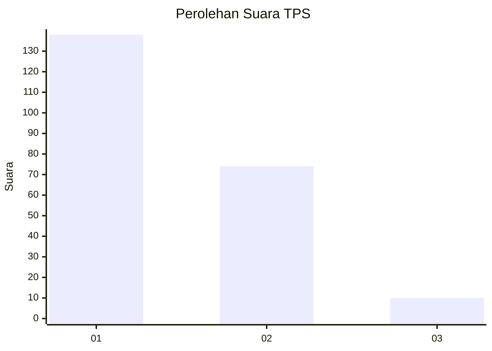
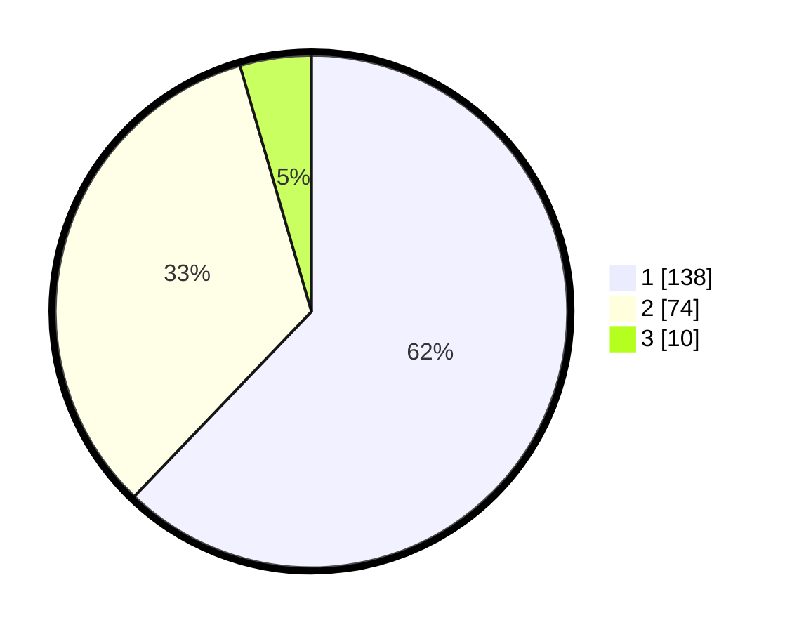

# Hasil

## Grafik

## Tabel

| No. | Nama Paslon    | Suara | Suara (raw) | Persentase |
|:--- |:-------------- | -----:| -----------:| ----------:|
| 1   | ANIES MUHAIMIN | 138   | [138][p-1]  | 62,16      |
| 2   | PRABOWO GIBRAN | 74    | [74][p-2]   | 33,33      |
| 3   | GANJAR MAHFUD  | 10    | [10][p-3]   | 4,50       |

[p-1]: https://github.com/gigit-pemilu/pemilu-2024/blob/main/pilpres/hitung-suara/sub/12-sumatera-utara/sub/07-deli-serdang/sub/02-tanjung-morawa/sub/2018-dalu-sepuluh-a/sub/002-tps/sub/paslon-1.txt
[p-2]: https://github.com/gigit-pemilu/pemilu-2024/blob/main/pilpres/hitung-suara/sub/12-sumatera-utara/sub/07-deli-serdang/sub/02-tanjung-morawa/sub/2018-dalu-sepuluh-a/sub/002-tps/sub/paslon-2.txt
[p-3]: https://github.com/gigit-pemilu/pemilu-2024/blob/main/pilpres/hitung-suara/sub/12-sumatera-utara/sub/07-deli-serdang/sub/02-tanjung-morawa/sub/2018-dalu-sepuluh-a/sub/002-tps/sub/paslon-3.txt

## Foto C Plano

https://sirekap-obj-formc.kpu.go.id/a0c2/pemilu/ppwp/12/07/02/20/18/1207022018002-20240214-221616--1c7b76af-8f26-4cce-8163-e7ddd12d3c18.jpg

https://sirekap-obj-formc.kpu.go.id/a0c2/pemilu/ppwp/12/07/02/20/18/1207022018002-20240214-221630--c70deaae-dcf3-4b5c-80f8-51ca7001066f.jpg

https://sirekap-obj-formc.kpu.go.id/a0c2/pemilu/ppwp/12/07/02/20/18/1207022018002-20240214-221639--13c1d2a4-1358-4b22-a2e0-46d1e94d83ca.jpg

## Metadata

| Key        | Value               |
| ---------- | ------------------- |
| Time Stamp | 2024-02-15 23:29:50 |

