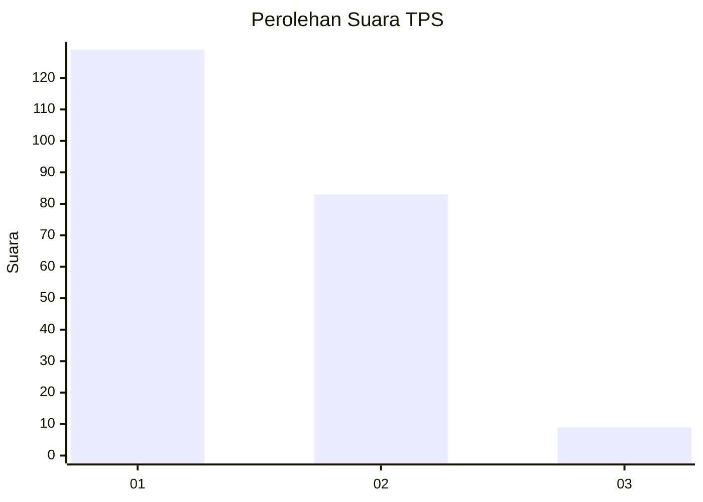
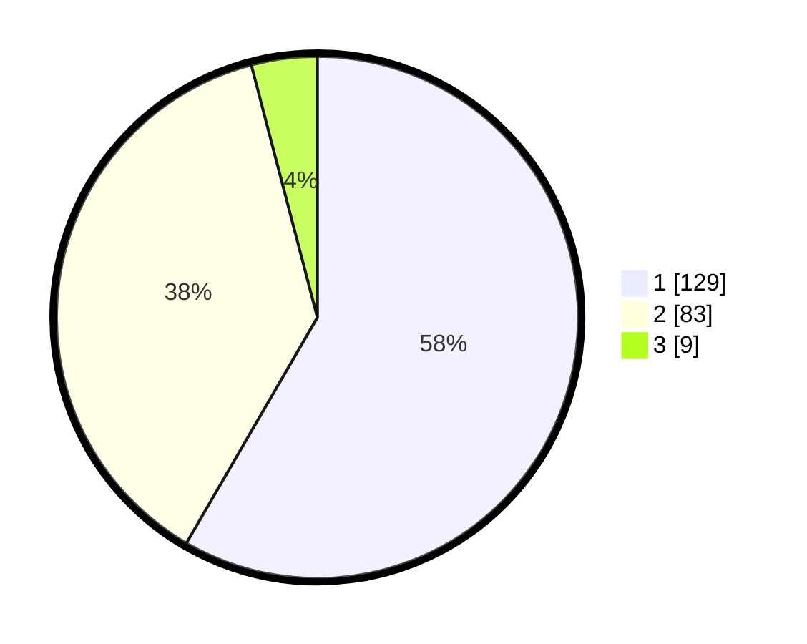

# Hasil

## Grafik

## Tabel

| No. | Nama Paslon    | Suara | Suara (raw) | Persentase |
|:--- |:-------------- | -----:| -----------:| ----------:|
| 1   | ANIES MUHAIMIN | 129   | [129][p-1]  | 58,37      |
| 2   | PRABOWO GIBRAN | 83    | [83][p-2]   | 37,56      |
| 3   | GANJAR MAHFUD  | 9     | [9][p-3]    | 4,07       |

[p-1]: https://github.com/gigit-pemilu/pemilu-2024/blob/main/pilpres/hitung-suara/sub/12-sumatera-utara/sub/07-deli-serdang/sub/02-tanjung-morawa/sub/2018-dalu-sepuluh-a/sub/003-tps/sub/paslon-1.txt
[p-2]: https://github.com/gigit-pemilu/pemilu-2024/blob/main/pilpres/hitung-suara/sub/12-sumatera-utara/sub/07-deli-serdang/sub/02-tanjung-morawa/sub/2018-dalu-sepuluh-a/sub/003-tps/sub/paslon-2.txt
[p-3]: https://github.com/gigit-pemilu/pemilu-2024/blob/main/pilpres/hitung-suara/sub/12-sumatera-utara/sub/07-deli-serdang/sub/02-tanjung-morawa/sub/2018-dalu-sepuluh-a/sub/003-tps/sub/paslon-3.txt

## Foto C Plano

https://sirekap-obj-formc.kpu.go.id/20f6/pemilu/ppwp/12/07/02/20/18/1207022018003-20240214-230708--5c0c1a81-716a-4519-8c37-657e2d6401c6.jpg

https://sirekap-obj-formc.kpu.go.id/20f6/pemilu/ppwp/12/07/02/20/18/1207022018003-20240214-233248--8b6120ec-395a-46cf-a59e-5ac0fdb6a8df.jpg

https://sirekap-obj-formc.kpu.go.id/20f6/pemilu/ppwp/12/07/02/20/18/1207022018003-20240214-234117--4f0f8a31-2b80-4668-a34f-6aff36ac40b2.jpg

## Metadata

| Key        | Value               |
| ---------- | ------------------- |
| Time Stamp | 2024-02-15 23:29:50 |

