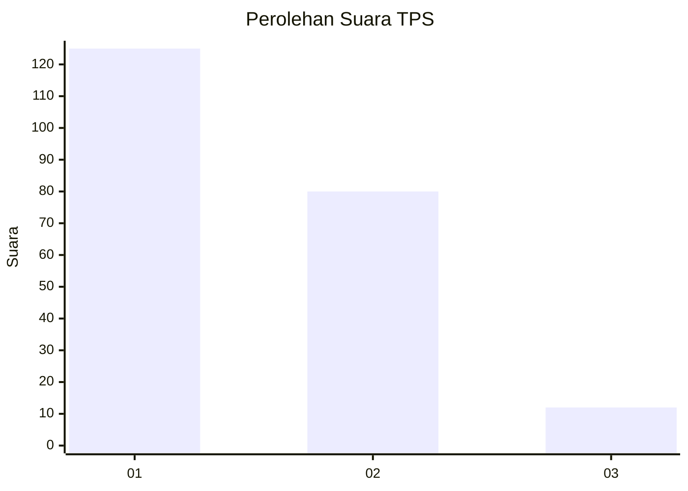
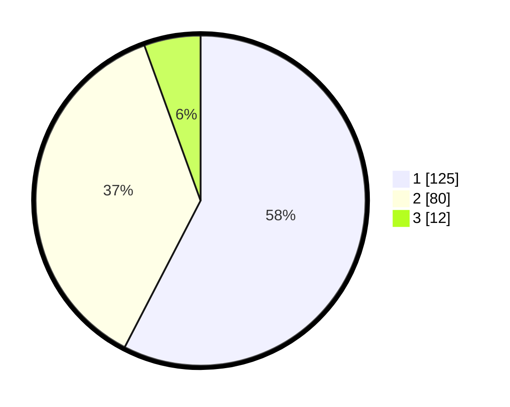

# Hasil

## Grafik

## Tabel

| No. | Nama Paslon    | Suara | Suara (raw) | Persentase |
|:--- |:-------------- | -----:| -----------:| ----------:|
| 1   | ANIES MUHAIMIN | 125   | [125][p-1]  | 57,60      |
| 2   | PRABOWO GIBRAN | 80    | [80][p-2]   | 36,87      |
| 3   | GANJAR MAHFUD  | 12    | [12][p-3]   | 5,53       |

[p-1]: https://github.com/gigit-pemilu/pemilu-2024/blob/main/pilpres/hitung-suara/sub/12-sumatera-utara/sub/07-deli-serdang/sub/02-tanjung-morawa/sub/2018-dalu-sepuluh-a/sub/004-tps/sub/paslon-1.txt
[p-2]: https://github.com/gigit-pemilu/pemilu-2024/blob/main/pilpres/hitung-suara/sub/12-sumatera-utara/sub/07-deli-serdang/sub/02-tanjung-morawa/sub/2018-dalu-sepuluh-a/sub/004-tps/sub/paslon-2.txt
[p-3]: https://github.com/gigit-pemilu/pemilu-2024/blob/main/pilpres/hitung-suara/sub/12-sumatera-utara/sub/07-deli-serdang/sub/02-tanjung-morawa/sub/2018-dalu-sepuluh-a/sub/004-tps/sub/paslon-3.txt

## Foto C Plano

https://sirekap-obj-formc.kpu.go.id/4ad5/pemilu/ppwp/12/07/02/20/18/1207022018004-20240215-070614--3518b5f1-b77c-4438-839c-7f23aacee818.jpg

https://sirekap-obj-formc.kpu.go.id/4ad5/pemilu/ppwp/12/07/02/20/18/1207022018004-20240215-070745--21d45fc0-4889-476f-a69c-6c11ab12c2a4.jpg

https://sirekap-obj-formc.kpu.go.id/4ad5/pemilu/ppwp/12/07/02/20/18/1207022018004-20240215-070929--d344510b-16a9-494f-b928-0566dc958fd9.jpg

## Metadata

| Key        | Value               |
| ---------- | ------------------- |
| Time Stamp | 2024-02-15 23:29:50 |

