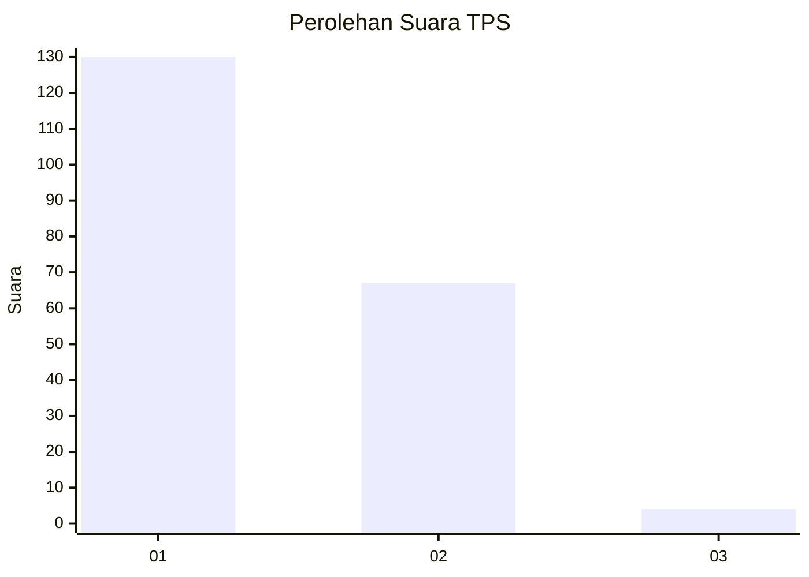
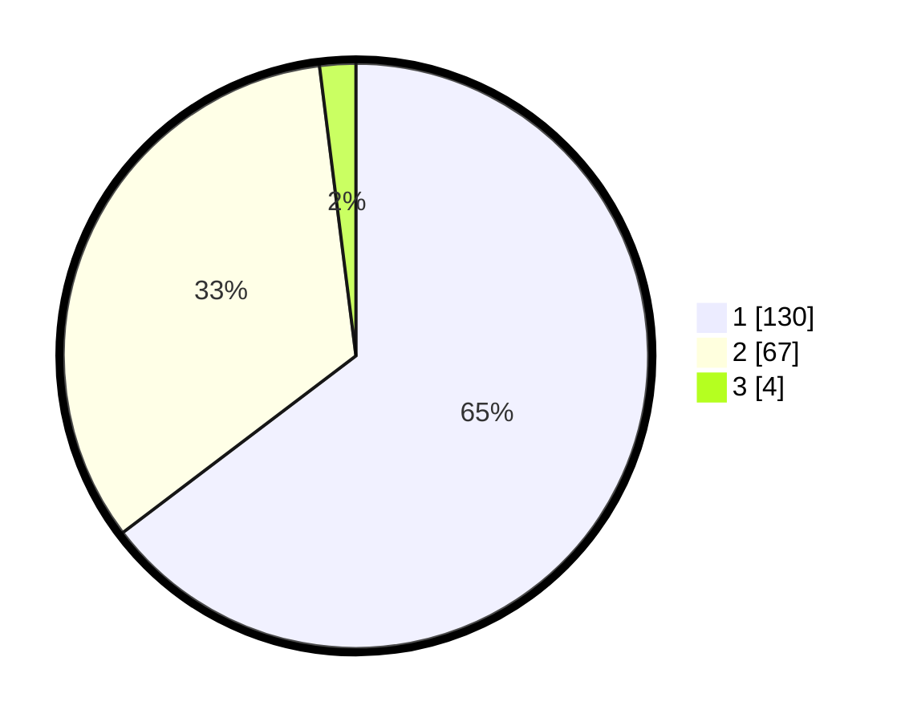

# Hasil

## Grafik

## Tabel

| No. | Nama Paslon    | Suara | Suara (raw) | Persentase |
|:--- |:-------------- | -----:| -----------:| ----------:|
| 1   | ANIES MUHAIMIN | 130   | [130][p-1]  | 64,68      |
| 2   | PRABOWO GIBRAN | 67    | [67][p-2]   | 33,33      |
| 3   | GANJAR MAHFUD  | 4     | [4][p-3]    | 1,99       |

[p-1]: https://github.com/gigit-pemilu/pemilu-2024-12-sumatera-utara/blob/main/pilpres/hitung-suara/sub/12-sumatera-utara/sub/07-deli-serdang/sub/02-tanjung-morawa/sub/2018-dalu-sepuluh-a/sub/005-tps/sub/paslon-1.txt
[p-2]: https://github.com/gigit-pemilu/pemilu-2024-12-sumatera-utara/blob/main/pilpres/hitung-suara/sub/12-sumatera-utara/sub/07-deli-serdang/sub/02-tanjung-morawa/sub/2018-dalu-sepuluh-a/sub/005-tps/sub/paslon-2.txt
[p-3]: https://github.com/gigit-pemilu/pemilu-2024-12-sumatera-utara/blob/main/pilpres/hitung-suara/sub/12-sumatera-utara/sub/07-deli-serdang/sub/02-tanjung-morawa/sub/2018-dalu-sepuluh-a/sub/005-tps/sub/paslon-3.txt

## Foto C Plano

https://sirekap-obj-formc.kpu.go.id/30c8/pemilu/ppwp/12/07/02/20/18/1207022018005-20240215-015003--7b5e470b-f86e-4d5f-9de9-5621885e6f9a.jpg

https://sirekap-obj-formc.kpu.go.id/30c8/pemilu/ppwp/12/07/02/20/18/1207022018005-20240215-015157--408ee218-0e45-4b29-a277-e5de8f06f53a.jpg

https://sirekap-obj-formc.kpu.go.id/30c8/pemilu/ppwp/12/07/02/20/18/1207022018005-20240215-015257--249ed0a7-f015-4c66-bb71-b7f661028afc.jpg

## Metadata

| Key        | Value               |
| ---------- | ------------------- |
| Time Stamp | 2024-02-15 23:29:50 |

