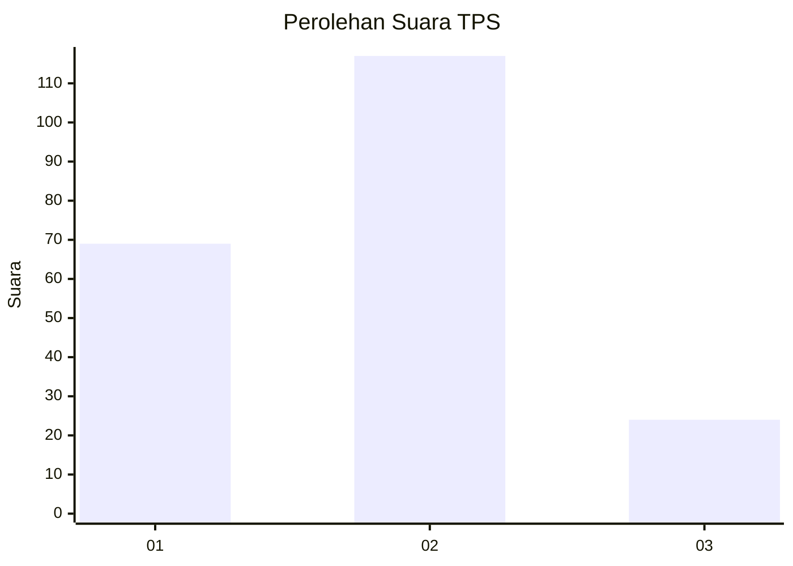
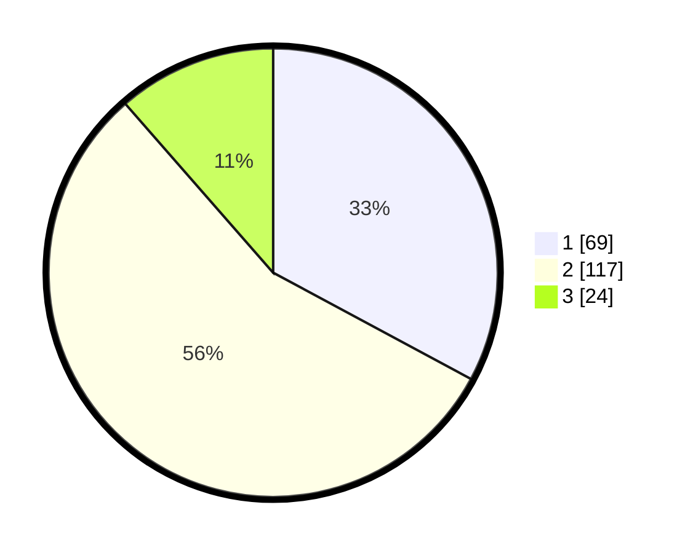

# Hasil

## Grafik

## Tabel

| No. | Nama Paslon    | Suara | Suara (raw) | Persentase |
|:--- |:-------------- | -----:| -----------:| ----------:|
| 1   | ANIES MUHAIMIN | 69    | [69][p-1]   | 32,86      |
| 2   | PRABOWO GIBRAN | 117   | [117][p-2]  | 55,71      |
| 3   | GANJAR MAHFUD  | 24    | [24][p-3]   | 11,43      |

[p-1]: https://github.com/gigit-pemilu/pemilu-2024-12-sumatera-utara/blob/main/pilpres/hitung-suara/sub/12-sumatera-utara/sub/07-deli-serdang/sub/02-tanjung-morawa/sub/2019-dalu-sepuluh-b/sub/001-tps/sub/paslon-1.txt
[p-2]: https://github.com/gigit-pemilu/pemilu-2024-12-sumatera-utara/blob/main/pilpres/hitung-suara/sub/12-sumatera-utara/sub/07-deli-serdang/sub/02-tanjung-morawa/sub/2019-dalu-sepuluh-b/sub/001-tps/sub/paslon-2.txt
[p-3]: https://github.com/gigit-pemilu/pemilu-2024-12-sumatera-utara/blob/main/pilpres/hitung-suara/sub/12-sumatera-utara/sub/07-deli-serdang/sub/02-tanjung-morawa/sub/2019-dalu-sepuluh-b/sub/001-tps/sub/paslon-3.txt

## Foto C Plano

https://sirekap-obj-formc.kpu.go.id/1ec6/pemilu/ppwp/12/07/02/20/19/1207022019001-20240216-133535--76de02d5-73c4-436f-b303-f7b2aa9b0519.jpg

https://sirekap-obj-formc.kpu.go.id/1ec6/pemilu/ppwp/12/07/02/20/19/1207022019001-20240215-023429--6bc6074d-1245-4ba0-b22c-a47db93d34ca.jpg

https://sirekap-obj-formc.kpu.go.id/1ec6/pemilu/ppwp/12/07/02/20/19/1207022019001-20240215-023901--ba7fdb52-0331-4736-8499-1123b9f2df20.jpg

## Metadata

| Key        | Value               |
| ---------- | ------------------- |
| Time Stamp | 2024-02-25 22:00:00 |

