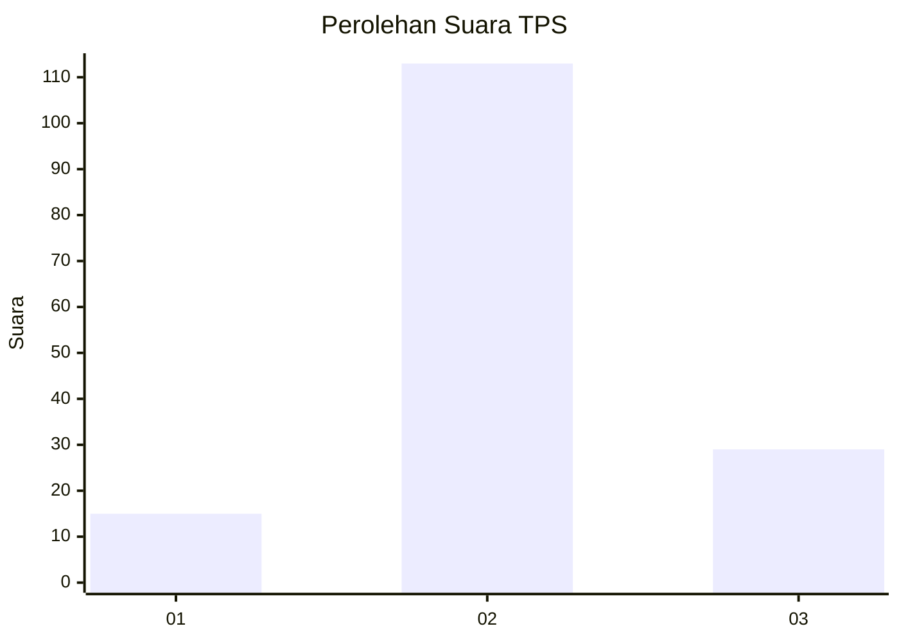
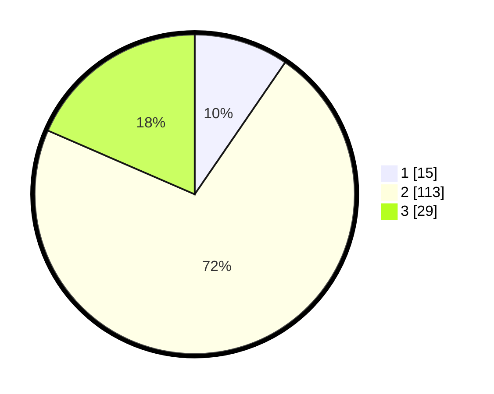

# Hasil

## Grafik

## Tabel

| No. | Nama Paslon    | Suara | Suara (raw) | Persentase |
|:--- |:-------------- | -----:| -----------:| ----------:|
| 1   | ANIES MUHAIMIN | 15    | [15][p-1]   | 9,55       |
| 2   | PRABOWO GIBRAN | 113   | [113][p-2]  | 71,97      |
| 3   | GANJAR MAHFUD  | 29    | [29][p-3]   | 18,47      |

[p-1]: https://github.com/gigit-pemilu/pemilu-2024/blob/main/pilpres/hitung-suara/sub/12-sumatera-utara/sub/07-deli-serdang/sub/03-sibolangit/sub/2001-bandar-baru/sub/002-tps/sub/paslon-1.txt
[p-2]: https://github.com/gigit-pemilu/pemilu-2024/blob/main/pilpres/hitung-suara/sub/12-sumatera-utara/sub/07-deli-serdang/sub/03-sibolangit/sub/2001-bandar-baru/sub/002-tps/sub/paslon-2.txt
[p-3]: https://github.com/gigit-pemilu/pemilu-2024/blob/main/pilpres/hitung-suara/sub/12-sumatera-utara/sub/07-deli-serdang/sub/03-sibolangit/sub/2001-bandar-baru/sub/002-tps/sub/paslon-3.txt

## Foto C Plano

https://sirekap-obj-formc.kpu.go.id/046a/pemilu/ppwp/12/07/03/20/01/1207032001002-20240215-025424--d9fcb81f-c73b-4cf8-88c6-e1c06c871fc2.jpg

https://sirekap-obj-formc.kpu.go.id/046a/pemilu/ppwp/12/07/03/20/01/1207032001002-20240215-025621--614de791-25e8-4a5f-9ebc-aac820b7878a.jpg

https://sirekap-obj-formc.kpu.go.id/046a/pemilu/ppwp/12/07/03/20/01/1207032001002-20240215-025823--54c50081-1727-499f-a782-ff26b351158c.jpg

## Metadata

| Key        | Value               |
| ---------- | ------------------- |
| Time Stamp | 2024-02-16 02:30:27 |

