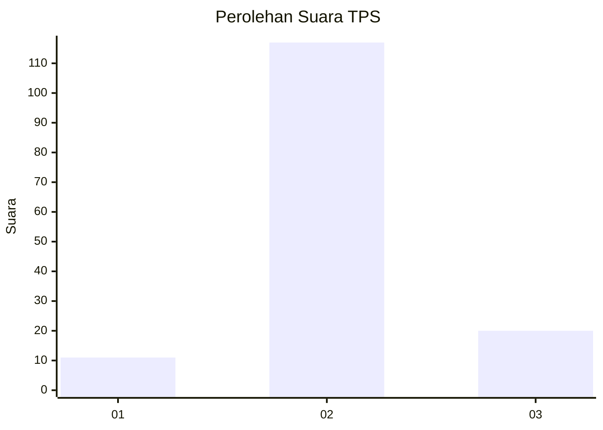
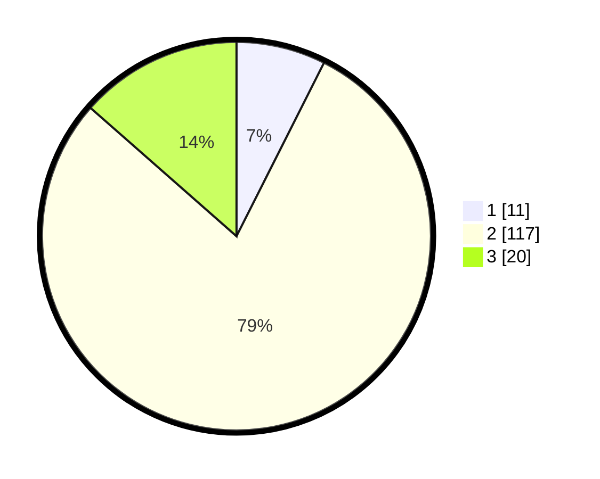

# Hasil

## Grafik

## Tabel

| No. | Nama Paslon    | Suara | Suara (raw) | Persentase |
|:--- |:-------------- | -----:| -----------:| ----------:|
| 1   | ANIES MUHAIMIN | 11    | [11][p-1]   | 7,43       |
| 2   | PRABOWO GIBRAN | 117   | [117][p-2]  | 79,05      |
| 3   | GANJAR MAHFUD  | 20    | [20][p-3]   | 13,51      |

[p-1]: https://github.com/gigit-pemilu/pemilu-2024/blob/main/pilpres/hitung-suara/sub/12-sumatera-utara/sub/07-deli-serdang/sub/03-sibolangit/sub/2001-bandar-baru/sub/004-tps/sub/paslon-1.txt
[p-2]: https://github.com/gigit-pemilu/pemilu-2024/blob/main/pilpres/hitung-suara/sub/12-sumatera-utara/sub/07-deli-serdang/sub/03-sibolangit/sub/2001-bandar-baru/sub/004-tps/sub/paslon-2.txt
[p-3]: https://github.com/gigit-pemilu/pemilu-2024/blob/main/pilpres/hitung-suara/sub/12-sumatera-utara/sub/07-deli-serdang/sub/03-sibolangit/sub/2001-bandar-baru/sub/004-tps/sub/paslon-3.txt

## Foto C Plano

https://sirekap-obj-formc.kpu.go.id/ff08/pemilu/ppwp/12/07/03/20/01/1207032001004-20240215-003901--6c5579b7-64a4-4dd6-8aee-2474ff92bfb2.jpg

https://sirekap-obj-formc.kpu.go.id/ff08/pemilu/ppwp/12/07/03/20/01/1207032001004-20240215-003957--993c8299-f7ee-40cd-87b2-acd0f36d70d4.jpg

https://sirekap-obj-formc.kpu.go.id/ff08/pemilu/ppwp/12/07/03/20/01/1207032001004-20240215-004042--31a419b6-2919-405e-a0fc-02a32e07443a.jpg

## Metadata

| Key        | Value               |
| ---------- | ------------------- |
| Time Stamp | 2024-02-25 15:00:00 |

