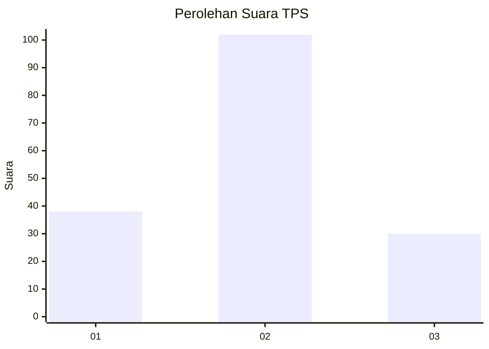

# Hasil

## Grafik

## Tabel

| No. | Nama Paslon    | Suara | Suara (raw) | Persentase |
|:--- |:-------------- | -----:| -----------:| ----------:|
| 1   | ANIES MUHAIMIN | 38    | [38][p-1]   | 22,35      |
| 2   | PRABOWO GIBRAN | 102   | [102][p-2]  | 60,00      |
| 3   | GANJAR MAHFUD  | 30    | [30][p-3]   | 17,65      |

[p-1]: https://github.com/gigit-pemilu/pemilu-2024/blob/main/pilpres/hitung-suara/sub/12-sumatera-utara/sub/07-deli-serdang/sub/03-sibolangit/sub/2001-bandar-baru/sub/006-tps/sub/paslon-1.txt
[p-2]: https://github.com/gigit-pemilu/pemilu-2024/blob/main/pilpres/hitung-suara/sub/12-sumatera-utara/sub/07-deli-serdang/sub/03-sibolangit/sub/2001-bandar-baru/sub/006-tps/sub/paslon-2.txt
[p-3]: https://github.com/gigit-pemilu/pemilu-2024/blob/main/pilpres/hitung-suara/sub/12-sumatera-utara/sub/07-deli-serdang/sub/03-sibolangit/sub/2001-bandar-baru/sub/006-tps/sub/paslon-3.txt

## Foto C Plano

https://sirekap-obj-formc.kpu.go.id/70d7/pemilu/ppwp/12/07/03/20/01/1207032001006-20240214-220452--15000b5f-20c5-4422-99f6-d46c1179e942.jpg

https://sirekap-obj-formc.kpu.go.id/70d7/pemilu/ppwp/12/07/03/20/01/1207032001006-20240214-195018--b7f16e5a-6e6b-4cd2-bd13-a237af3f5a9f.jpg

https://sirekap-obj-formc.kpu.go.id/70d7/pemilu/ppwp/12/07/03/20/01/1207032001006-20240214-195039--de952de7-9b94-4a80-a988-3395d6f4c5f4.jpg

## Metadata

| Key        | Value               |
| ---------- | ------------------- |
| Time Stamp | 2024-02-15 12:00:28 |

