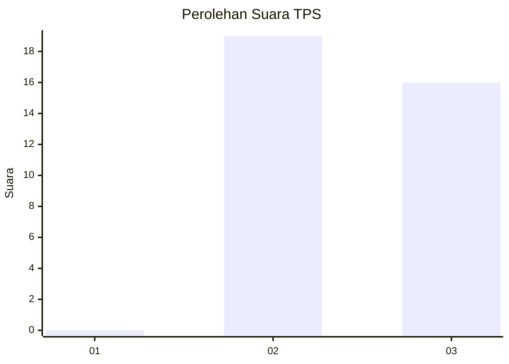
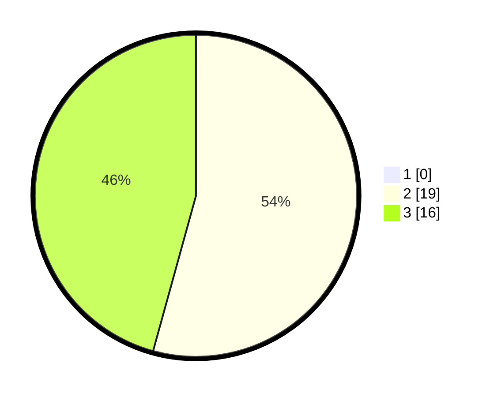

# Hasil

## Grafik

## Tabel

| No. | Nama Paslon    | Suara | Suara (raw) | Persentase |
|:--- |:-------------- | -----:| -----------:| ----------:|
| 1   | ANIES MUHAIMIN | 0     | [0][p-1]    | 0,00       |
| 2   | PRABOWO GIBRAN | 19    | [19][p-2]   | 54,29      |
| 3   | GANJAR MAHFUD  | 16    | [16][p-3]   | 45,71      |

[p-1]: https://github.com/gigit-pemilu/pemilu-2024/blob/main/pilpres/hitung-suara/sub/12-sumatera-utara/sub/07-deli-serdang/sub/03-sibolangit/sub/2011-durin-serugun/sub/003-tps/sub/paslon-1.txt
[p-2]: https://github.com/gigit-pemilu/pemilu-2024/blob/main/pilpres/hitung-suara/sub/12-sumatera-utara/sub/07-deli-serdang/sub/03-sibolangit/sub/2011-durin-serugun/sub/003-tps/sub/paslon-2.txt
[p-3]: https://github.com/gigit-pemilu/pemilu-2024/blob/main/pilpres/hitung-suara/sub/12-sumatera-utara/sub/07-deli-serdang/sub/03-sibolangit/sub/2011-durin-serugun/sub/003-tps/sub/paslon-3.txt

## Foto C Plano

https://sirekap-obj-formc.kpu.go.id/83cd/pemilu/ppwp/12/07/03/20/11/1207032011003-20240214-223818--71b42f4f-4353-4333-9380-3f1e6bb65aca.jpg

https://sirekap-obj-formc.kpu.go.id/83cd/pemilu/ppwp/12/07/03/20/11/1207032011003-20240214-223901--7675179b-9db9-49e0-bf55-7dd3cdfdc02d.jpg

https://sirekap-obj-formc.kpu.go.id/83cd/pemilu/ppwp/12/07/03/20/11/1207032011003-20240214-223926--602dfd26-9a18-46eb-aa8d-e1daf5630792.jpg

## Metadata

| Key        | Value               |
| ---------- | ------------------- |
| Time Stamp | 2024-02-24 22:31:28 |

