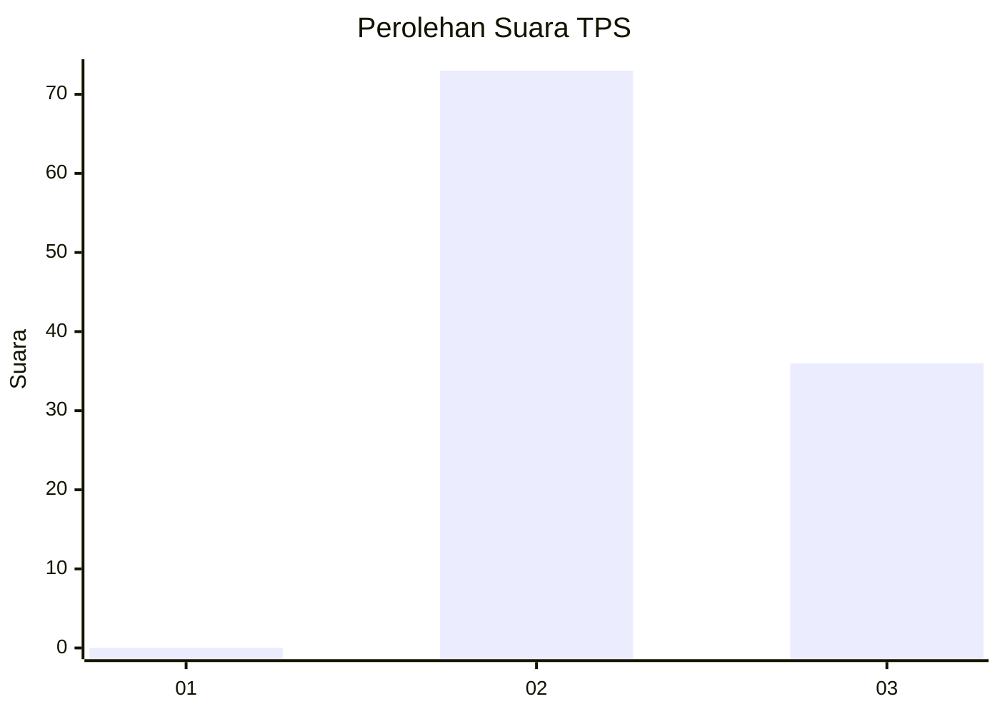
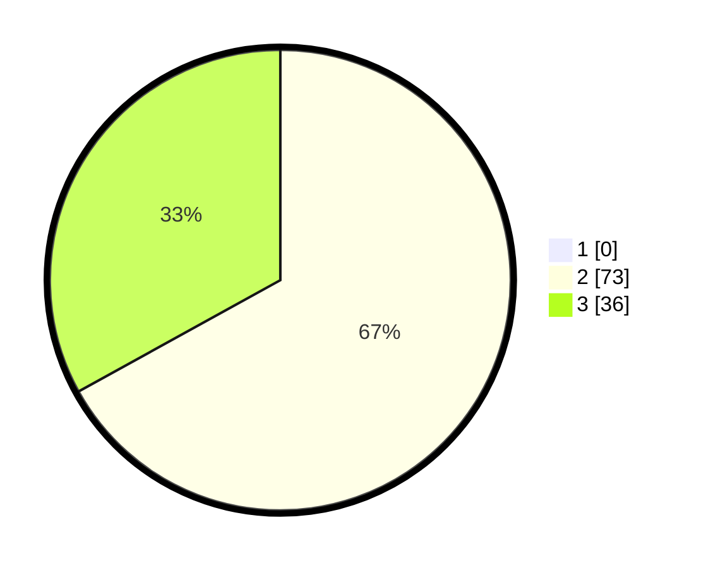

# Hasil

## Grafik

## Tabel

| No. | Nama Paslon    | Suara | Suara (raw) | Persentase |
|:--- |:-------------- | -----:| -----------:| ----------:|
| 1   | ANIES MUHAIMIN | 0     | [0][p-1]    | 0,00       |
| 2   | PRABOWO GIBRAN | 73    | [73][p-2]   | 66,97      |
| 3   | GANJAR MAHFUD  | 36    | [36][p-3]   | 33,03      |

[p-1]: https://github.com/gigit-pemilu/pemilu-2024/blob/main/pilpres/hitung-suara/sub/12-sumatera-utara/sub/07-deli-serdang/sub/03-sibolangit/sub/2012-ketangkuhen/sub/001-tps/sub/paslon-1.txt
[p-2]: https://github.com/gigit-pemilu/pemilu-2024/blob/main/pilpres/hitung-suara/sub/12-sumatera-utara/sub/07-deli-serdang/sub/03-sibolangit/sub/2012-ketangkuhen/sub/001-tps/sub/paslon-2.txt
[p-3]: https://github.com/gigit-pemilu/pemilu-2024/blob/main/pilpres/hitung-suara/sub/12-sumatera-utara/sub/07-deli-serdang/sub/03-sibolangit/sub/2012-ketangkuhen/sub/001-tps/sub/paslon-3.txt

## Foto C Plano

https://sirekap-obj-formc.kpu.go.id/b6c3/pemilu/ppwp/12/07/03/20/12/1207032012001-20240214-220119--7cbe12dc-086d-4e51-b821-348b20a4d5db.jpg

https://sirekap-obj-formc.kpu.go.id/b6c3/pemilu/ppwp/12/07/03/20/12/1207032012001-20240214-220350--b1d41be2-83bc-4db8-93fd-a433997046fa.jpg

https://sirekap-obj-formc.kpu.go.id/b6c3/pemilu/ppwp/12/07/03/20/12/1207032012001-20240214-220540--dcad8b26-cf7b-46ec-8c36-7fa06ec75e87.jpg

## Metadata

| Key        | Value               |
| ---------- | ------------------- |
| Time Stamp | 2024-02-25 15:00:00 |

