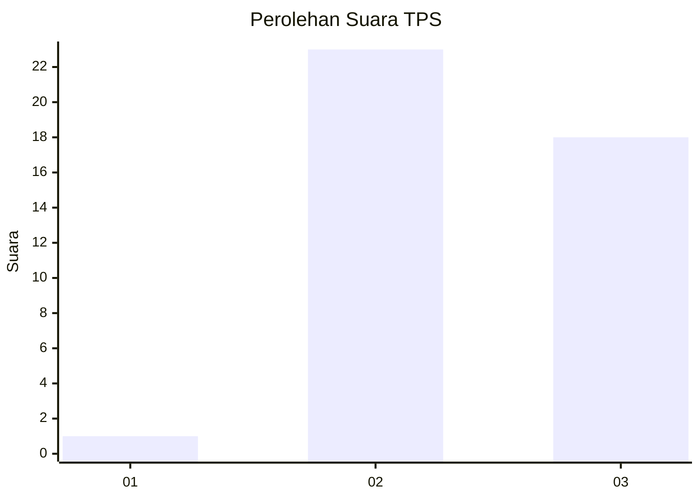
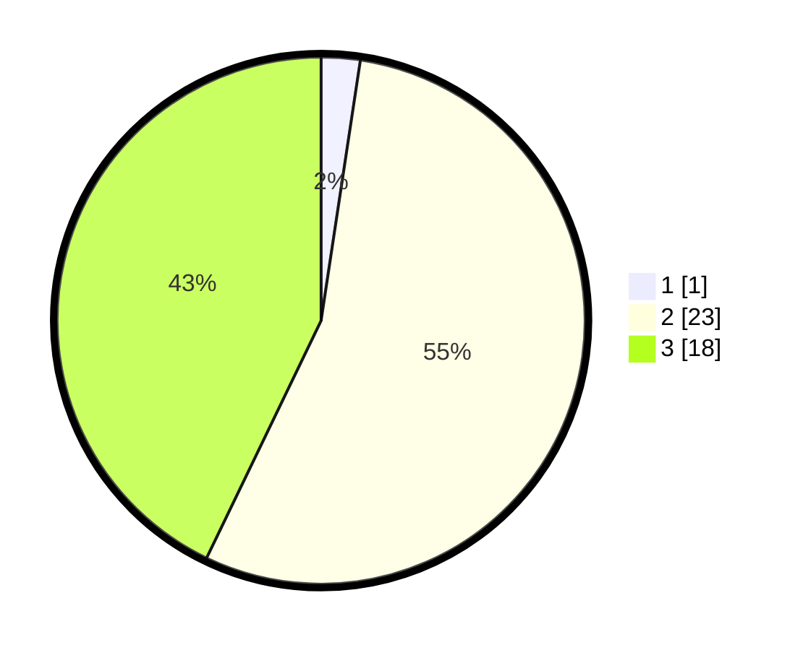

# Hasil

## Grafik

## Tabel

| No. | Nama Paslon    | Suara | Suara (raw) | Persentase |
|:--- |:-------------- | -----:| -----------:| ----------:|
| 1   | ANIES MUHAIMIN | 1     | [1][p-1]    | 2,38       |
| 2   | PRABOWO GIBRAN | 23    | [23][p-2]   | 54,76      |
| 3   | GANJAR MAHFUD  | 18    | [18][p-3]   | 42,86      |

[p-1]: https://github.com/gigit-pemilu/pemilu-2024/blob/main/pilpres/hitung-suara/sub/12-sumatera-utara/sub/07-deli-serdang/sub/03-sibolangit/sub/2016-puangaja/sub/002-tps/sub/paslon-1.txt
[p-2]: https://github.com/gigit-pemilu/pemilu-2024/blob/main/pilpres/hitung-suara/sub/12-sumatera-utara/sub/07-deli-serdang/sub/03-sibolangit/sub/2016-puangaja/sub/002-tps/sub/paslon-2.txt
[p-3]: https://github.com/gigit-pemilu/pemilu-2024/blob/main/pilpres/hitung-suara/sub/12-sumatera-utara/sub/07-deli-serdang/sub/03-sibolangit/sub/2016-puangaja/sub/002-tps/sub/paslon-3.txt

## Foto C Plano

https://sirekap-obj-formc.kpu.go.id/0277/pemilu/ppwp/12/07/03/20/16/1207032016002-20240214-224728--1b59a754-981f-40ea-a83e-8e1b11b6c536.jpg

https://sirekap-obj-formc.kpu.go.id/0277/pemilu/ppwp/12/07/03/20/16/1207032016002-20240214-231348--89343419-9243-4a44-a8f7-1c75a7f8f369.jpg

https://sirekap-obj-formc.kpu.go.id/0277/pemilu/ppwp/12/07/03/20/16/1207032016002-20240214-222939--e8b9c5d0-244c-491a-b58c-f8c16c8f2e1f.jpg

## Metadata

| Key        | Value               |
| ---------- | ------------------- |
| Time Stamp | 2024-02-24 22:31:28 |

