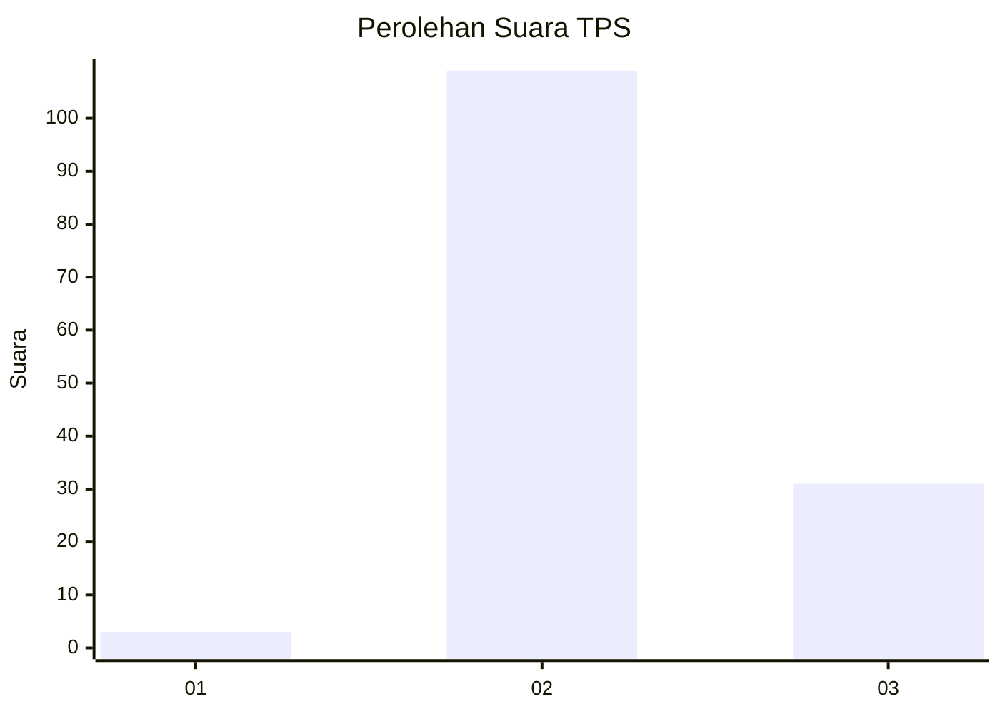

# Hasil

## Grafik

## Tabel

| No. | Nama Paslon    | Suara | Suara (raw) | Persentase |
|:--- |:-------------- | -----:| -----------:| ----------:|
| 1   | ANIES MUHAIMIN | 3     | [3][p-1]    | 2,10       |
| 2   | PRABOWO GIBRAN | 109   | [109][p-2]  | 76,22      |
| 3   | GANJAR MAHFUD  | 31    | [31][p-3]   | 21,68      |

[p-1]: https://github.com/gigit-pemilu/pemilu-2024-12-sumatera-utara/blob/main/pilpres/hitung-suara/sub/12-sumatera-utara/sub/07-deli-serdang/sub/03-sibolangit/sub/2017-rumah-kinangkung-sp/sub/002-tps/sub/paslon-1.txt
[p-2]: https://github.com/gigit-pemilu/pemilu-2024-12-sumatera-utara/blob/main/pilpres/hitung-suara/sub/12-sumatera-utara/sub/07-deli-serdang/sub/03-sibolangit/sub/2017-rumah-kinangkung-sp/sub/002-tps/sub/paslon-2.txt
[p-3]: https://github.com/gigit-pemilu/pemilu-2024-12-sumatera-utara/blob/main/pilpres/hitung-suara/sub/12-sumatera-utara/sub/07-deli-serdang/sub/03-sibolangit/sub/2017-rumah-kinangkung-sp/sub/002-tps/sub/paslon-3.txt

## Foto C Plano

https://sirekap-obj-formc.kpu.go.id/d63c/pemilu/ppwp/12/07/03/20/17/1207032017002-20240215-020930--5e24dd75-a6fb-41e9-b2a5-e8b97e901cfe.jpg

https://sirekap-obj-formc.kpu.go.id/d63c/pemilu/ppwp/12/07/03/20/17/1207032017002-20240215-015000--cfcdf75e-83f0-4d06-9320-b735c7a2ce4e.jpg

https://sirekap-obj-formc.kpu.go.id/d63c/pemilu/ppwp/12/07/03/20/17/1207032017002-20240215-015145--d1d8e4e0-b11a-4664-b0c4-5ad118e1d2ad.jpg

## Metadata

| Key        | Value               |
| ---------- | ------------------- |
| Time Stamp | 2024-02-25 18:00:00 |

