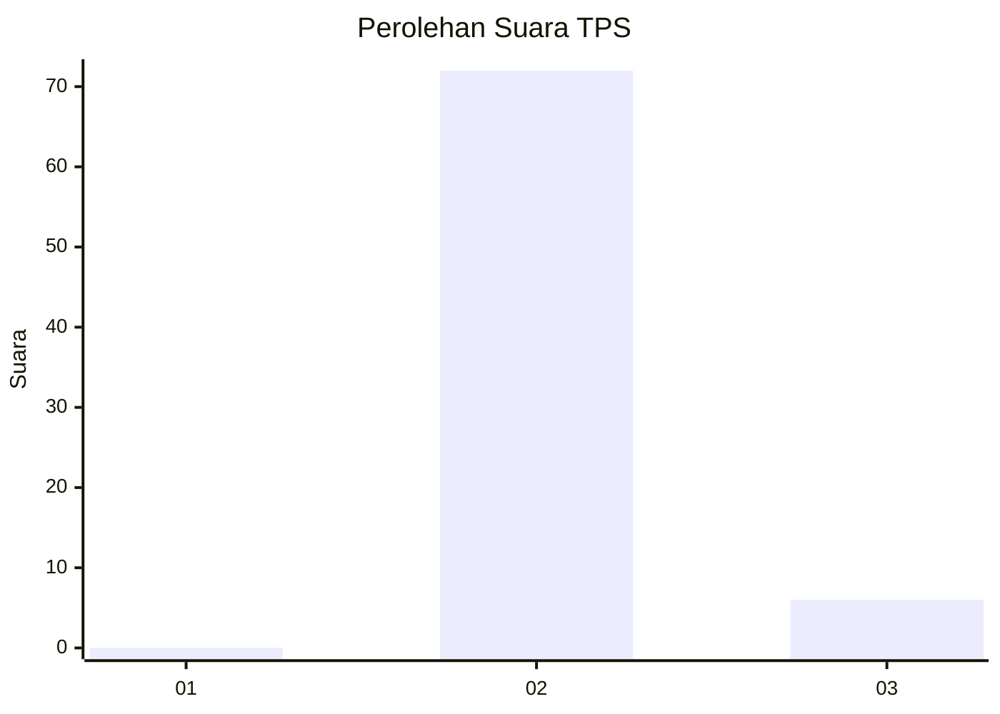
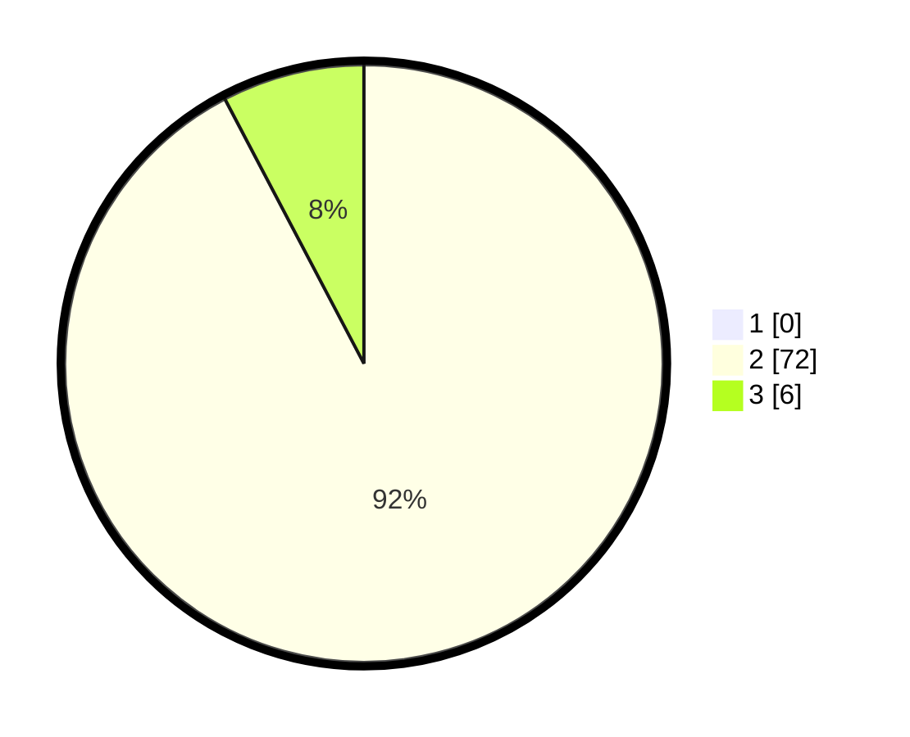

# Hasil

## Grafik

## Tabel

| No. | Nama Paslon    | Suara | Suara (raw) | Persentase |
|:--- |:-------------- | -----:| -----------:| ----------:|
| 1   | ANIES MUHAIMIN | 0     | [0][p-1]    | 0,00       |
| 2   | PRABOWO GIBRAN | 72    | [72][p-2]   | 92,31      |
| 3   | GANJAR MAHFUD  | 6     | [6][p-3]    | 7,69       |

[p-1]: https://github.com/gigit-pemilu/pemilu-2024/blob/main/pilpres/hitung-suara/sub/12-sumatera-utara/sub/07-deli-serdang/sub/03-sibolangit/sub/2019-rumah-pil-pil/sub/003-tps/sub/paslon-1.txt
[p-2]: https://github.com/gigit-pemilu/pemilu-2024/blob/main/pilpres/hitung-suara/sub/12-sumatera-utara/sub/07-deli-serdang/sub/03-sibolangit/sub/2019-rumah-pil-pil/sub/003-tps/sub/paslon-2.txt
[p-3]: https://github.com/gigit-pemilu/pemilu-2024/blob/main/pilpres/hitung-suara/sub/12-sumatera-utara/sub/07-deli-serdang/sub/03-sibolangit/sub/2019-rumah-pil-pil/sub/003-tps/sub/paslon-3.txt

## Foto C Plano

https://sirekap-obj-formc.kpu.go.id/90b6/pemilu/ppwp/12/07/03/20/19/1207032019003-20240215-020957--9b3b4e70-0e2a-42ef-a799-beb30ad1d5ab.jpg

https://sirekap-obj-formc.kpu.go.id/90b6/pemilu/ppwp/12/07/03/20/19/1207032019003-20240215-020221--898d925b-3cdb-478f-a141-0c494d156fc7.jpg

https://sirekap-obj-formc.kpu.go.id/90b6/pemilu/ppwp/12/07/03/20/19/1207032019003-20240215-020330--b45d1a84-b33b-445e-9265-6852afd6dcc7.jpg

## Metadata

| Key        | Value               |
| ---------- | ------------------- |
| Time Stamp | 2024-02-25 11:00:00 |

