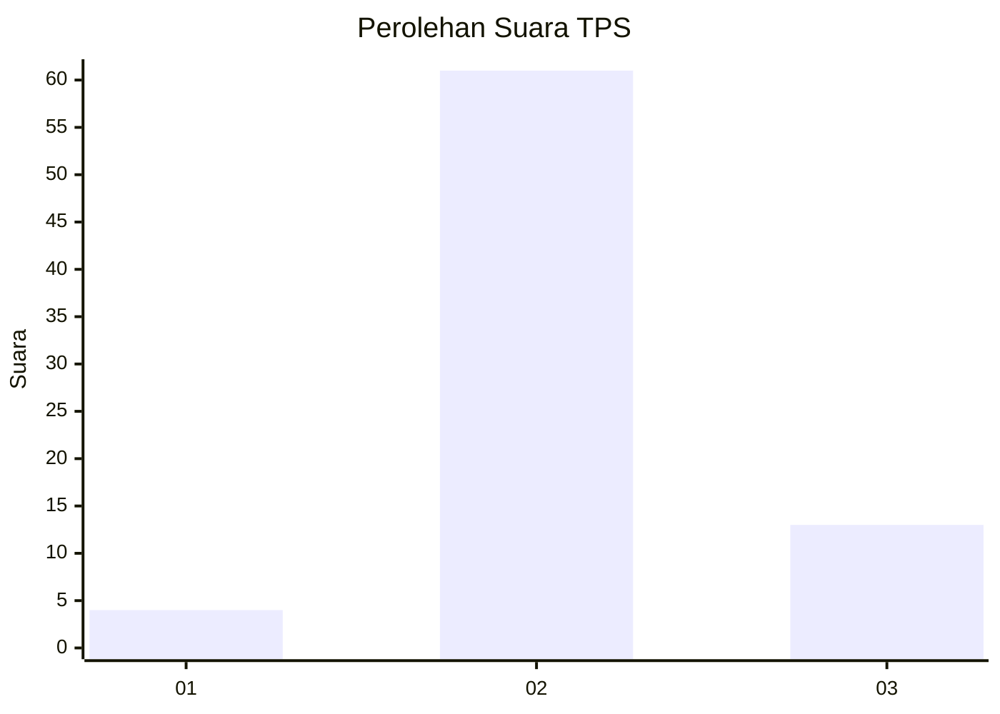
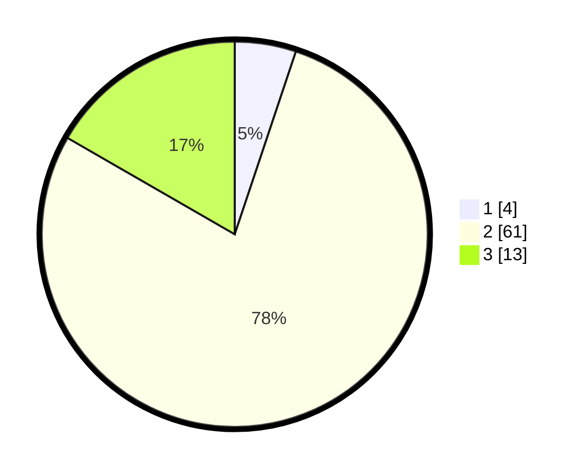

# Hasil

## Grafik

## Tabel

| No. | Nama Paslon    | Suara | Suara (raw) | Persentase |
|:--- |:-------------- | -----:| -----------:| ----------:|
| 1   | ANIES MUHAIMIN | 4     | [4][p-1]    | 5,13       |
| 2   | PRABOWO GIBRAN | 61    | [61][p-2]   | 78,21      |
| 3   | GANJAR MAHFUD  | 13    | [13][p-3]   | 16,67      |

[p-1]: https://github.com/gigit-pemilu/pemilu-2024/blob/main/pilpres/hitung-suara/sub/12-sumatera-utara/sub/07-deli-serdang/sub/03-sibolangit/sub/2020-rumah-sumbul/sub/001-tps/sub/paslon-1.txt
[p-2]: https://github.com/gigit-pemilu/pemilu-2024/blob/main/pilpres/hitung-suara/sub/12-sumatera-utara/sub/07-deli-serdang/sub/03-sibolangit/sub/2020-rumah-sumbul/sub/001-tps/sub/paslon-2.txt
[p-3]: https://github.com/gigit-pemilu/pemilu-2024/blob/main/pilpres/hitung-suara/sub/12-sumatera-utara/sub/07-deli-serdang/sub/03-sibolangit/sub/2020-rumah-sumbul/sub/001-tps/sub/paslon-3.txt

## Foto C Plano

https://sirekap-obj-formc.kpu.go.id/121a/pemilu/ppwp/12/07/03/20/20/1207032020001-20240214-230147--7def8251-9701-46c5-b661-4ad57822a28e.jpg

https://sirekap-obj-formc.kpu.go.id/121a/pemilu/ppwp/12/07/03/20/20/1207032020001-20240214-225840--ea311f68-3ad8-4acc-98a9-defa82133730.jpg

https://sirekap-obj-formc.kpu.go.id/121a/pemilu/ppwp/12/07/03/20/20/1207032020001-20240214-230001--e0419145-12a6-44dc-b7e8-41fbb7a32e6f.jpg

## Metadata

| Key        | Value               |
| ---------- | ------------------- |
| Time Stamp | 2024-02-25 12:00:00 |

