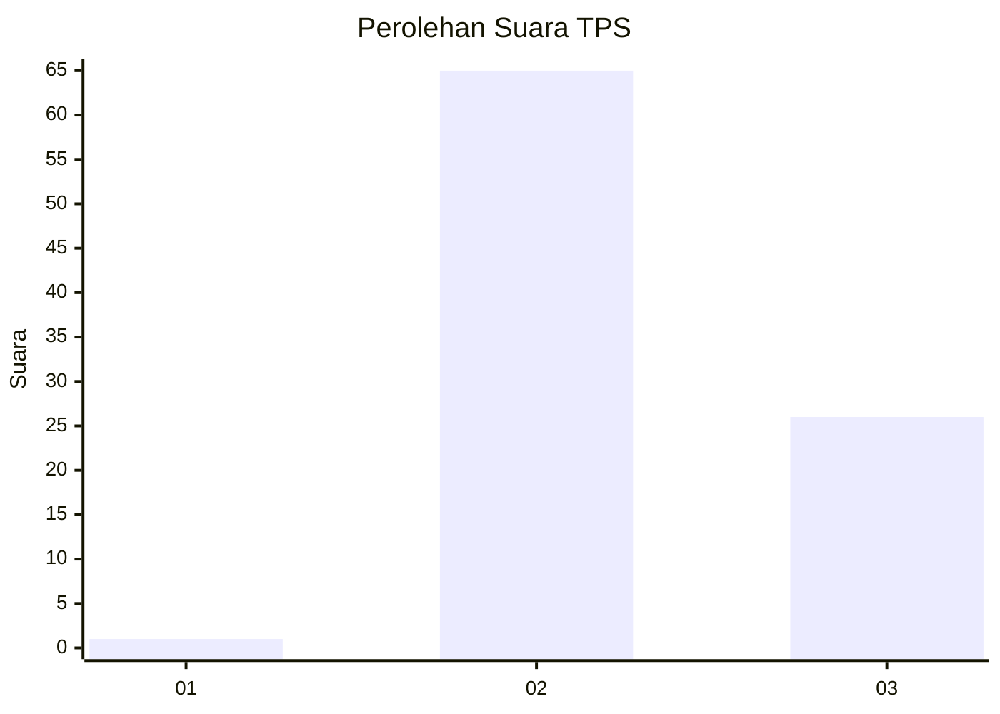
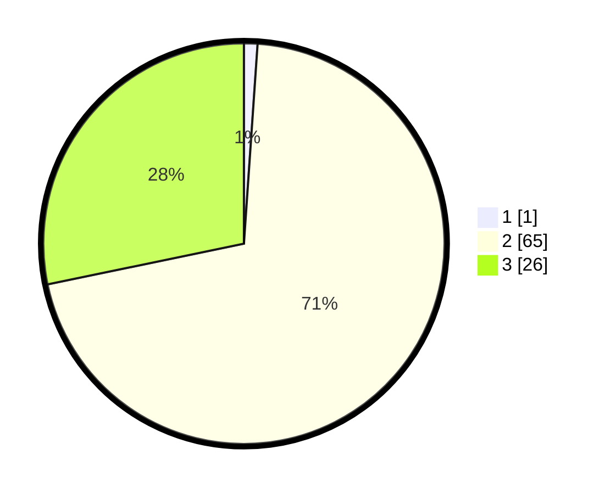

# Hasil

## Grafik

## Tabel

| No. | Nama Paslon    | Suara | Suara (raw) | Persentase |
|:--- |:-------------- | -----:| -----------:| ----------:|
| 1   | ANIES MUHAIMIN | 1     | [1][p-1]    | 1,09       |
| 2   | PRABOWO GIBRAN | 65    | [65][p-2]   | 70,65      |
| 3   | GANJAR MAHFUD  | 26    | [26][p-3]   | 28,26      |

[p-1]: https://github.com/gigit-pemilu/pemilu-2024/blob/main/pilpres/hitung-suara/sub/12-sumatera-utara/sub/07-deli-serdang/sub/03-sibolangit/sub/2026-suka-maju/sub/003-tps/sub/paslon-1.txt
[p-2]: https://github.com/gigit-pemilu/pemilu-2024/blob/main/pilpres/hitung-suara/sub/12-sumatera-utara/sub/07-deli-serdang/sub/03-sibolangit/sub/2026-suka-maju/sub/003-tps/sub/paslon-2.txt
[p-3]: https://github.com/gigit-pemilu/pemilu-2024/blob/main/pilpres/hitung-suara/sub/12-sumatera-utara/sub/07-deli-serdang/sub/03-sibolangit/sub/2026-suka-maju/sub/003-tps/sub/paslon-3.txt

## Foto C Plano

https://sirekap-obj-formc.kpu.go.id/8dbd/pemilu/ppwp/12/07/03/20/26/1207032026003-20240215-045727--70004725-632e-46c3-936f-5729f7658338.jpg

https://sirekap-obj-formc.kpu.go.id/8dbd/pemilu/ppwp/12/07/03/20/26/1207032026003-20240214-205459--4f0f62a4-db18-4db6-a227-4576efb36491.jpg

https://sirekap-obj-formc.kpu.go.id/8dbd/pemilu/ppwp/12/07/03/20/26/1207032026003-20240214-155606--6ab871e4-6749-4286-8a33-bb9147d958f2.jpg

## Metadata

| Key        | Value               |
| ---------- | ------------------- |
| Time Stamp | 2024-02-24 22:31:28 |

