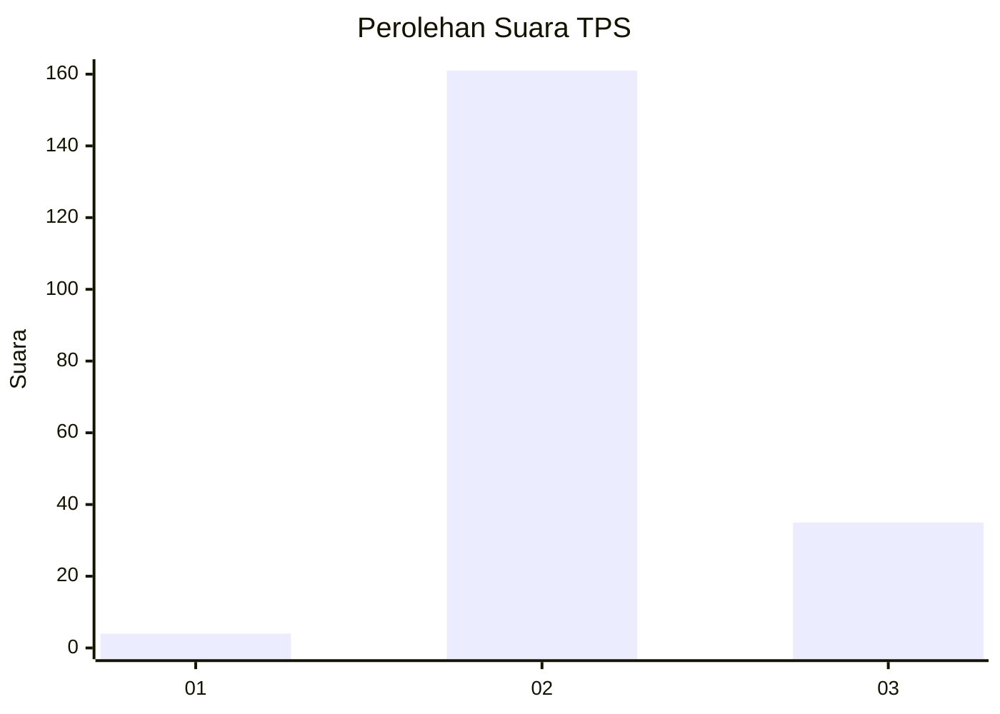

# Hasil

## Grafik

## Tabel

| No. | Nama Paslon    | Suara | Suara (raw) | Persentase |
|:--- |:-------------- | -----:| -----------:| ----------:|
| 1   | ANIES MUHAIMIN | 4     | [4][p-1]    | 2,00       |
| 2   | PRABOWO GIBRAN | 161   | [161][p-2]  | 80,50      |
| 3   | GANJAR MAHFUD  | 35    | [35][p-3]   | 17,50      |

[p-1]: https://github.com/gigit-pemilu/pemilu-2024-12-sumatera-utara/blob/main/pilpres/hitung-suara/sub/12-sumatera-utara/sub/07-deli-serdang/sub/04-kutalimbaru/sub/2001-suka-makmur/sub/001-tps/sub/paslon-1.txt
[p-2]: https://github.com/gigit-pemilu/pemilu-2024-12-sumatera-utara/blob/main/pilpres/hitung-suara/sub/12-sumatera-utara/sub/07-deli-serdang/sub/04-kutalimbaru/sub/2001-suka-makmur/sub/001-tps/sub/paslon-2.txt
[p-3]: https://github.com/gigit-pemilu/pemilu-2024-12-sumatera-utara/blob/main/pilpres/hitung-suara/sub/12-sumatera-utara/sub/07-deli-serdang/sub/04-kutalimbaru/sub/2001-suka-makmur/sub/001-tps/sub/paslon-3.txt

## Foto C Plano

https://sirekap-obj-formc.kpu.go.id/9a03/pemilu/ppwp/12/07/04/20/01/1207042001001-20240215-001650--e9a95998-645e-4140-b67c-b2e91290f05f.jpg

https://sirekap-obj-formc.kpu.go.id/9a03/pemilu/ppwp/12/07/04/20/01/1207042001001-20240215-001935--e43a2202-92ac-423c-a22a-1bf976aa9859.jpg

https://sirekap-obj-formc.kpu.go.id/9a03/pemilu/ppwp/12/07/04/20/01/1207042001001-20240215-002248--7c6c9d7e-fcf6-48ed-af53-50c4eb4eae0b.jpg

## Metadata

| Key        | Value               |
| ---------- | ------------------- |
| Time Stamp | 2024-02-25 16:00:00 |

