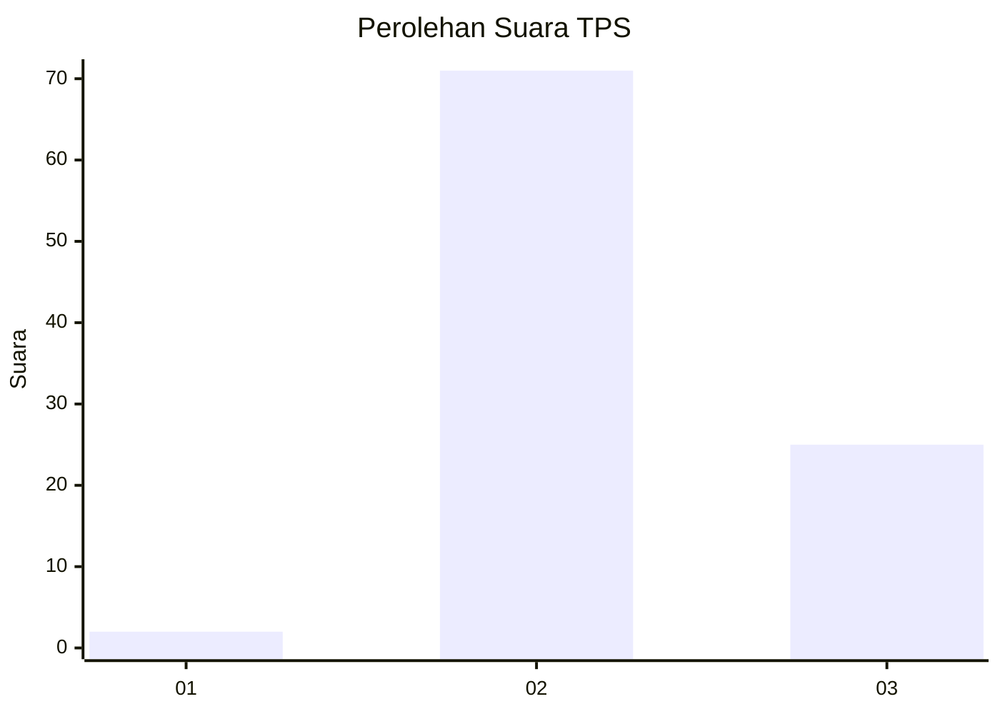
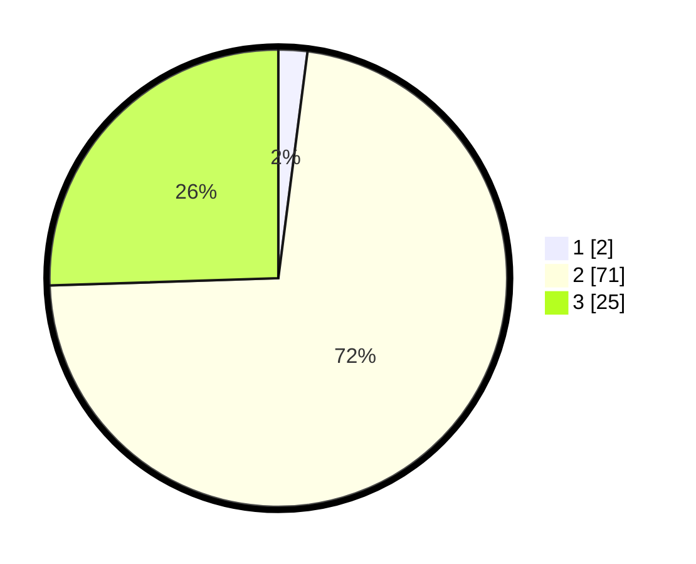

# Hasil

## Grafik

## Tabel

| No. | Nama Paslon    | Suara | Suara (raw) | Persentase |
|:--- |:-------------- | -----:| -----------:| ----------:|
| 1   | ANIES MUHAIMIN | 2     | [2][p-1]    | 2,04       |
| 2   | PRABOWO GIBRAN | 71    | [71][p-2]   | 72,45      |
| 3   | GANJAR MAHFUD  | 25    | [25][p-3]   | 25,51      |

[p-1]: https://github.com/gigit-pemilu/pemilu-2024-12-sumatera-utara/blob/main/pilpres/hitung-suara/sub/12-sumatera-utara/sub/07-deli-serdang/sub/04-kutalimbaru/sub/2001-suka-makmur/sub/006-tps/sub/paslon-1.txt
[p-2]: https://github.com/gigit-pemilu/pemilu-2024-12-sumatera-utara/blob/main/pilpres/hitung-suara/sub/12-sumatera-utara/sub/07-deli-serdang/sub/04-kutalimbaru/sub/2001-suka-makmur/sub/006-tps/sub/paslon-2.txt
[p-3]: https://github.com/gigit-pemilu/pemilu-2024-12-sumatera-utara/blob/main/pilpres/hitung-suara/sub/12-sumatera-utara/sub/07-deli-serdang/sub/04-kutalimbaru/sub/2001-suka-makmur/sub/006-tps/sub/paslon-3.txt

## Foto C Plano

https://sirekap-obj-formc.kpu.go.id/7ab0/pemilu/ppwp/12/07/04/20/01/1207042001006-20240215-162735--a1b06951-5134-4e5b-b557-7a945b4ae2f3.jpg

https://sirekap-obj-formc.kpu.go.id/7ab0/pemilu/ppwp/12/07/04/20/01/1207042001006-20240215-162909--d7d68b59-4c77-4766-9dd4-4f49e351542b.jpg

https://sirekap-obj-formc.kpu.go.id/7ab0/pemilu/ppwp/12/07/04/20/01/1207042001006-20240215-162957--b80c8391-24ab-49df-bf5b-beabaad3df84.jpg

## Metadata

| Key        | Value               |
| ---------- | ------------------- |
| Time Stamp | 2024-02-25 18:00:00 |

