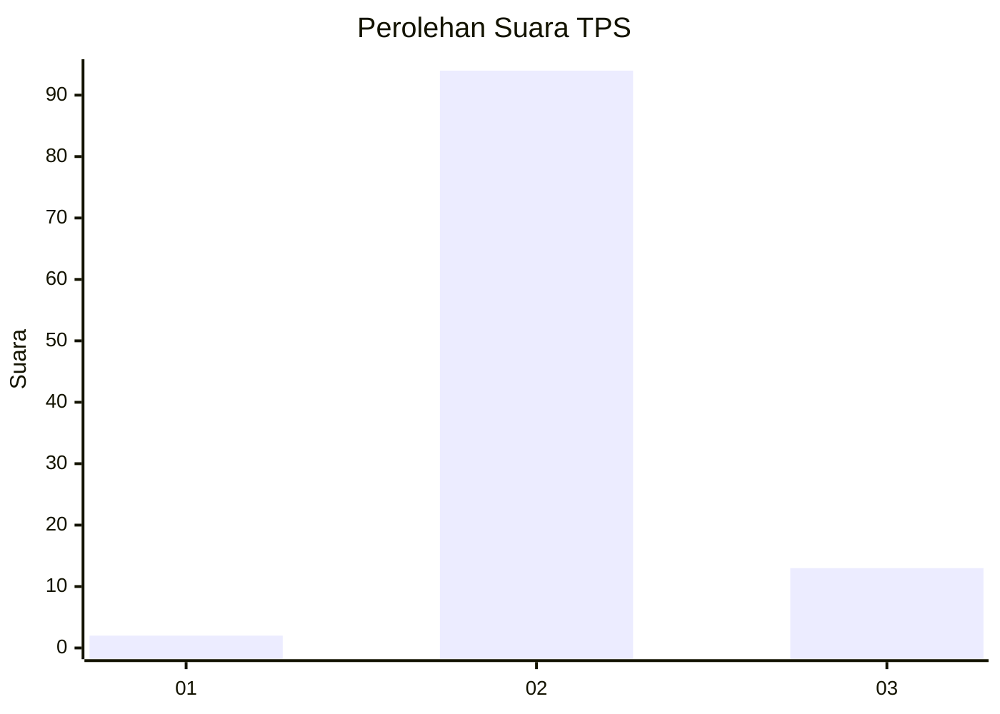
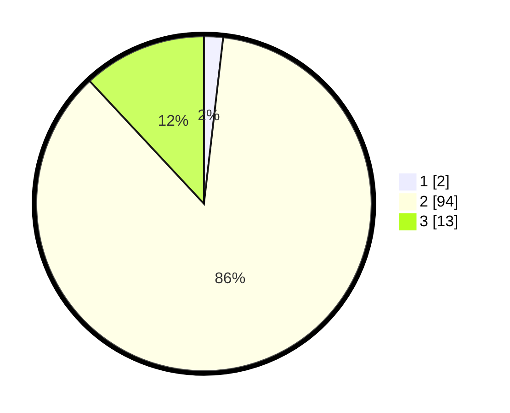

# Hasil

## Grafik

## Tabel

| No. | Nama Paslon    | Suara | Suara (raw) | Persentase |
|:--- |:-------------- | -----:| -----------:| ----------:|
| 1   | ANIES MUHAIMIN | 2     | [2][p-1]    | 1,83       |
| 2   | PRABOWO GIBRAN | 94    | [94][p-2]   | 86,24      |
| 3   | GANJAR MAHFUD  | 13    | [13][p-3]   | 11,93      |

[p-1]: https://github.com/gigit-pemilu/pemilu-2024/blob/main/pilpres/hitung-suara/sub/12-sumatera-utara/sub/07-deli-serdang/sub/04-kutalimbaru/sub/2009-kwala-lau-bicik/sub/005-tps/sub/paslon-1.txt
[p-2]: https://github.com/gigit-pemilu/pemilu-2024/blob/main/pilpres/hitung-suara/sub/12-sumatera-utara/sub/07-deli-serdang/sub/04-kutalimbaru/sub/2009-kwala-lau-bicik/sub/005-tps/sub/paslon-2.txt
[p-3]: https://github.com/gigit-pemilu/pemilu-2024/blob/main/pilpres/hitung-suara/sub/12-sumatera-utara/sub/07-deli-serdang/sub/04-kutalimbaru/sub/2009-kwala-lau-bicik/sub/005-tps/sub/paslon-3.txt

## Foto C Plano

https://sirekap-obj-formc.kpu.go.id/f1b8/pemilu/ppwp/12/07/04/20/09/1207042009005-20240214-193733--69f773e2-8323-492e-884a-4f34c8bf0b3b.jpg

https://sirekap-obj-formc.kpu.go.id/f1b8/pemilu/ppwp/12/07/04/20/09/1207042009005-20240214-192657--da4af3b2-8331-4ff9-ae3e-a6d3d45d0317.jpg

https://sirekap-obj-formc.kpu.go.id/f1b8/pemilu/ppwp/12/07/04/20/09/1207042009005-20240214-193009--9f304011-7a34-49f5-87de-e5b1a1e7f77b.jpg

## Metadata

| Key        | Value               |
| ---------- | ------------------- |
| Time Stamp | 2024-02-24 22:31:28 |

