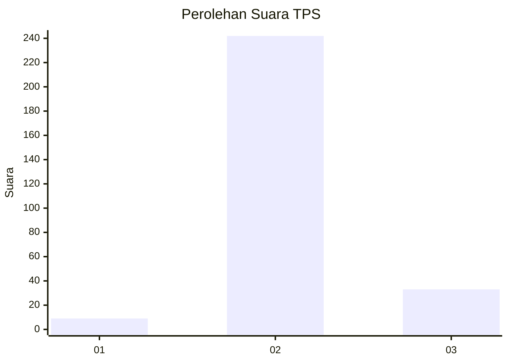
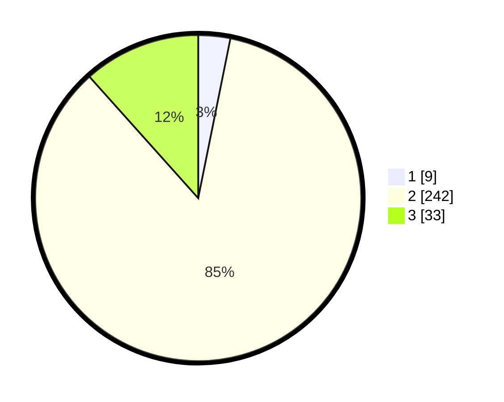

# Hasil

## Grafik

## Tabel

| No. | Nama Paslon    | Suara | Suara (raw) | Persentase |
|:--- |:-------------- | -----:| -----------:| ----------:|
| 1   | ANIES MUHAIMIN | 9     | [9][p-1]    | 3,17       |
| 2   | PRABOWO GIBRAN | 242   | [242][p-2]  | 85,21      |
| 3   | GANJAR MAHFUD  | 33    | [33][p-3]   | 11,62      |

[p-1]: https://github.com/gigit-pemilu/pemilu-2024/blob/main/pilpres/hitung-suara/sub/12-sumatera-utara/sub/07-deli-serdang/sub/04-kutalimbaru/sub/2011-silebo-lebo/sub/007-tps/sub/paslon-1.txt
[p-2]: https://github.com/gigit-pemilu/pemilu-2024/blob/main/pilpres/hitung-suara/sub/12-sumatera-utara/sub/07-deli-serdang/sub/04-kutalimbaru/sub/2011-silebo-lebo/sub/007-tps/sub/paslon-2.txt
[p-3]: https://github.com/gigit-pemilu/pemilu-2024/blob/main/pilpres/hitung-suara/sub/12-sumatera-utara/sub/07-deli-serdang/sub/04-kutalimbaru/sub/2011-silebo-lebo/sub/007-tps/sub/paslon-3.txt

## Foto C Plano

https://sirekap-obj-formc.kpu.go.id/5c58/pemilu/ppwp/12/07/04/20/11/1207042011007-20240214-224500--162931eb-9d68-4836-a694-b1fc6d1585a6.jpg

https://sirekap-obj-formc.kpu.go.id/5c58/pemilu/ppwp/12/07/04/20/11/1207042011007-20240214-224739--973f732e-4c47-4936-89cf-0e79c81f74e3.jpg

https://sirekap-obj-formc.kpu.go.id/5c58/pemilu/ppwp/12/07/04/20/11/1207042011007-20240214-224916--62714315-4b57-4896-b668-df70c3809084.jpg

## Metadata

| Key        | Value               |
| ---------- | ------------------- |
| Time Stamp | 2024-02-25 16:00:00 |

