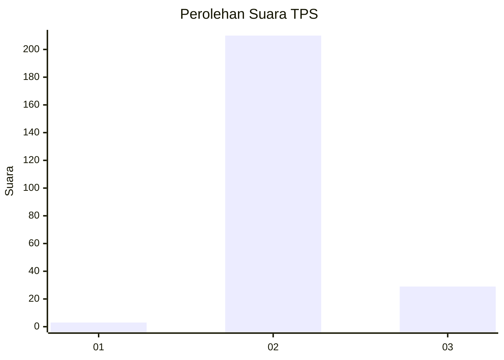
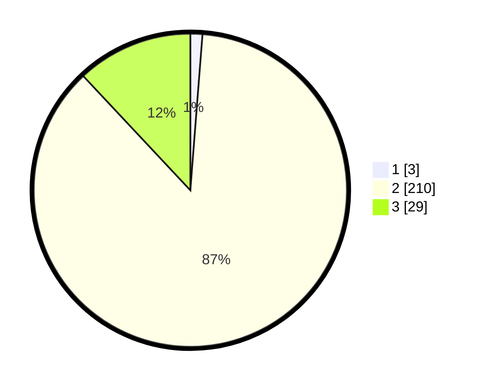

# Hasil

## Grafik

## Tabel

| No. | Nama Paslon    | Suara | Suara (raw) | Persentase |
|:--- |:-------------- | -----:| -----------:| ----------:|
| 1   | ANIES MUHAIMIN | 3     | [3][p-1]    | 1,24       |
| 2   | PRABOWO GIBRAN | 210   | [210][p-2]  | 86,78      |
| 3   | GANJAR MAHFUD  | 29    | [29][p-3]   | 11,98      |

[p-1]: https://github.com/gigit-pemilu/pemilu-2024/blob/main/pilpres/hitung-suara/sub/12-sumatera-utara/sub/07-deli-serdang/sub/05-pancur-batu/sub/2001-bintang-meriah/sub/001-tps/sub/paslon-1.txt
[p-2]: https://github.com/gigit-pemilu/pemilu-2024/blob/main/pilpres/hitung-suara/sub/12-sumatera-utara/sub/07-deli-serdang/sub/05-pancur-batu/sub/2001-bintang-meriah/sub/001-tps/sub/paslon-2.txt
[p-3]: https://github.com/gigit-pemilu/pemilu-2024/blob/main/pilpres/hitung-suara/sub/12-sumatera-utara/sub/07-deli-serdang/sub/05-pancur-batu/sub/2001-bintang-meriah/sub/001-tps/sub/paslon-3.txt

## Foto C Plano

https://sirekap-obj-formc.kpu.go.id/2643/pemilu/ppwp/12/07/05/20/01/1207052001001-20240214-230329--47419f04-98d1-472a-83de-5310d646d9c1.jpg

https://sirekap-obj-formc.kpu.go.id/2643/pemilu/ppwp/12/07/05/20/01/1207052001001-20240214-225934--1ec4025e-b706-4815-8b85-7e03eac843b3.jpg

https://sirekap-obj-formc.kpu.go.id/2643/pemilu/ppwp/12/07/05/20/01/1207052001001-20240214-230151--5d18a54f-7878-436b-bf05-cf5df6288562.jpg

## Metadata

| Key        | Value               |
| ---------- | ------------------- |
| Time Stamp | 2024-02-16 02:00:27 |

## DATA PEMILIH TETAP

Jumlah pemilih dalam DPT: **748**.
 * L: **329**.
 * P: **526**.

## DATA PENGGUNA HAK PILIH

Jumlah pengguna hak pilih dalam DPT: **242**.
 * L: **628**.
 * P: **524**.

Jumlah pengguna hak pilih dalam DPTb: **800**.
 * L: **8**.
 * P: **0**.

Jumlah pengguna hak pilih dalam DPK: **803**.
 * L: **880**.
 * P: **882**.

Jumlah pengguna hak pilih: **245**.
 * L: **479**.
 * P: **226**.

## JUMLAH SUARA SAH DAN TIDAK SAH

JUMLAH SELURUH SUARA SAH: **242**.

JUMLAH SUARA TIDAK SAH: **8**.

JUMLAH SELURUH SUARA SAH DAN SUARA TIDAK SAH: **250**.

